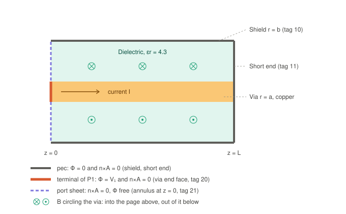
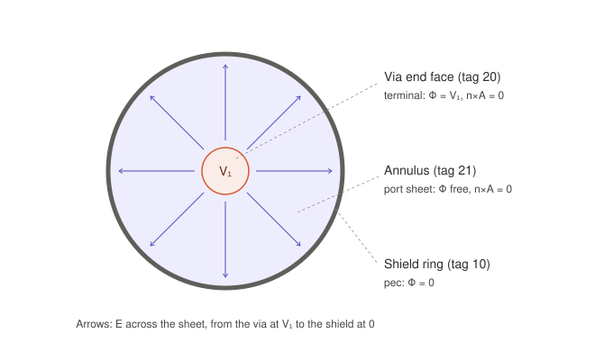

# Coaxial via: domain, boundary conditions, and the port

*Opus 5, Sept 2026. Companion to `port_and_dof_plan.md`. Mesh tags refer to
`APhi_Solver/tools/coax_via.geo` and `APhi_Solver/meshes/coax_via.msh`.*

---

## 1. What is being modelled

The Phase 01 EDA target problem (`docs/FORMULATION.md` §7.1): a straight
cylindrical via inside a cylindrical shield, filled with a lossy dielectric.

| quantity | value |
|---|---|
| via radius `a` | 0.1 mm |
| shield radius `b` | 0.5 mm |
| length `L` | 2 mm |
| via conductivity | 5.8e7 S/m (copper) |
| dielectric | εr = 4.3, tan δ = 0.02 |
| mesh | 5,099 nodes, 28,586 tets |

**There is no surrounding domain box.** The computational domain is the
cylinder `r ≤ b, 0 ≤ z ≤ L` and nothing else. The shield is the outer
boundary of the domain; nothing outside it is meshed, because nothing outside
it matters for a closed coax. An air box only becomes necessary for radiating
problems (the Phase 07 scattering track), where the outer surface then carries
an absorbing boundary condition.

Two volume regions are meshed:

| volume tag | region | why it is meshed |
|---|---|---|
| 1 `via_conductor` | r ≤ a | `R_DC` is set by current flowing through the via's cross-section, so the via needs volume unknowns to carry it |
| 2 `dielectric` | a ≤ r ≤ b | carries the fields between the conductors |

The shield is *not* meshed as a volume. It is a PEC boundary: the return
path's own resistance is not one of the closed-form checks, and meshing a
shell would add elements that earn nothing at this stage.

---

## 2. Side section



A cut through the axis. Current enters through the terminal at `z = 0`, runs
along the via, exits into the short at `z = L`, and returns as surface current
on the shield.

The field that matters for the boundary conditions is **B**. It circles the
via: into the page above the axis, out of it below. So on every boundary face
of this domain — the shield wall, both end planes — **B lies in the surface**
and never crosses it (`B·n = 0`).

---

## 3. Feed plane, end view



The plane `z = 0`, looking down the axis. This is the face the port question
is about.

- The **via end face** (tag 20) is the port terminal, held at the port voltage
  `V₁`.
- The **dielectric annulus** (tag 21) is the port sheet. Φ is free on it, and it
  falls from `V₁` at the via to 0 at the shield. That gradient is the radial
  **E** shown by the arrows.
- The **shield ring** (tag 10) is grounded.

---

## 4. Boundary conditions, face by face

A and Φ get **independent** conditions on each face. That is what makes the
port expressible at all: the sheet needs `n×A = 0` with Φ free, which no single
"PEC or natural" switch can say.

| face | tag | condition on **A** | condition on **Φ** | role |
|---|---|---|---|---|
| shield wall, r = b | 10 | `n×A = 0` | Φ = 0 | ground |
| short end, z = L | 11 | `n×A = 0` | Φ = 0 | ground, via shorted to shield |
| via end face, z = 0 | 20 | `n×A = 0` | Φ = V₁ | port terminal |
| annulus, z = 0 | 21 | `n×A = 0` | natural (free) | port sheet |
| via–dielectric interface, r = a | — | internal, none | internal, none | material interface |

Every face of the boundary ends up with `n×A = 0`. That is not a coincidence:
it is the condition that says `B·n = 0`, and §2 showed B never crosses any of
these faces.

---

## 5. Why `n×A = 0` on the port does not short it

The tangential electric field on a surface is

```
n×E = −jω (n×A) − n×∇Φ
```

With `n×A = 0` this reduces to `n×E = −n×∇Φ`. So it depends entirely on what
Φ is doing:

- **On the terminal**, Φ is constant (`V₁`), so `E_tan = 0`. That is correct:
  the terminal is a conductor face, and current crosses it normally.
- **On the sheet**, Φ is free and varies from `V₁` to 0, so `E_tan = −∇_tΦ ≠ 0`.
  The radial field survives. The port is not shorted.

`n×A = 0` behaves as a PEC short **only if Φ is also held constant across the
whole face**. That is the case the Gemini review
(`Gemini/Port_BC_and_Conductor_Gauging_Review.md` §1) describes, but it is not
the case here.

A bonus: because A has no tangential part on the sheet, `V₁ = ∫E·dl` along
*any* path within the sheet. The port voltage is gauge-invariant and
path-independent, even at full-wave.

---

## 6. Why "no condition on A" at the port fails

A boundary face always carries *some* condition on A. Imposing nothing gives
the natural condition of the weak form:

```
n×H = 0        (tangential H vanishes: a perfect magnetic conductor)
```

The normal component of `∇×H` on a surface depends only on the tangential
field along it:

```
n·(∇×H) = ∇_s·(H×n)
```

So `n×H = 0` on the feed plane forces `n·J_tot = n·(∇×H) = 0` there — **no
current may cross it**. But the port injects current `I` through exactly that
plane. The A equation and the Φ equation then demand contradictory things, and
the continuous problem has no solution.

In the pictures: the natural condition would kill the circling B of §2 right at
`z = 0`, while the current I is still flowing through the via there.

At DC it is starker. The magnetostatic stage solves `∇×H = J` with a source
whose flux through the via end face is `I` — impossible on a surface where
`H_tan = 0`.

The discrete system would still produce a solution, because the gauged matrix
is non-singular. It would converge toward something violating one of the two
conditions: a distorted field near the feed, and an inductance that shifts
with mesh refinement.

**For internal ports the answer is different:** an internal cut needs no
condition on A at all, because A is continuous across it and the source enters
only through the jump in Φ (`port_and_dof_plan.md` §3.3).

---

## 7. The limitation of this port

`n×A = 0` imposes `B·n = 0` on the port plane. That is right whenever B lies in
the port plane — the coax's TEM mode, and lumped ports generally. It is
**wrong for general waveguide modes** whose magnetic field crosses the port
plane. Those need a modal (Robin-type) condition,

```
n×(∇×A) + γ_p n×(n×A) = U_inc
```

as the Gemini review describes. That is a separate wave-port feature for later
phases. It does not replace the lumped port, which remains the right tool for
the coax and for EDA lumped excitations.

---

## 8. What the DC solve should produce

| quantity | analytic | expected from this mesh | note |
|---|---|---|---|
| `R_DC = L/(σπa²)` | 1.098 mΩ | ≈ 1.114 mΩ | the mesh's via cross-section is 0.985 of πa² (flat faceting), so ≈ 1.5 % high |
| `L_DC = (μ₀/2π)(ln(b/a) + ¼)·L` | 0.744 nH | ≈ 0.744 nH | 0.644 nH external + 0.100 nH internal |

`FORMULATION.md` §7.1 gives `L' = (μ/2π) ln(b/a)`, the **external**
inductance. That is the high-frequency value, where skin effect pushes the
current to the via's surface. At DC the current is uniform across the via and
the internal term `μ₀/8π` per unit length is added. Comparing a DC solve with
the external-only formula would show a false **15.5 %** error.

---

## 9. How to settle the port-condition question by measurement

Once assembly exists, solve the coax at DC twice, changing only the A condition
on the feed plane (tags 20 and 21):

| run | A on the feed plane | predicted `L_DC` |
|---|---|---|
| 1 | `n×A = 0` | ≈ 0.744 nH, stable under mesh refinement |
| 2 | natural (`n×H = 0`) | wrong, and changing with refinement |

This tests the §6 argument directly and costs one extra solve. It should be
written as a permanent test in the DC milestone.
