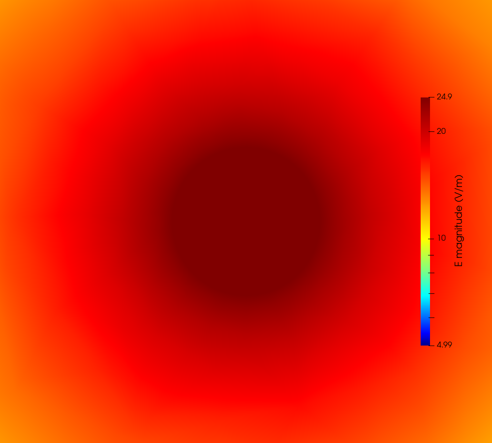

# Copper rod at 50 Hz

Hybrid A-Φ finite-element solver, tree-cotree gauge. A slender copper conductor
driven by a 1 V terminal voltage, validated against the exact axisymmetric
solution.

`regression_tests/02_Ansys_Cylinder_50Hz` · 240,990 unknowns · backward error 4.8e-21

---

## 0. How to read these figures

**Every figure here comes from one solve, on one mesh** — the Netgen-optimised
mesh in §1. "Netgen-optimised" is a property of that mesh, not a variant of any
individual plot: there is no unoptimised figure here to compare against. What
Netgen changed, and by how much, is in §2.1.

Only one pair differs in *processing* rather than in what it shows: §4.2 applies
one smoothing pass, and those are the only two images with a red banner burned
into them.

| section | what the figure is |
|---|---|
| §2 | cross-section mesh, whole domain and the wire alone |
| §3 | `Re(Φ)` and `\|Φ\|` on the wire's lateral surface |
| §4.1 | **nodal `\|B\|`, unsmoothed** — the solver's output |
| §4.2 | **the same data, one smoothing pass** — not solver output |
| §5.1 | **per-node `\|E\|`**, whole domain, log scale |
| §5.1.1 | where the nodal field is not to be trusted (no figure) |
| §5.2 | nodal `\|E\|` in the wire, auto range beside pinned range |
| §5.3 | `J` as coloured vectors, longitudinal cut |

---

## 1. The case

| | |
|---|---|
| Conductor | copper, `σ = 5.8e7 S/m`, `a = 1.5 mm`, `L = 40 mm`, a 40-gon |
| Domain | 40 mm cube of air, `n × A = 0` on the outer boundary |
| Excitation | 1.0 V top face, 0.0 V bottom face, 50 Hz |
| Skin depth | `δ = 9.346 mm`, so `a/δ = 0.1605` — no skin effect |
| Regime | `ωL/R = 0.0725`, resistance dominated, so Φ is readable |
| Formulation | first-order Whitney edge `A`, second-order P2 nodal `Φ` |
| Mesh | 18,994 nodes, 101,873 tets, **Netgen-optimised**, 0.25 mm at the surface, 0.4 mm in the core |
| Solve | 240,990 unknowns, 503 s, 4.03 GB |

`a/δ` and `ωL/R` are the same parameter, both scaling as `ω a²`. A case cannot
show a strong skin effect and a readable potential at once; this one takes the
resistive branch.

---

## 2. Mesh

| whole domain | the wire alone |
|---|---|
|  |  |

Graded from 0.25 mm at the conductor to 6 mm in the far air. The element budget
sits where the field is: **6.7 %** inside `r = 1 mm`, **84.8 %** in the band
`1.0–2.0 mm`, and **3.8 %** beyond `r = 3 mm`.

### 2.1 What Netgen optimisation bought

It changes element *shape* at fixed element size. Measured against the same mesh
generated without it — same geometry file, same sizes, only the flag changed:

| | without | with Netgen | |
|---|---|---|---|
| tets | 105,715 | 101,873 | CombineImprove merges elements |
| unknowns | 248,294 | 240,990 | |
| factorise | 681 s, 4.56 GB | **503 s, 4.03 GB** | 26 % faster, 12 % less memory |
| scatter at the peak | 0.0181 | **0.0138** | −24 % |
| scatter near the core | 0.0309 | **0.0210** | −32 % |
| azimuthal purity | 0.9996 | **0.9999** | |

Better-shaped elements give the sparse ordering less fill-in, so the quality
gain pays for itself twice. For comparison, the last *refinement* step bought
0.0215 → 0.0181 for 1.6× the unknowns and 2.8× the time. Netgen bought
0.0181 → 0.0138 for nothing.

---

## 3. Potential

Φ over the lateral surface of the wire, seen side on — not a cross-section,
because the potential is driven along the axis.

| `Re(Φ)` | magnitude |
|---|---|
|  |  |

Against the exact `z/L` over all 95,149 wire nodes: worst deviation **8.26e-04**,
mean **2.51e-04**. Φ is gauge dependent — a different spanning tree shifts it by
`−jωψ`, almost purely imaginary. `E`, `B`, `H` and `J` are not.

---

## 4. Magnetic flux density

### 4.1 The solver's output

Nodal `|B|`, mid-length cross-section, **no smoothing**. Linear colour scale — a
log ramp compresses the `1/r` decay into the top few colours and hides the ring
entirely. These are the figures to read numbers off.

| whole domain | zoomed to 3a |
|---|---|
|  |  |

Zero on the axis, rising linearly inside the conductor, falling as `1/r`
outside — the peak sits at `r = a`, 1.3385 T.

### 4.2 The same data with one smoothing pass

> **The only difference from §4.1 is one point-to-cell-to-point averaging round
> trip.** Same solve, same mesh, same colour map. Commercial tools smooth
> plotted fields by default, which is the leading explanation for why their
> `|B|` cross-sections look cleaner, so these exist to compare like with like.
> **They are not the solver's output**, and each carries a red banner saying so.

| smoothed, whole domain | smoothed, zoomed to 3a |
|---|---|
|  |  |

| | unsmoothed (§4.1) | 1 pass (§4.2) | 2 passes | 4 passes |
|---|---|---|---|---|
| scatter, `1.20–1.49 mm` | 0.0296 | 0.0183 | 0.0179 | 0.0225 |
| error, `1.20–1.49 mm` | −0.39 % | −1.84 % | −2.43 % | −3.48 % |
| displayed peak (T) | 1.3385 | 1.2954 | 1.2716 | 1.2387 |
| peak change | — | −3.2 % | −5.0 % | −7.5 % |

38 % less scatter for 3.2 % of the peak — a better trade than on the pre-Netgen
mesh, where it cost 6.2 % for 14 %. The bias still grows while the scatter stops
improving past one pass. Smoothing is not a route to a better answer; it is the
control needed to compare like with like if the reference picture is itself
smoothed.

---

## 5. Electric field

### 5.1 Whole domain, per node

| whole domain | zoomed to 3a |
|---|---|
|  |  |

The scale is logarithmic, `5 → 24.9 V/m`. The conductor is at the **top** of
that range, which is correct: `E` is largest inside the copper and decays
outward.

### 5.1.1 Where the nodal field is not to be trusted

The post-processor also writes a per-cell `E`, one constant value per
tetrahedron. It is not plotted here — it renders as a mosaic and reads badly —
but it is the reference the nodal field is checked against, because it is exact
at the material interface where the nodal field is not. Mean `|E|` by radius,
nodal against per cell:

| band (mm) | nodal | per cell | difference |
|---|---|---|---|
| 0.0 – 1.5 | 24.934 | 24.934 | 0.00 % |
| 1.5 – 2.0 | 29.972 | 37.882 | **−20.88 %** |
| 2.0 – 3.0 | 29.866 | 29.775 | +0.31 % |
| 3.0 – 5.0 | 21.507 | 21.493 | +0.06 % |
| 5.0 – 8.0 | 14.807 | 14.690 | +0.80 % |

> Inside the conductor the two agree exactly, and from `r = 2 mm` outward to
> better than 1 %. **Exactly one band differs — the one immediately outside the
> wire.** `E`'s *normal* component jumps at the material interface, so no single
> nodal value is correct there. The post-processor resolves the ambiguity by
> taking the higher-conductivity side, so every interface node carries the
> copper value, 24.93 V/m — but the air just outside genuinely carries
> 37.88 V/m, because a radial component appears there that the purely axial
> field inside does not have. `|E|` jumps **up** crossing into the air, so
> forcing the copper value onto those nodes makes that first band read
> **21 % low**, not high.
>
> 45,200 of 140,532 nodes (32.2 %) are flagged as interface nodes, all at
> `r = 1.4954–1.5000 mm`.

### 5.2 Inside the wire — and why the colours disagree with §5.1

| auto colour range | range pinned to 0–25 V/m |
|---|---|
|  |  |

> **This answers why the centre reads red in one figure and blue in the other.**
> Both show the same number, about 24.935 V/m, against colour ranges that differ
> by a factor of roughly 20,000.
>
> In §5.1 the range is `5 → 24.9 V/m` across the whole box, so the conductor
> sits at the top and renders dark red. In the left figure above, ParaView
> rescaled to the wire's *own* range — **24.9342 → 24.9351 V/m**, a total span of
> `9e-04 V/m`, or **0.004 %** of the value. Auto-rescaling blew that up to the
> full colour map, producing a red ring and blue core that look like a strong
> radial gradient and are in fact noise at the fifth significant figure.
>
> The right figure pins the range to `0–25 V/m` and the same data renders as a
> uniform disc — the physical truth. With `a/δ = 0.16` there is no skin effect
> and `E = V/L` uniformly. The exact value is 25.0 V/m; we are **0.26 %** low,
> consistent with the 40-gon being 0.41 % smaller in area than the circle it
> approximates.

### 5.3 Current density

`J = σE` inside the conductor, on a longitudinal slice — on a mid-length cut
every arrow points at the viewer and nothing is visible.

---

## 6. Validation

Nothing below fits a free parameter. The current follows from `R_dc` under the
1 V drive: `I = 10207.3 A`, `B(a) = 1.3610 T`.

| quantity | result |
|---|---|
| `R` | 9.796995e-05 Ω against 9.796863e-05 exact — **1.3e-05** |
| `L` from `Im(Z)/ω` | 22.60 nH |
| `J(0)/J(a)` | 0.999968 against the Bessel 0.999959 |
| `Φ` vs exact `z/L` | worst 8.26e-04, mean 2.51e-04 |
| `B` direction at the peak | azimuthal component 0.9999 of the total — **0.01 %** off |
| `B` inside the conductor | every band within **0.5 %** |

| band (mm) | mean, T | exact, T | error | azimuthal scatter |
|---|---|---|---|---|
| 0.30 – 0.60 | 0.4167 | 0.4163 | +0.24 % | 0.0477 |
| 0.60 – 0.90 | 0.6914 | 0.6884 | +0.40 % | 0.0309 |
| 0.90 – 1.20 | 0.9906 | 0.9929 | −0.22 % | 0.0210 |
| 1.20 – 1.49 | 1.2734 | 1.2722 | +0.10 % | 0.0138 |
| 1.49 – 2.00 | 1.2380 | 1.2633 | −1.99 % | 0.0307 |
| 2.00 – 3.00 | 0.8776 | 0.8869 | −1.15 % | 0.0559 |
| 3.00 – 5.00 | 0.5490 | 0.5601 | −2.01 % | 0.0768 |
| 5.00 – 8.00 | 0.3267 | 0.3349 | −2.37 % | 0.0868 |

Linear rise inside, `1/r` outside, correct absolute scale, over a 25× span in
radius. Inside the conductor every band is within 0.5 %.

---

## 7. Known limitations

- **Nodal `B` reads low in the far field — the figures in §4, not the numbers in
  §6.** `04`/`04b` plot the nodal array; §6 is computed from the per-cell array.
  Tested against the exact solution at each sample's own radius:

  | band (mm) | nodal error | per-cell error |
  |---|---|---|
  | 0.30 – 1.49 | −0.4 % to −1.5 % | +0.1 % to +0.4 % |
  | 1.49 – 2.00 | −4.29 % | −2.01 % |
  | 2.00 – 3.00 | −3.91 % | −1.10 % |
  | 3.00 – 5.00 | −6.15 % | −2.12 % |
  | 5.00 – 8.00 | **−7.50 %** | −2.19 % |

  Inside the conductor and at the peak both are within 1.5 %, so the 1.3385 T
  peak read off `04b` is sound. Beyond the wire the nodal colours under-read,
  reaching 7.5 % at the box wall. The likely cause, reasoned rather than
  separately measured: the nodal value is a volume-weighted average over each
  node's element patch, the mesh coarsens rapidly outward, and the patch is
  therefore dominated by the larger outer elements where `|B|` is smaller — the
  bias grows with radius as the grading steepens. Unlike `E`, `B` has **no**
  material-interface problem here, because `mu_r = 1` on both sides: the band
  that is `E`'s worst is `B`'s best, +0.58 % nodal against per cell.

- **Azimuthal scatter in `B` of 1.4–3.1 % near the conductor.** The problem is
  axisymmetric, so this is error. It is `O(h)` element noise from `B` being
  constant per tetrahedron — the lowest-order quantity in the formulation.

- **A coherent polygon harmonic is now visible, at 0.31 %.** Fourier analysis at
  `r = a` finds a peak at `m = 40`, the polygon order. No earlier mesh showed
  one — it was buried under element-quality noise, and Netgen removed enough of
  that to expose it. At 0.31 % against 1.4 % total scatter it is not what the
  eye sees, but it means raising `N` becomes worthwhile once quality noise falls
  further.

- **Far-field accuracy was traded for near-field resolution.** Beyond
  `r = 3 mm` the error is ~2 % against ~1 % on a uniformly-graded mesh. That
  band holds 3.8 % of the elements and does not affect `R`, `L` or the conductor
  fields.

- **Tried and rejected, all measured:** superconvergent patch recovery (made `B`
  more than twice as rough), plot smoothing (costs peak amplitude for modest
  gain), raising the polygon order alone (no effect on scatter, and slivers
  above `N = 48`), coarsening the far field further (a few per cent of the mesh
  to reclaim).

- **Uniform refinement is reaching its limit.** `lc_skin` 0.7 → 0.35 → 0.25 gave
  peak-band scatter 0.029 → 0.0215 → 0.0181, ratios ×0.74 and ×0.84 where `O(h)`
  allows ×0.50 and ×0.71. Netgen then took it to **0.0138 for free** — a larger
  gain than the last refinement step bought. Element *shape* was the cheaper
  lever all along.
