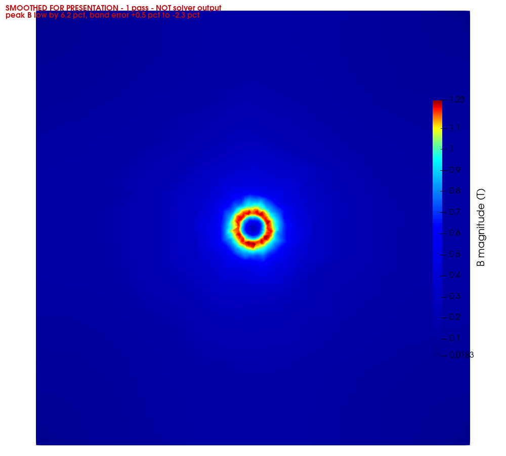
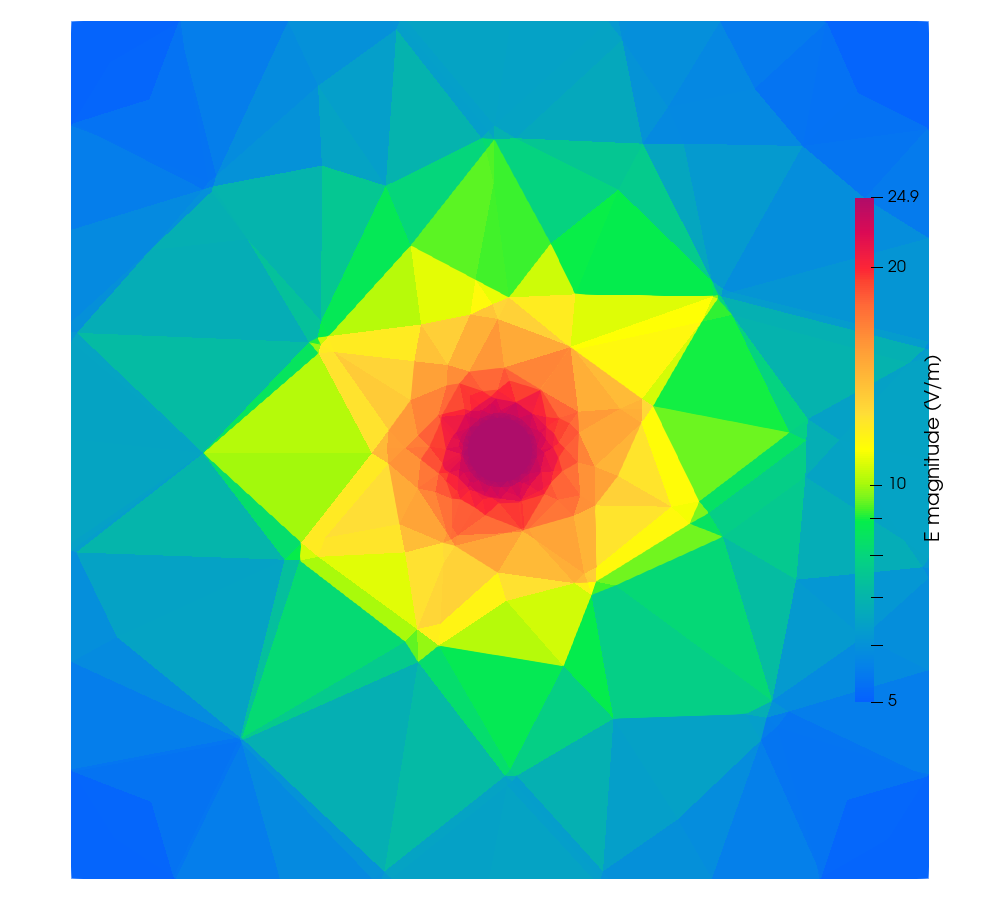
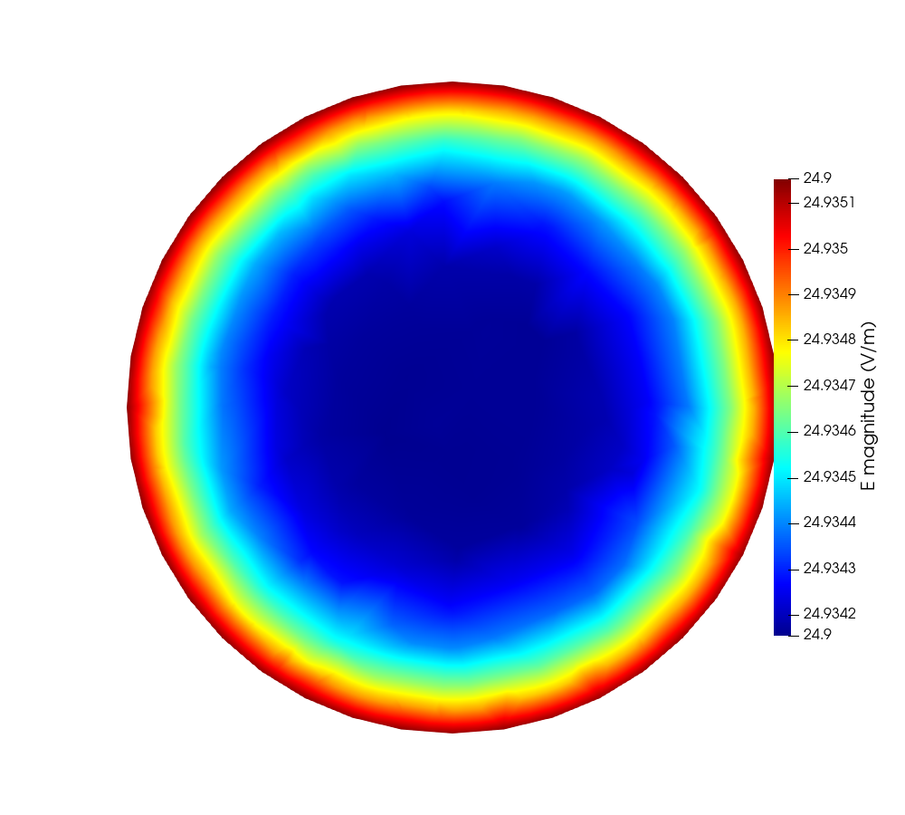

# 02_Ansys_Cylinder_50Hz — a slender copper cylinder at 50 Hz

A single copper rod driven by a 1 V terminal voltage, solved with the hybrid
A-Φ formulation and the tree-cotree gauge. Sized to match the regime of the
Ansys Maxwell A-Φ voltage example.

Regenerate every figure here with:

```bash
"C:\Program Files\ParaView 6.1.1\bin\pvbatch.exe" make_plots.py
```

---

## 1. Case

| | |
|---|---|
| conductor | copper, `sigma = 5.8e7 S/m`, `a = 1.5 mm`, `L = 40 mm`, a 40-gon |
| domain | 40 mm cube of air, `n x A = 0` on the outer boundary (flux tangential) |
| excitation | 1.0 V on the top face, 0.0 V on the bottom |
| frequency | 50 Hz |
| skin depth | `delta = 9.346 mm`, so `a/delta = 0.1605` — **no skin effect** |
| regime | `omega*L/R = 0.0724`, resistance dominated, so `Phi` is readable |
| formulation | first-order Whitney edge `A`, second-order P2 nodal `Phi` |
| mesh | 18804 nodes, 105715 tets, 0.25 mm at the conductor surface, 0.4 mm in its core |
| solve | 248294 unknowns, 681 s, 4.56 GB, backward error 2.8e-21 |

`a/delta` and `omega*L/R` are the same parameter, both scaling as `omega*a^2`.
A case cannot show a strong skin effect and a readable potential at once; this
one takes the resistive branch.

---

## 2. Mesh

| whole domain | the wire alone |
|---|---|
|  |  |

Graded from 0.25 mm at the conductor surface to 6 mm in the far air. The
element budget is heavily concentrated where the field is: **8.9 %** inside
`r = 1 mm`, **78.5 %** in the band `1.0–2.0 mm`, and only **2.5 %** beyond
`r = 3 mm`.

---

## 3. Potential

`Phi` over the lateral surface of the wire, seen side on — not a cross-section,
because the potential is driven along the axis.

| `Re(Phi)` | `|Phi|` |
|---|---|
|  |  |

A clean `z/L` gradient from 0 to 1 V. Against the exact `z/L` over all 98003
wire nodes: worst deviation **1.18e-03**, mean **2.48e-04**.

`Phi` is gauge dependent — a different spanning tree shifts it by `-j*omega*psi`,
almost purely imaginary. `E`, `B`, `H` and `J` are not.

---

## 4. Magnetic flux density

Mid-length cross-section. Linear colour scale: a log ramp compresses the `1/r`
decay into the top few colours and hides the ring entirely.

| whole domain | zoomed to 3a |
|---|---|
|  |  |

Zero on the axis, rising linearly inside the conductor, falling as `1/r`
outside — the peak sits at `r = a`.

### 4.1 Smoothed variant, for comparison only

Commercial tools smooth plotted fields by default, which is the leading
explanation for why their `|B|` cross-sections look cleaner. These apply one
smoothing pass so a like-for-like comparison can be made. **They are not the
solver's output** and each carries a banner saying so.

| honest default | smoothed, 1 pass |
|---|---|
|  |  |
|  |  |

Measured cost of that one pass:

| | unsmoothed | 1 pass | 2 passes | 4 passes |
|---|---|---|---|---|
| scatter, `1.20–1.49 mm` | 0.0277 | 0.0238 | 0.0255 | 0.0280 |
| error, `1.20–1.49 mm` | +0.54 % | −2.33 % | −3.76 % | −5.69 % |
| displayed peak (T) | 1.3322 | 1.2502 | 1.2226 | 1.1886 |
| | | −6.2 % | −8.2 % | −10.8 % |

14 % less scatter for 6.2 % of the peak, and the bias keeps growing while the
scatter stops improving past one pass. **Read numbers off the unsmoothed
figures.** Smoothing is not a route to a better answer — it is the control
needed to compare like with like if the reference picture is itself smoothed.

---

## 5. Electric field and current density

| `|E|`, whole domain | `|E|` inside the wire |
|---|---|
|  |  |

`E` is uniform inside the conductor at `V/L = 25 V/m` — there is no skin effect
at `a/delta = 0.16`. It is also one order smoother than `B`: `E = -j*omega*A -
grad(Phi)` is *linear* per tet because `grad(Phi)` comes from the P2 space,
while `B = curl A` is *constant* per tet. That is the whole reason `B` plots
rougher than `E`, in this code and in any other first-order edge-element code.


`J = sigma*E` inside the conductor, drawn on a longitudinal slice — on a
mid-length cut every arrow points at the viewer and nothing is visible.

---

## 6. Validation

Nothing below fits a free parameter. The current follows from `R_dc` under the
1 V drive: `I = 10207.3 A`, `B(a) = 1.3610 T`.

| quantity | result |
|---|---|
| `R` | 9.796996e-05 ohm against 9.796863e-05 DC exact, **1.4e-05** |
| `L` from `Im(Z)/omega` | 22.58 nH |
| `J(0)/J(a)` | 0.999969 against the Bessel 0.999959 |
| `Phi` vs exact `z/L` | worst 1.18e-03, mean 2.48e-04, over 98003 wire nodes |
| `Phi` at `\|z − L/2\| < 1 um` | 83 nodes, mean 0.499993, spread 3.40e-04 |
| `B` direction | `\|B_phi\|/\|B\| = 0.9996` — azimuthal to 0.04 % |
| `B` vs exact, inside the conductor | every band within **1 %** |

`|B|` against the exact axisymmetric solution, by radius:

| band (mm) | `<\|B\|>` T | exact T | error | azimuthal scatter |
|---|---|---|---|---|
| 0.30 – 0.60 | 0.4107 | 0.4107 | −0.11 % | 0.0716 |
| 0.60 – 0.90 | 0.6980 | 0.6928 | +0.92 % | 0.0389 |
| 0.90 – 1.20 | 0.9584 | 0.9593 | −0.16 % | 0.0309 |
| 1.20 – 1.49 | 1.2409 | 1.2459 | −0.35 % | 0.0181 |
| 1.49 – 2.00 | 1.1865 | 1.2164 | −2.35 % | 0.0352 |
| 2.00 – 3.00 | 0.8656 | 0.8802 | −1.64 % | 0.0511 |
| 3.00 – 5.00 | 0.5543 | 0.5676 | −2.33 % | 0.0751 |
| 5.00 – 8.00 | 0.3257 | 0.3363 | −3.17 % | 0.0927 |

Linear rise inside, `1/r` outside, correct absolute scale, over a 25× span in
radius.

---

## 7. Known limitations

**Azimuthal scatter in `B` of 1.8–2.8 % at the peak.** The problem is
axisymmetric, so this is error. It is `O(h)` element noise from `B` being
constant per tetrahedron. Fourier analysis of 14374 samples around the azimuth
finds **no coherent structure above 0.11 %** and no harmonic at the polygon
order, at any refinement level or polygon count tested — the visible star is
incoherent per-element scatter that the eye organises into a pattern.

**Far-field accuracy was traded for near-field resolution.** Beyond `r = 3 mm`
the error is ~2–3 % against ~1 % on a uniformly-graded mesh. That band holds
2.5 % of the elements and does not affect `R`, `L` or the conductor fields, but
it does degrade `tools/pv_ampere.py`.

**What was tried and did not work**, all measured and documented in
`docs/FIELD_POSTPROCESSING.md`: superconvergent patch recovery (made `B` more
than twice as rough), plot smoothing (costs peak amplitude for modest gain),
raising the polygon order (no effect on scatter, and slivers above `N = 48`),
and coarsening the far field further (at most 2.5 % of the mesh to reclaim).

**Refinement is reaching its limit.** `lc_skin` 0.7 → 0.35 → 0.25 gave
peak-band scatter 0.029 → 0.0215 → 0.0181, ratios ×0.74 and ×0.84 where `O(h)`
allows ×0.50 and ×0.71. Going further needs a solver holding more than the
~250k unknowns this direct factorisation manages.
