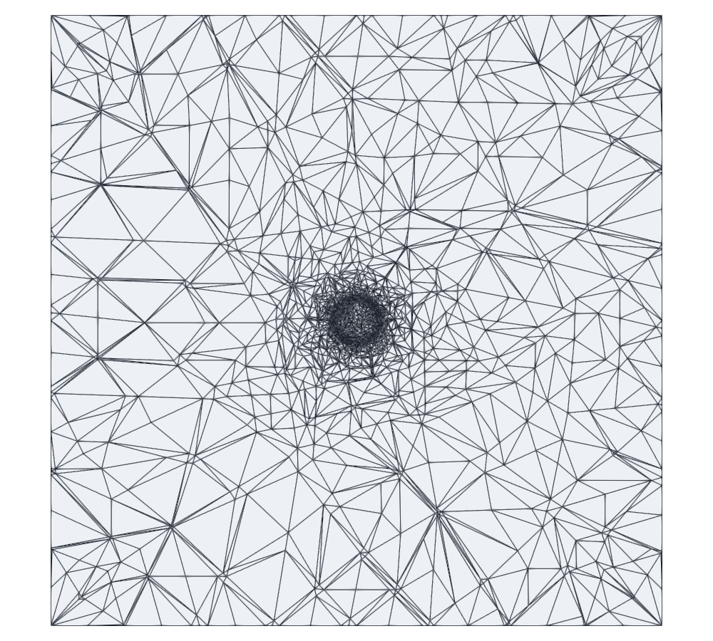
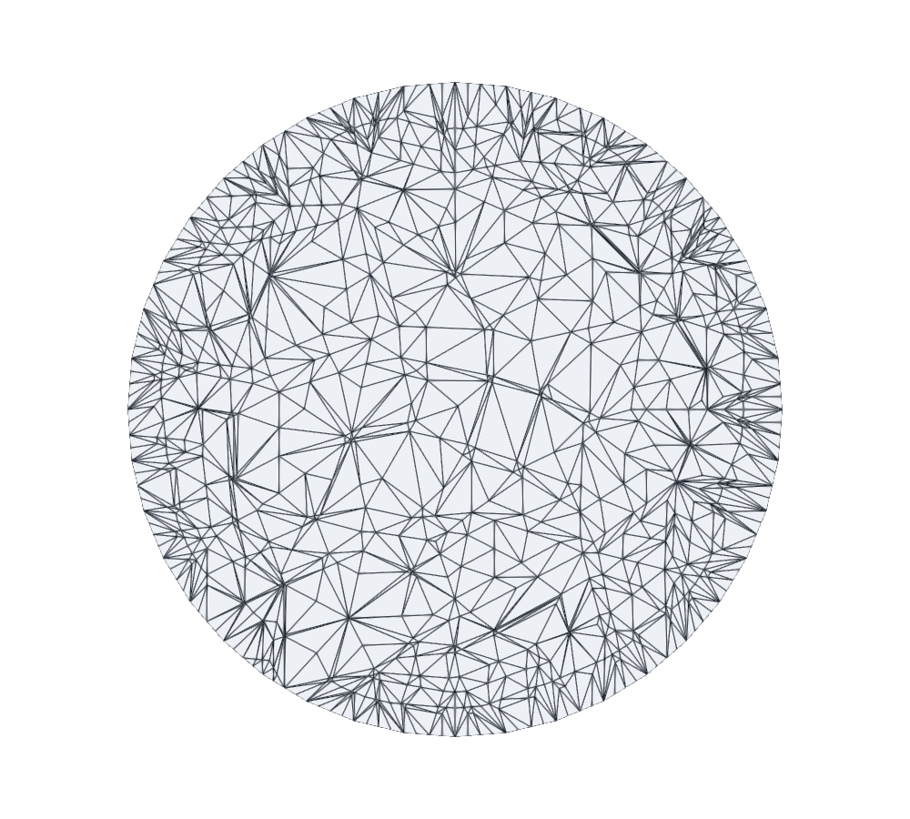
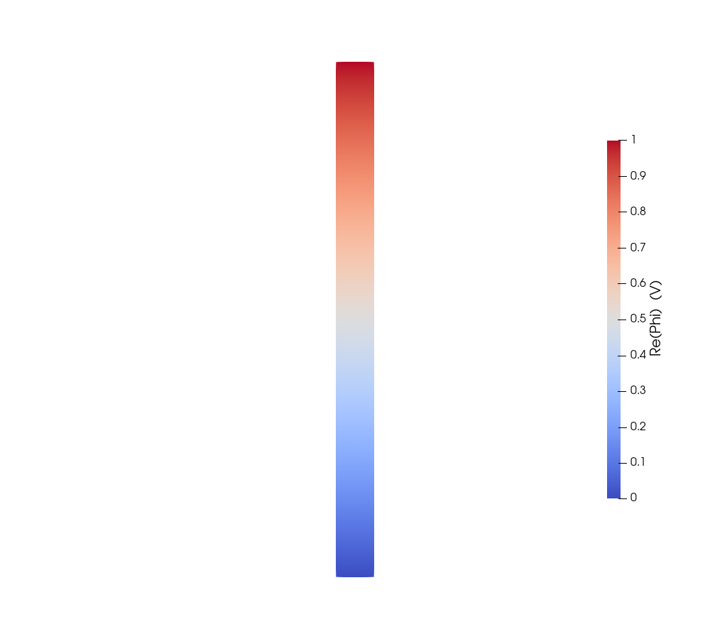
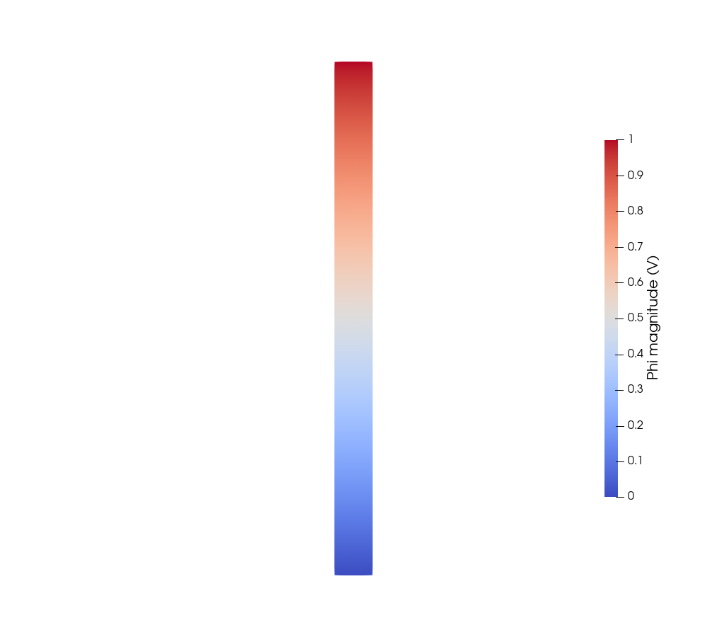
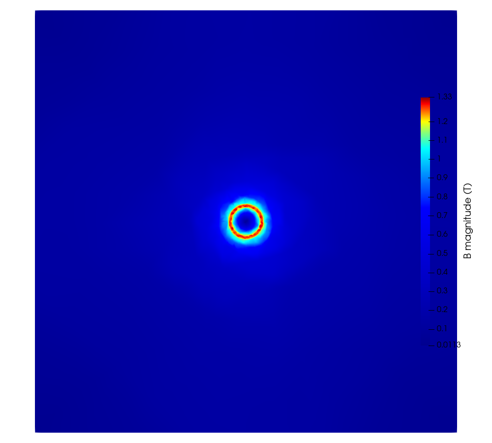
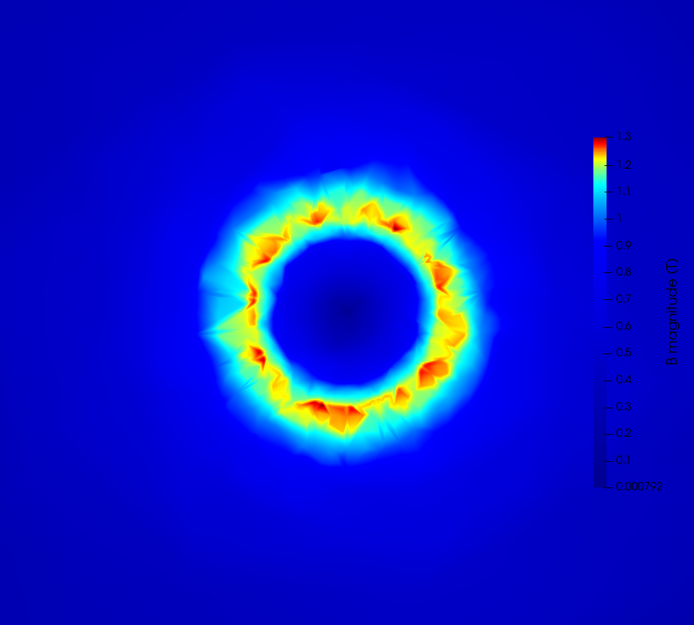
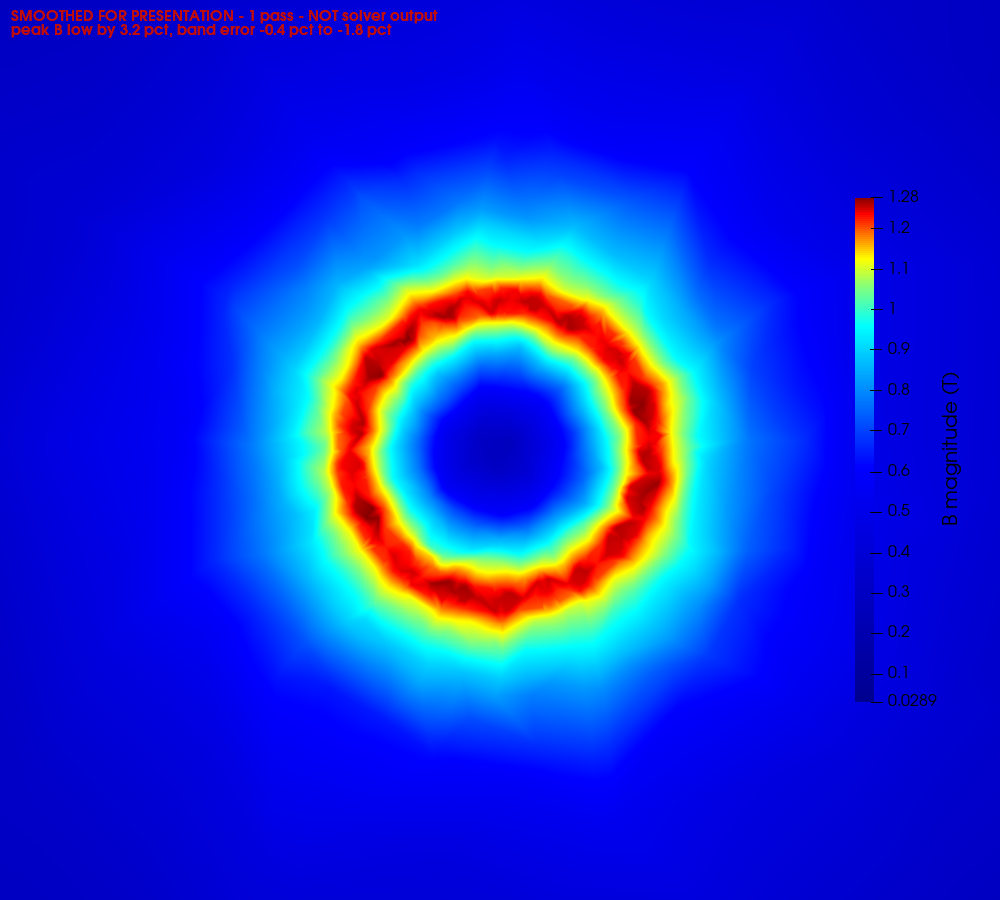
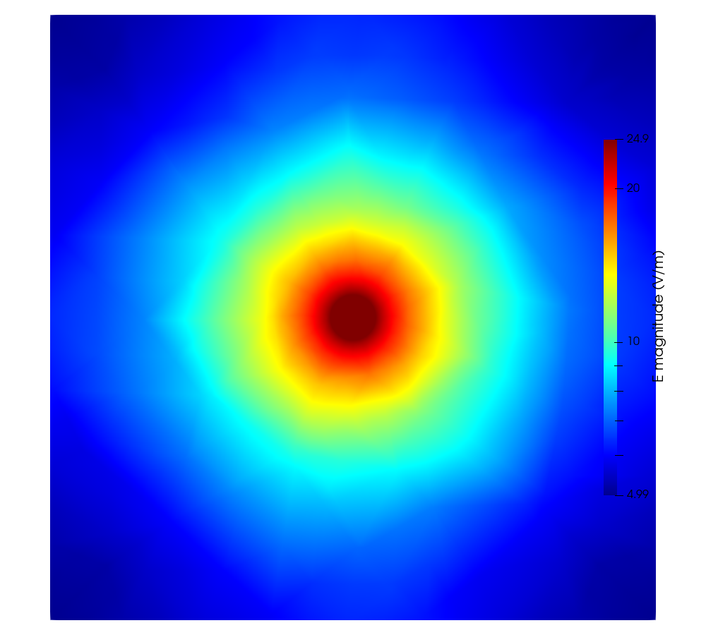
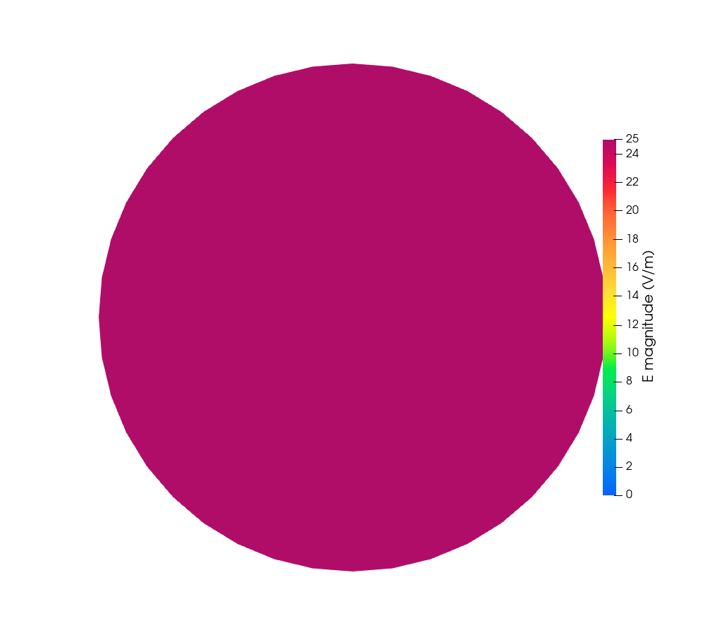
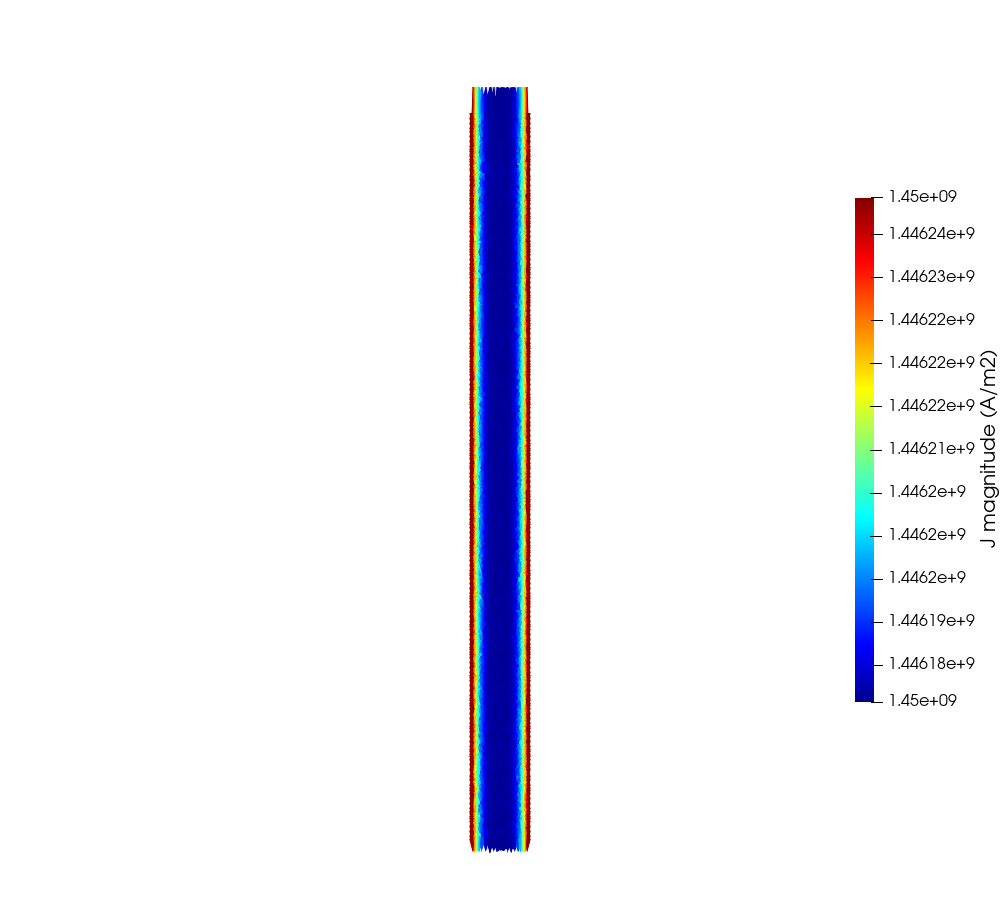

# 02_Ansys_Cylinder_50Hz — a slender copper cylinder at 50 Hz

A single copper rod driven by a 1 V terminal voltage, solved with the hybrid
A-Φ formulation and the tree-cotree gauge. Sized to match the regime of the
Ansys Maxwell A-Φ voltage example.

Regenerate every figure here with:

```bash
"C:\Program Files\ParaView 6.1.1\bin\pvbatch.exe" make_plots.py
"C:\Program Files\ParaView 6.1.1\bin\pvbatch.exe" pv_bcell.py     # 09_* only
```

---

## 0. How to read these figures

**| `05_E_magnitude.png` | **per-cell** `|E|`, whole domain, log scale | `make_plots.py` |
| `05c_E_magnitude_nodal.png` | **per-node** `|E|`, whole domain, log scale | `make_plots.py` |
| `05d_E_magnitude_nodal_zoom.png` | the same, zoomed to `3a` | `make_plots.py` |very figure in this report comes from one single solve, on one mesh** — the
Netgen-optimised mesh described in §1. "Netgen-optimised" is a property of that
mesh, not a variant of any individual plot: there is no unoptimised figure here
to compare against. What Netgen changed, and by how much, is in §2.

Only one figure pair differs in *processing* rather than in what it shows: §4.2
applies one smoothing pass, and those two files are the only ones with
`_SMOOTH| `05_E_magnitude.png` | **per-cell** `|E|`, whole domain, log scale | `make_plots.py` |
| `05c_E_magnitude_nodal.png` | **per-node** `|E|`, whole domain, log scale | `make_plots.py` |
| `05d_E_magnitude_nodal_zoom.png` | the same, zoomed to `3a` | `make_plots.py` |D` in the name and a red banner burned into the image.

| file | what it is | script |
|---|---|---|
| `01_mesh_domain.png` | mesh, whole cross-section | `make_plots.py` |
| `02_mesh_wire.png` | mesh, the wire alone | `make_plots.py` |
| `03_phi_on_surface.png` | `Re(Phi)` on the wire's lateral surface | `make_plots.py` |
| `03b_phi_magnitude_surface.png` | `\|Phi\|`, same view | `make_plots.py` |
| `04_B_magnitude.png` | **nodal** `\|B\|`, whole domain, **unsmoothed** | `make_plots.py` |
| `04b_B_magnitude_zoom.png` | the same, zoomed to `3a` | `make_plots.py` |
| `05_E_magnitude.png` | **per-cell** `|E|`, whole domain, log scale | `make_plots.py` |
| `05c_E_magnitude_nodal.png` | **per-node** `|E|`, whole domain, log scale | `make_plots.py` |
| `05d_E_magnitude_nodal_zoom.png` | the same, zoomed to `3a` | `make_plots.py` |\|E\|`, whole domain, log scale | `make_plots.py` |
| `05b_| `05_E_magnitude.png` | **per-cell** `|E|`, whole domain, log scale | `make_plots.py` |
| `05c_E_magnitude_nodal.png` | **per-node** `|E|`, whole domain, log scale | `make_plots.py` |
| `05d_E_magnitude_nodal_zoom.png` | the same, zoomed to `3a` | `make_plots.py` |_magnitude_zoom.png` | the same, zoomed to `3a` | `make_plots.py` |
| `06_| `05_E_magnitude.png` | **per-cell** `|E|`, whole domain, log scale | `make_plots.py` |
| `05c_E_magnitude_nodal.png` | **per-node** `|E|`, whole domain, log scale | `make_plots.py` |
| `05d_E_magnitude_nodal_zoom.png` | the same, zoomed to `3a` | `make_plots.py` |_in_wire.png` | nodal `\|E\|` in the wire, **auto colour range** | `make_plots.py` |
| `06b_| `05_E_magnitude.png` | **per-cell** `|E|`, whole domain, log scale | `make_plots.py` |
| `05c_E_magnitude_nodal.png` | **per-node** `|E|`, whole domain, log scale | `make_plots.py` |
| `05d_E_magnitude_nodal_zoom.png` | the same, zoomed to `3a` | `make_plots.py` |_in_wire_true_scale.png` | the same data, range pinned `0–25 V/m` | `make_plots.py` |
| `07_J_vectors.png` | `J` as coloured vectors, longitudinal cut | `make_plots.py` |
| `08_B_magnitude_SMOOTH| `05_E_magnitude.png` | **per-cell** `|E|`, whole domain, log scale | `make_plots.py` |
| `05c_E_magnitude_nodal.png` | **per-node** `|E|`, whole domain, log scale | `make_plots.py` |
| `05d_E_magnitude_nodal_zoom.png` | the same, zoomed to `3a` | `make_plots.py` |D.png` | **04 with one smoothing pass** | `make_plots.py` |
| `08b_B_magnitude_zoom_SMOOTH| `05_E_magnitude.png` | **per-cell** `|E|`, whole domain, log scale | `make_plots.py` |
| `05c_E_magnitude_nodal.png` | **per-node** `|E|`, whole domain, log scale | `make_plots.py` |
| `05d_E_magnitude_nodal_zoom.png` | the same, zoomed to `3a` | `make_plots.py` |D.png` | **04b with one smoothing pass** | `make_plots.py` |
| `09*_B_cell_*` / `09*_B_nodal_*` | per-cell vs nodal `B`, banded and continuous | `pv_bcell.py` |

The `09_*` set is a separate study — it shows what the volume-averaging step in
the post-processor does, by rendering the raw per-tetrahedron `B` beside the
nodal one. It is not part of the validation and is documented in
`docs/FI| `05_E_magnitude.png` | **per-cell** `|E|`, whole domain, log scale | `make_plots.py` |
| `05c_E_magnitude_nodal.png` | **per-node** `|E|`, whole domain, log scale | `make_plots.py` |
| `05d_E_magnitude_nodal_zoom.png` | the same, zoomed to `3a` | `make_plots.py` |LD_POSTPROCESSING.md`.

---

## 1. Case

| | |
|---|---|
| conductor | copper, `sigma = 5.8e7 S/m`, `a = 1.5 mm`, `L = 40 mm`, a 40-gon |
| domain | 40 mm cube of air, `n x A = 0` on the outer boundary (flux tangential) |
| excitation | 1.0 V on the top face, 0.0 V on the bottom |
| frequency | 50 Hz |
| skin depth | `delta = 9.346 mm`, so `a/delta = 0.1605` — **no skin effect** |
| regime | `omega*L/R = 0.0725`, resistance dominated, so `Phi` is readable |
| formulation | first-order Whitney edge `A`, second-order P2 nodal `Phi` |
| mesh | 18994 nodes, 101873 tets, **Netgen-optimised**, 0.25 mm at the surface, 0.4 mm in the core |
| solve | 240990 unknowns, 503 s, 4.03 GB, backward error 4.8e-21 |

`a/delta` and `omega*L/R` are the same parameter, both scaling as `omega*a^2`.
A case cannot show a strong skin effect and a readable potential at once; this
one takes the resistive branch.

---

## 2. Mesh

| whole domain | the wire alone |
|---|---|
|  |  |

Graded from 0.25 mm at the conductor surface to 6 mm in the far air, then
optimised with Netgen. The element budget is heavily concentrated where the
field is: **6.7 %** inside `r = 1 mm`, **84.8 %** in the band `1.0–2.0 mm`, and
**3.8 %** beyond `r = 3 mm`.

### What `Mesh.OptimizeNetgen = 1` bought

It changes element *shape* at fixed element size. Measured against the same
mesh generated without it — same `.geo`, same sizes, only the flag changed:

| | without Netgen | with Netgen | |
|---|---|---|---|
| tets | 105715 | 101873 | `CombineImprove` merges elements |
| unknowns | 248294 | 240990 | |
| `nnz(L)` | 239 M | 211 M | |
| factorise | 681 s, 4.56 GB | **503 s, 4.03 GB** | 26 % faster, 12 % less memory |
| scatter at the peak | 0.0181 | **0.0138** | −24 % |
| scatter near the core | 0.0309 | **0.0210** | −32 % |
| `\|B_phi\|/\|B\|` | 0.9996 | **0.9999** | |
| band errors | — | better in 6 of 8 | |

Better-shaped elements give the sparse ordering less fill-in, so the quality
gain pays for itself twice. For comparison, the last *refinement* step
(`lc_skin` 0.35 → 0.25) bought 0.0215 → 0.0181 for 1.6× the unknowns and 2.8×
the factorisation time. Netgen bought 0.0181 → 0.0138 for nothing.

---

## 3. Potential

`Phi` over the lateral surface of the wire, seen side on — not a cross-section,
because the potential is driven along the axis.

| `Re(Phi)` | magnitude |
|---|---|
|  |  |

A clean `z/L` gradient from 0 to 1 V. Against the exact `z/L` over all 95149
wire nodes: worst deviation **8.26e-04**, mean **2.51e-04**.

`Phi` is gauge dependent — a different spanning tree shifts it by `-j*omega*psi`,
almost purely imaginary. `| `05_E_magnitude.png` | **per-cell** `|E|`, whole domain, log scale | `make_plots.py` |
| `05c_E_magnitude_nodal.png` | **per-node** `|E|`, whole domain, log scale | `make_plots.py` |
| `05d_E_magnitude_nodal_zoom.png` | the same, zoomed to `3a` | `make_plots.py` |`, `B`, `H` and `J` are not.

---

## 4. Magnetic flux density

### 4.1 The solver's output

Nodal `|B|`, mid-length cross-section, **no smoothing**. Linear colour scale: a
log ramp compresses the `1/r` decay into the top few colours and hides the ring
entirely. These are the figures to read numbers off.

| whole domain | zoomed to 3a |
|---|---|
|  |  |

Zero on the axis, rising linearly inside the conductor, falling as `1/r`
outside — the peak sits at `r = a`.

### 4.2 The same data with one smoothing pass

**The only difference from §4.1 is one point↔cell averaging round trip.** Same
solve, same mesh, same colour map. Commercial tools smooth plotted fields by
default, which is the leading explanation for why their `|B|` cross-sections
look cleaner, so these exist to compare like with like. **They are not the
solver's output**, and each carries a red banner in the image saying so.

| smoothed, whole domain | smoothed, zoomed to 3a |
|---|---|
|  |  |

Measured cost of that one pass:

| | unsmoothed (§4.1) | 1 pass (§4.2) | 2 passes | 4 passes |
|---|---|---|---|---|
| scatter, `1.20–1.49 mm` | 0.0296 | 0.0183 | 0.0179 | 0.0225 |
| error, `1.20–1.49 mm` | −0.39 % | −1.84 % | −2.43 % | −3.48 % |
| displayed peak (T) | 1.3385 | 1.2954 | 1.2716 | 1.2387 |
| peak change | — | −3.2 % | −5.0 % | −7.5 % |

38 % less scatter for 3.2 % of the peak — a better trade than on the pre-Netgen
mesh, where it cost 6.2 % for 14 %. The bias still grows while the scatter stops
improving past one pass. Smoothing is not a route to a better answer; it is the
control needed to compare like with like if the reference picture is itself
smoothed. `SMOOTH_PASS| `05_E_magnitude.png` | **per-cell** `|E|`, whole domain, log scale | `make_plots.py` |
| `05c_E_magnitude_nodal.png` | **per-node** `|E|`, whole domain, log scale | `make_plots.py` |
| `05d_E_magnitude_nodal_zoom.png` | the same, zoomed to `3a` | `make_plots.py` |S` in `make_plots.py` stays **0**.

---

## 5. | `05_E_magnitude.png` | **per-cell** `|E|`, whole domain, log scale | `make_plots.py` |
| `05c_E_magnitude_nodal.png` | **per-node** `|E|`, whole domain, log scale | `make_plots.py` |
| `05d_E_magnitude_nodal_zoom.png` | the same, zoomed to `3a` | `make_plots.py` |lectric field

### 5.1 Whole domain — per cell and per node

| per cell (`05`) | **per node** (`05c`) |
|---|---|
|  |  |

Both are the same solve on the same mesh, same log scale `5 → 24.9 V/m`. The
conductor is at the **top** of that range, which is correct: `| `05_E_magnitude.png` | **per-cell** `|E|`, whole domain, log scale | `make_plots.py` |
| `05c_E_magnitude_nodal.png` | **per-node** `|E|`, whole domain, log scale | `make_plots.py` |
| `05d_E_magnitude_nodal_zoom.png` | the same, zoomed to `3a` | `make_plots.py` |` is largest
inside the copper and decays outward.

**The per-cell figure is faceted by construction.** `| `05_E_magnitude.png` | **per-cell** `|E|`, whole domain, log scale | `make_plots.py` |
| `05c_E_magnitude_nodal.png` | **per-node** `|E|`, whole domain, log scale | `make_plots.py` |
| `05d_E_magnitude_nodal_zoom.png` | the same, zoomed to `3a` | `make_plots.py` |` is piecewise-linear per
tetrahedron, so ParaView renders one flat colour per cell, and the far-field
mesh is coarse by design — only 3.8 % of elements sit beyond `r = 3 mm`.

**The nodal figure is far smoother, and it is also faithful — except in one
band.** Mean `|| `05_E_magnitude.png` | **per-cell** `|E|`, whole domain, log scale | `make_plots.py` |
| `05c_E_magnitude_nodal.png` | **per-node** `|E|`, whole domain, log scale | `make_plots.py` |
| `05d_E_magnitude_nodal_zoom.png` | the same, zoomed to `3a` | `make_plots.py` ||` by radius, nodal against per cell:

| band (mm) | nodal | per cell | difference |
|---|---|---|---|
| 0.0 – 1.5 | 24.934 | 24.934 | 0.00 % |
| 1.5 – 2.0 | 29.972 | 37.882 | **−20.88 %** |
| 2.0 – 3.0 | 29.866 | 29.775 | +0.31 % |
| 3.0 – 5.0 | 21.507 | 21.493 | +0.06 % |
| 5.0 – 8.0 | 14.807 | 14.690 | +0.80 % |

Inside the conductor the two agree exactly, and from `r = 2 mm` outward they
agree to better than 1 %. **The single bad band is the one immediately outside
the wire**, and the reason is the material interface: `| `05_E_magnitude.png` | **per-cell** `|E|`, whole domain, log scale | `make_plots.py` |
| `05c_E_magnitude_nodal.png` | **per-node** `|E|`, whole domain, log scale | `make_plots.py` |
| `05d_E_magnitude_nodal_zoom.png` | the same, zoomed to `3a` | `make_plots.py` |`'s *normal* component
jumps there, so no single nodal value is correct. `compute_fields` resolves the
ambiguity by taking the higher-conductivity side, so every interface node
carries the copper value, 24.93 V/m — but the air just outside genuinely
carries 37.88 V/m, because a radial component appears there that the purely
axial field inside does not have. `|| `05_E_magnitude.png` | **per-cell** `|E|`, whole domain, log scale | `make_plots.py` |
| `05c_E_magnitude_nodal.png` | **per-node** `|E|`, whole domain, log scale | `make_plots.py` |
| `05d_E_magnitude_nodal_zoom.png` | the same, zoomed to `3a` | `make_plots.py` ||` jumps **up** crossing into the air, and
forcing the copper value onto those nodes makes that first band read **21 %
low**, not high.

45200 of 140532 nodes (32.2 %) are flagged `material_interface`, all at
`r = 1.4954–1.5000 mm`. Use the per-cell figure when the value at the surface
matters; use the nodal one when the overall picture does. `05b`/`05d` are the
same pair zoomed to `3a`.

### 5.2 Inside the wire — and why the colours disagree with §5.1

| auto colour range | range pinned to 0–25 V/m |
|---|---|
|  |  |

**This is the answer to "why is the centre red in one figure and blue in the
other".** The two figures show the same number, ~24.935 V/m, against colour
ranges that differ by a factor of about 20000.

In §5.1 the range is `5 → 24.9 V/m` across the whole box, so the conductor sits
at the top and renders dark red. In `06` ParaView rescaled to the wire's *own*
range, which is **24.9342 → 24.9351 V/m** — a total span of `9e-04 V/m`, or
**0.004 %** of the value. Auto-rescaling blew that up to the full colour map,
producing a red ring and a blue core that look like a strong radial gradient and
are in fact numerical noise at the fifth significant figure.

`06b` pins the range to `0–25 V/m` and the same data renders as a uniform disc,
which is the physical truth: with `a/delta = 0.16` there is no skin effect, and
`| `05_E_magnitude.png` | **per-cell** `|E|`, whole domain, log scale | `make_plots.py` |
| `05c_E_magnitude_nodal.png` | **per-node** `|E|`, whole domain, log scale | `make_plots.py` |
| `05d_E_magnitude_nodal_zoom.png` | the same, zoomed to `3a` | `make_plots.py` | = V/L = 24.935 V/m` uniformly. The exact value is `1/0.040 = 25.0 V/m`; we
are **0.26 %** low, consistent with the polygon being 0.41 % smaller in area
than the circle it approximates.

So the two figures are not inconsistent. `06` is the one that misleads, and it
is kept only because the noise structure is occasionally worth seeing.

### 5.3 Current density



`J = sigma*| `05_E_magnitude.png` | **per-cell** `|E|`, whole domain, log scale | `make_plots.py` |
| `05c_E_magnitude_nodal.png` | **per-node** `|E|`, whole domain, log scale | `make_plots.py` |
| `05d_E_magnitude_nodal_zoom.png` | the same, zoomed to `3a` | `make_plots.py` |` inside the conductor, drawn on a longitudinal slice — on a
mid-length cut every arrow points at the viewer and nothing is visible.

---

## 6. Validation

Nothing below fits a free parameter. The current follows from `R_dc` under the
1 V drive: `I = 10207.3 A`, `B(a) = 1.3610 T`.

| quantity | result |
|---|---|
| `R` | 9.796995e-05 ohm against 9.796863e-05 DC exact, **1.3e-05** |
| `L` from `Im(Z)/omega` | 22.60 nH |
| `J(0)/J(a)` | 0.999968 against the Bessel 0.999959 |
| `Phi` vs exact `z/L` | worst 8.26e-04, mean 2.51e-04, over 95149 wire nodes |
| `Phi` at mid height | 84 nodes within 1 um, mean 0.499996, spread 6.02e-04 |
| `B` direction at the peak | azimuthal component 0.9999 of the total — **0.01 %** off |
| `B` vs exact, inside the conductor | every band within **0.5 %** |

`|B|` against the exact axisymmetric solution, by radius:

| band (mm) | mean, T | exact, T | error | azimuthal scatter |
|---|---|---|---|---|
| 0.30 – 0.60 | 0.4167 | 0.4163 | +0.24 % | 0.0477 |
| 0.60 – 0.90 | 0.6914 | 0.6884 | +0.40 % | 0.0309 |
| 0.90 – 1.20 | 0.9906 | 0.9929 | −0.22 % | 0.0210 |
| 1.20 – 1.49 | 1.2734 | 1.2722 | +0.10 % | 0.0138 |
| 1.49 – 2.00 | 1.2380 | 1.2633 | −1.99 % | 0.0307 |
| 2.00 – 3.00 | 0.8776 | 0.8869 | −1.15 % | 0.0559 |
| 3.00 – 5.00 | 0.5490 | 0.5601 | −2.01 % | 0.0768 |
| 5.00 – 8.00 | 0.3267 | 0.3349 | −2.37 % | 0.0868 |

Linear rise inside, `1/r` outside, correct absolute scale, over a 25x span in
radius. Inside the conductor every band is within 0.5 %.

---

## 7. Known limitations

**Azimuthal scatter in `B` of 1.4–3.1 % near the conductor.** The problem is
axisymmetric, so this is error. It is `O(h)` element noise from `B` being
constant per tetrahedron — the lowest-order quantity in the formulation.

**A coherent polygon harmonic is now visible, at 0.31 %.** Fourier analysis of
the azimuthal profile at `r = a` finds a peak at `m = 40`, the polygon order.
On every earlier mesh no such peak existed: it was buried under element-quality
noise, and Netgen removed enough of that to expose it. At 0.31 % of the mean
against 1.4 % total scatter it is not what the eye sees, but it means that if
quality noise falls further, raising `N` finally becomes worthwhile — with
`lc_skin` lowered in step, so the facet stays comparable to the volume size.

**Far-field accuracy was traded for near-field resolution.** Beyond `r = 3 mm`
the error is ~2 % against ~1 % on a uniformly-graded mesh. That band holds
3.8 % of the elements and does not affect `R`, `L` or the conductor fields, but
it does degrade `tools/pv_ampere.py`.

**What was tried and did not work**, all measured and documented in
`docs/FI| `05_E_magnitude.png` | **per-cell** `|E|`, whole domain, log scale | `make_plots.py` |
| `05c_E_magnitude_nodal.png` | **per-node** `|E|`, whole domain, log scale | `make_plots.py` |
| `05d_E_magnitude_nodal_zoom.png` | the same, zoomed to `3a` | `make_plots.py` |LD_POSTPROCESSING.md`: superconvergent patch recovery (made `B` more
than twice as rough), plot smoothing (costs peak amplitude for modest gain),
raising the polygon order alone (no effect on scatter, and slivers above
`N = 48`), and coarsening the far field further (at most a few per cent of the
mesh to reclaim).

**Uniform refinement is reaching its limit.** `lc_skin` 0.7 → 0.35 → 0.25 gave
peak-band scatter 0.029 → 0.0215 → 0.0181, ratios x0.74 and x0.84 where `O(h)`
allows x0.50 and x0.71. Netgen then took it to 0.0138 for free, which is a
larger gain than the last refinement step bought — element *shape* was the
cheaper lever all along. Going further by refinement alone needs a solver
holding more than the ~250k unknowns this direct factorisation manages.
