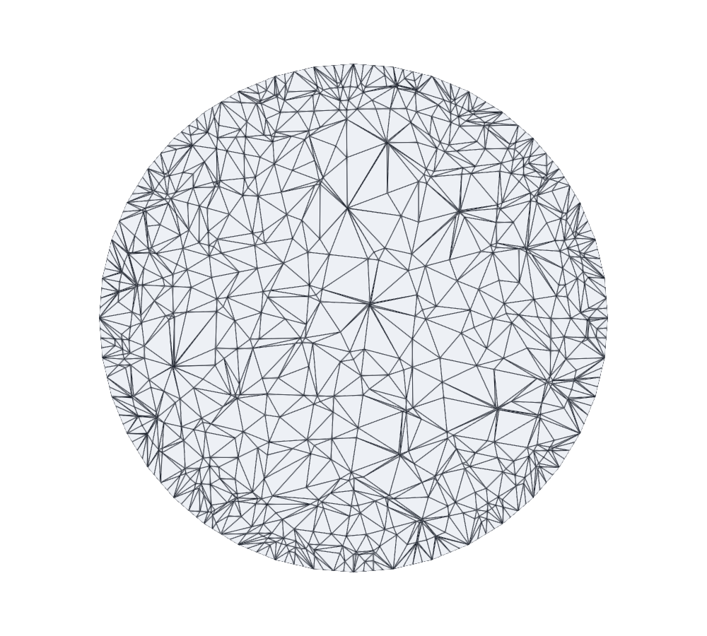
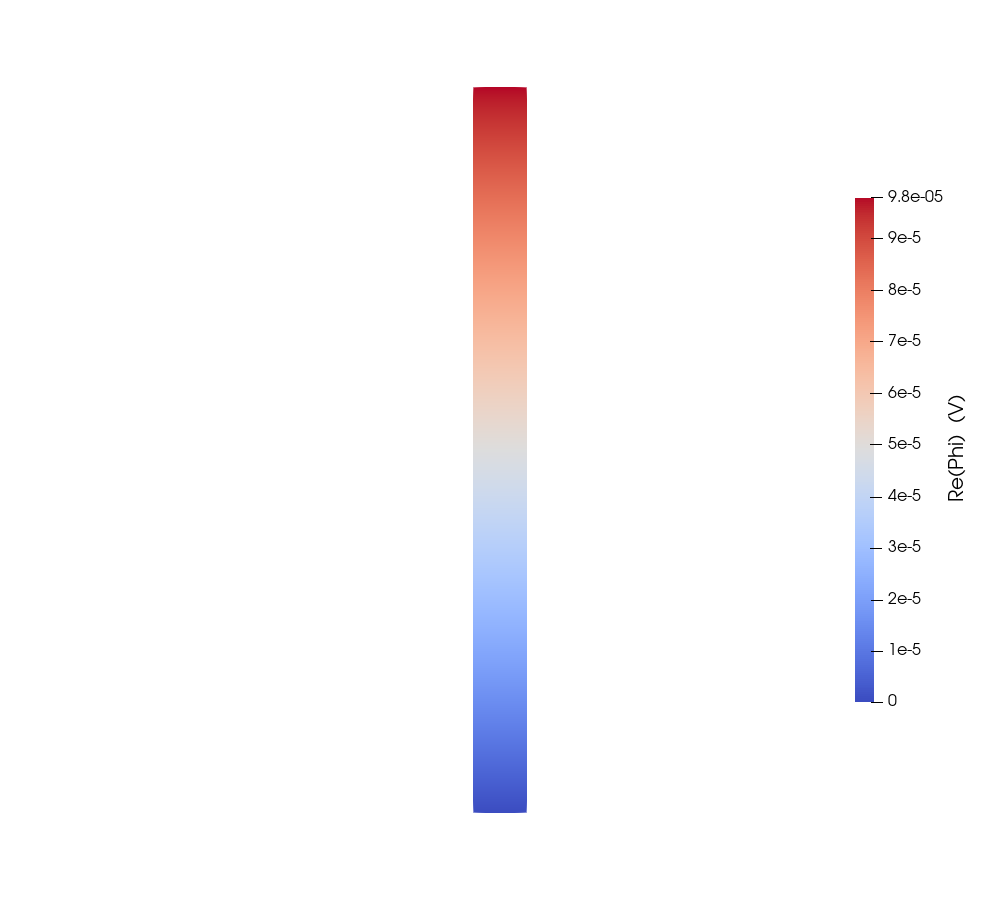
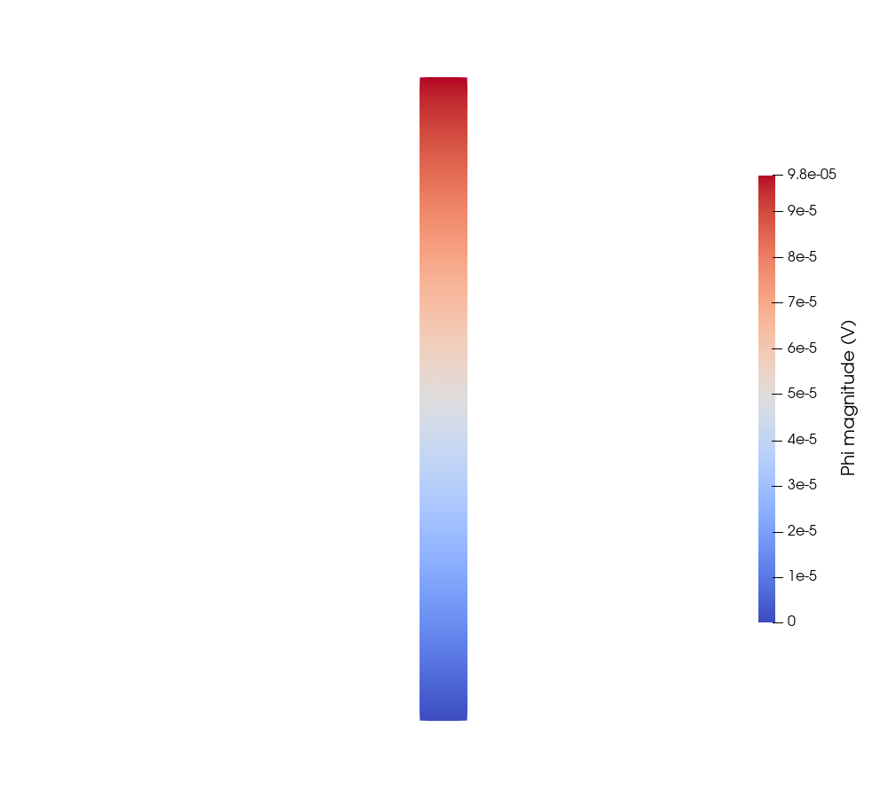
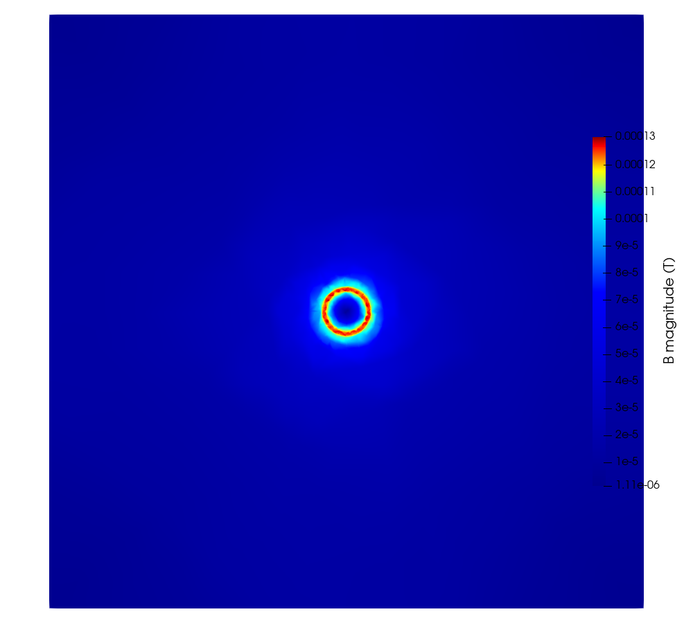
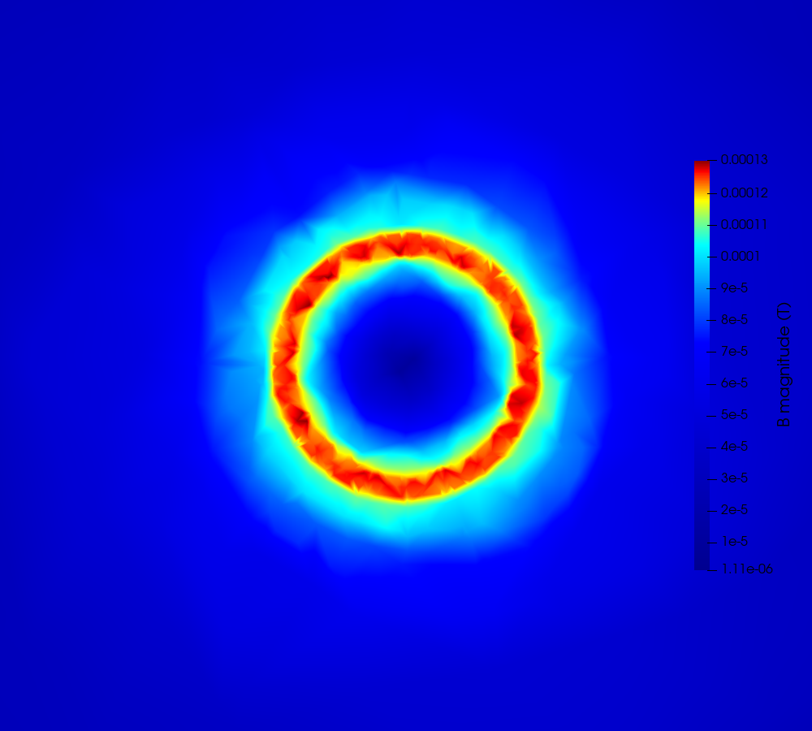
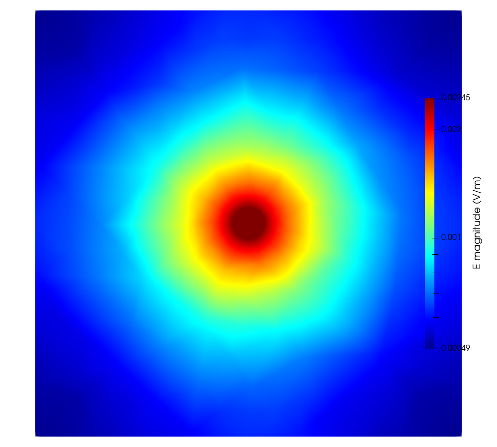
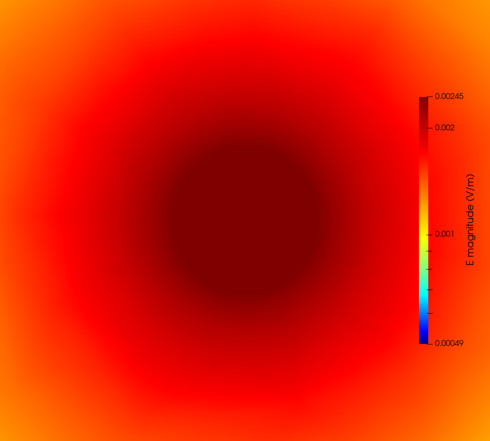
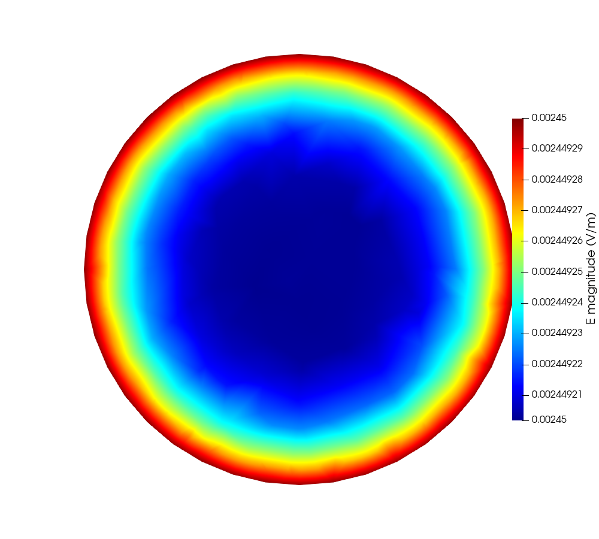
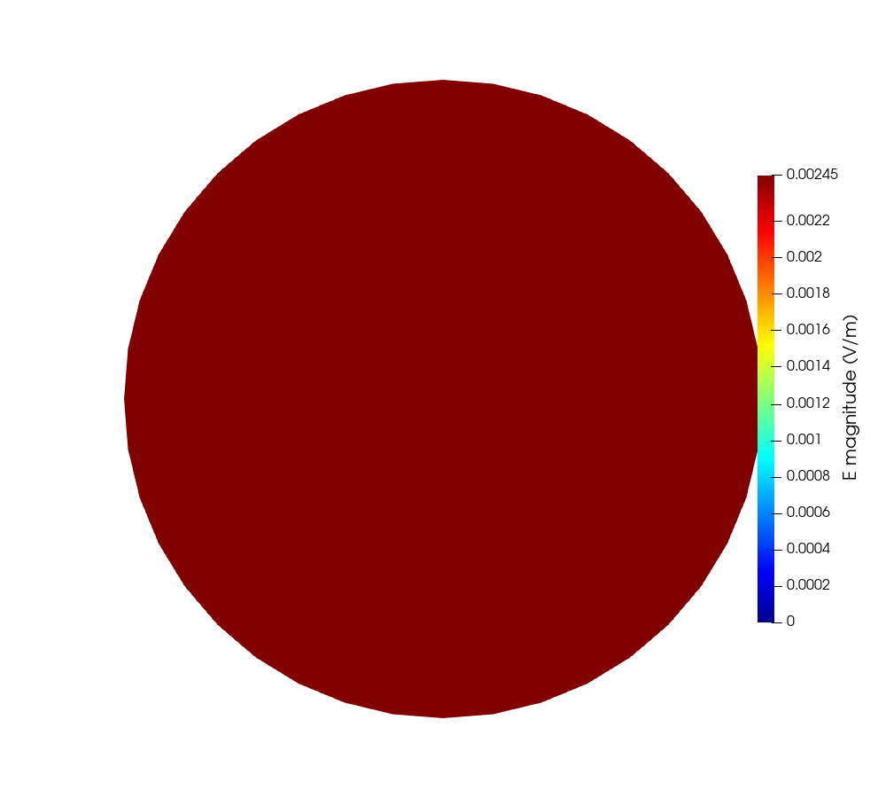
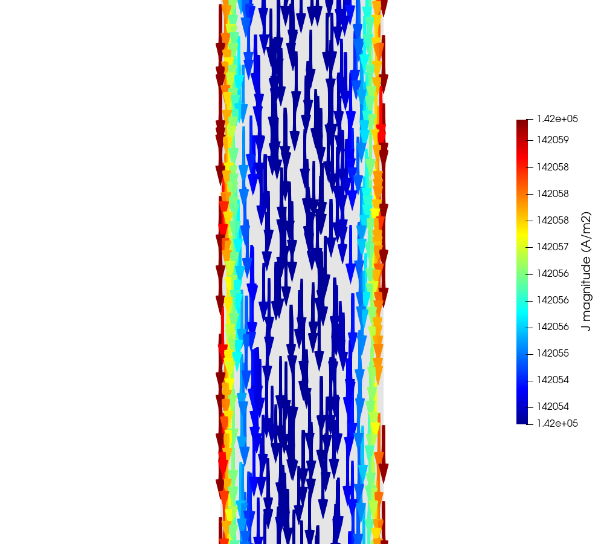

# Copper rod at 50 Hz, driven by 1 A

Hybrid A-Φ finite-element solver, tree-cotree gauge. **The dual of the 1 V
case**: the same conductor, the same mesh, the same frequency, driven with a
1 A current source instead of a 1 V terminal voltage.

`regression_tests/03_Cylinder_1A_50Hz` · 240,990 unknowns · backward error 3.8e-21

---

## 0. Why this case exists

This is the first **current-driven** problem this solver has run. The port
machinery for it had existed since the DOF map was written — a current port
gets an unknown terminal potential instead of a fixed one, and its row is the
terminal's current balance — but nothing had ever exercised it.

It answers two questions the 1 V case cannot.

**Port current self-consistency.** Inject 1 A at the top cap; exactly 1 A must
be collected at the bottom. Charge does not accumulate in a conductor, so any
other answer means current is being created or destroyed inside the
formulation. Measured: **1.000000 A**.

**Does the dual agree?** `R` and `L` belong to the geometry and the material,
not to how the thing is driven, and the problem is linear. So driving 1 A must
return the same impedance as driving 1 V:

| | 1 V case | 1 A case |
|---|---|---|
| `I` | 10180.56 A | **1.000000 −0.000000 j A** |
| `V` | 1 V | **9.796995e-05 +7.098621e-06 j V** |
| `Z` | 9.796995e-05 +7.098621e-06 j Ω | **9.796995e-05 +7.098621e-06 j Ω** |
| `R` | 9.796995e-05 Ω | identical |
| `L` | 22.5956 nH | identical |

Identical to every digit printed.

**The terminal voltage is 98 microvolts**, because the rod is 98 micro-ohms.
Every field below is correspondingly about 10⁴ times smaller than in the 1 V
case — `B` peaks at 1.3e-04 T rather than 1.34 T. That is not a red flag; it is
the same physics read from the other side, and reproducing the 1 V case's `Z`
from it is a genuine test of the scaling. A formulation that quietly loses a
factor somewhere would not.

---

## 1. The case

| | |
|---|---|
| Conductor | copper, `σ = 5.8e7 S/m`, `a = 1.5 mm`, `L = 40 mm`, a 40-gon |
| Domain | 40 mm cube of air, `n × A = 0` on the outer boundary |
| Excitation | **1.0 A into the top cap**, 0 V reference on the bottom, 50 Hz |
| Skin depth | `δ = 9.346 mm`, so `a/δ = 0.1605` — no skin effect |
| Formulation | first-order Whitney edge `A`, second-order P2 nodal `Φ` |
| Mesh | case 02's, **referenced not copied** — 18,994 nodes, 101,873 tets, Netgen-optimised |
| Solve | 240,990 unknowns, backward error 3.8e-21 |

---

## 2. Mesh

| whole domain | the wire alone |
|---|---|
|  |  |

Identical to the 1 V case by construction — the input file points at that
case's `cylinder.msh`. "Exactly the same mesh" is the whole point of the
comparison, and a copy is a thing that can drift.

---

## 3. Potential

`Φ` over the lateral surface of the wire, seen side on.

| `Re(Φ)` | magnitude |
|---|---|
|  |  |

The colour range is read from the field, not pinned to 1 V: the terminal
potential here is an unknown the solve returns, and it came back at
9.797e-05 V.

**`Φ` is markedly more linear than in the 1 V case**, and on the stricter of
two metrics:

| | absolute | normalised by V | pointwise relative |
|---|---|---|---|
| 1 V case | 8.257e-04 V | 8.257e-04 | 3.946e-03 |
| **1 A case** | 3.778e-10 V | **3.856e-06** | **4.301e-06** |

A voltage port forces the whole cap to a single potential; a current port
constrains only the total current and lets the cap relax to whatever the field
wants. The prescribed equipotential is what bends `Φ` in the 1 V case — it is
the boundary condition doing its job, not an error.

---

## 4. Magnetic flux density

Mid-length cross-section, linear colour scale.

| whole domain | zoomed to 3a |
|---|---|
|  |  |

Zero on the axis, rising linearly inside the conductor, falling as `1/r`
outside — the peak sits at `r = a` and reaches **1.3e-04 T**. That is the 1 V
case's 1.3385 T divided by its 10180 A, which is what driving 1 A instead
should give.

---

## 5. Electric field

| whole domain, per node | zoomed to 3a |
|---|---|
|  |  |

`E` is one order smoother than `B` and this is structural:
`E = −jωA − ∇Φ` is **linear** per tetrahedron because `∇Φ` comes from the P2
space, while `B = curl A` is **constant** per tetrahedron.

### 5.1 Inside the wire, and a warning about colour ranges

| auto colour range | range pinned to `0 … V/L` |
|---|---|
|  |  |

`E` inside the conductor is uniform at `V/L = 2.449e-03 V/m` — there is no skin
effect at `a/δ = 0.16`. The left figure auto-rescales to the wire's own range,
which spans about 0.004 % of the value, so **noise at the fifth significant
figure fills the entire colour map** and reads as a strong radial gradient. The
right figure pins the range and the same data renders as the uniform disc it
physically is. This is the single easiest way to misread these plots.

---

## 6. Current density

`J = σE` on a longitudinal slice, arrows coloured by magnitude. **The view
frames a section of the length rather than all 40 mm**: the wire is 3 mm across
and 40 mm long, and a view containing the whole thing renders the arrows as a
smear two pixels wide. Nothing varies along `z`, so a section shows everything
the full length would.

Read the colours with the §5.1 warning in mind — the bar spans
142,054 to 142,060 A/m², a range of **0.004 %**. `J` is uniform; those colours
are the fifth digit. The nominal value is `I/A = 1 / 7.0635e-06 = 141,573 A/m²`,
and the measured 142,05x sits 0.3 % above it because the current concentrates
very slightly toward the surface even at `a/δ = 0.16`.

---

## 7. Validation

Nothing below fits a free parameter.

| quantity | result |
|---|---|
| **`\|I\|` collected vs injected** | **1.000000 A vs 1.0 A** — port self-consistency |
| `R` | 9.796995e-05 Ω against 9.796863e-05 exact — **1.3e-05** |
| `L` | 22.5956 nH — identical to the 1 V case |
| `Φ` vs exact `z/L`, pointwise | 4.301e-06 |
| `J(0)/J(a)` | 0.999968 against the Bessel 0.999959 |

All six are asserted automatically by `regression_tests/check.bat`, which runs
this case and the 1 V case together. They are duals, and **a change that breaks
the duality shows up as the two disagreeing — which neither case alone can
see.**

---

## 8. Known limitations

These are inherited from the mesh and the formulation and are identical to the
1 V case; see that report for the measurements behind them.

- **Azimuthal scatter in `B` of 1.4–3.1 % near the conductor.** `O(h)` element
  noise from `B` being constant per tetrahedron, the lowest-order quantity in
  the formulation.
- **Nodal `B` reads low in the far field**, up to −7.5 % at the box wall, while
  per-cell stays near −2 %. The volume-weighted nodal average is dominated by
  the larger outer elements on a rapidly coarsening mesh.
- **Far-field accuracy was traded for near-field resolution** when the mesh was
  built: beyond `r = 3 mm` the error is ~2 % rather than ~1 %.

One thing specific to this case: the **relative residual is 1.4e-09** where the
1 V case gives 6e-13, while the backward error is as good — 3.8e-21 against
3.7e-21. That is exactly the situation `factorization.hpp` warns about:
`‖Ax−b‖/‖b‖` misleads when `‖b‖` is small, and a 1 A drive makes a far smaller
right-hand side than a 1 V one. **Judge this case by the backward error.**
