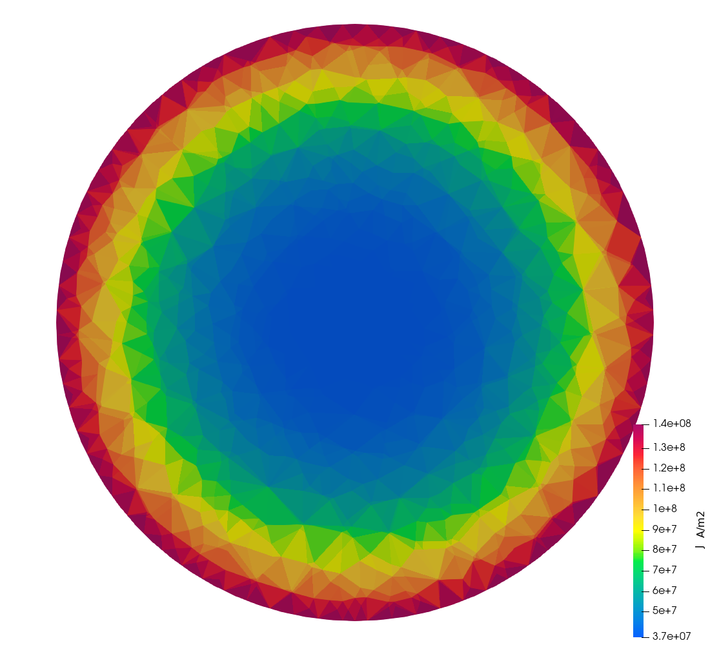
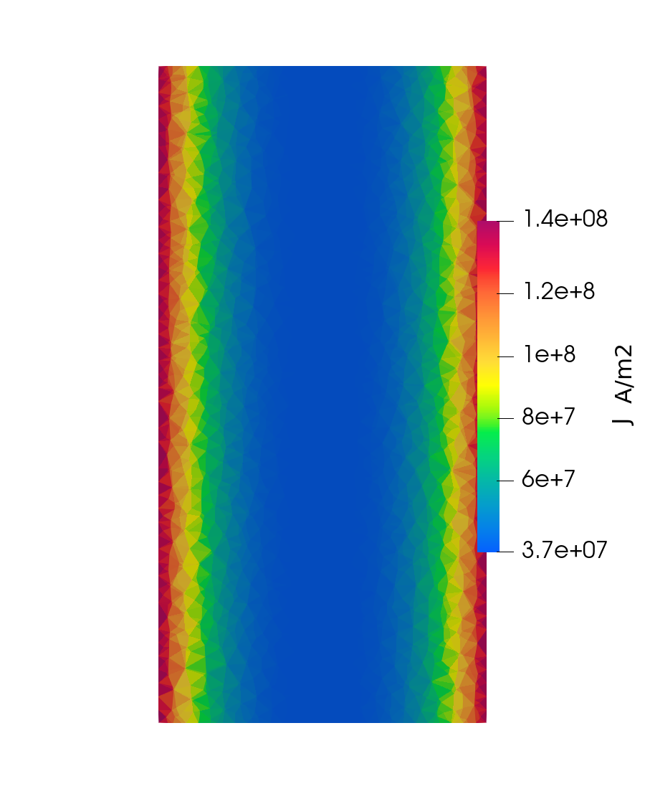
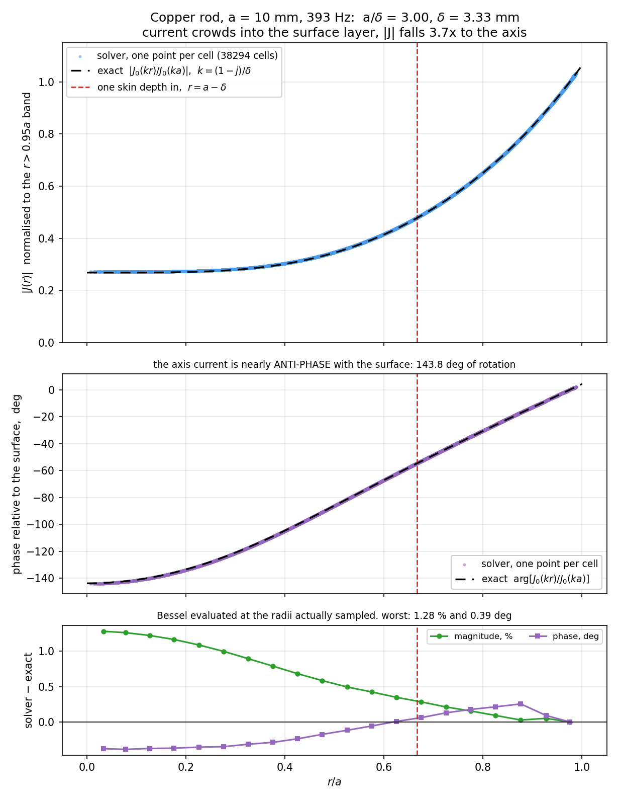
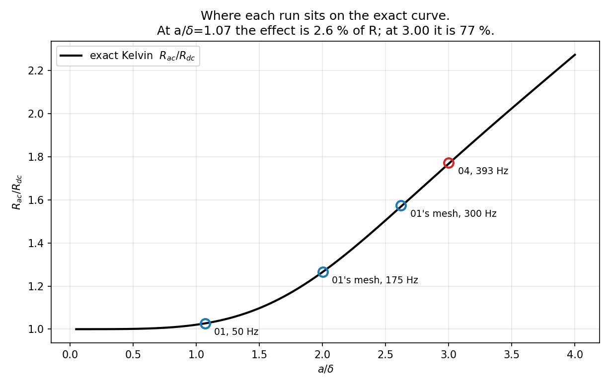
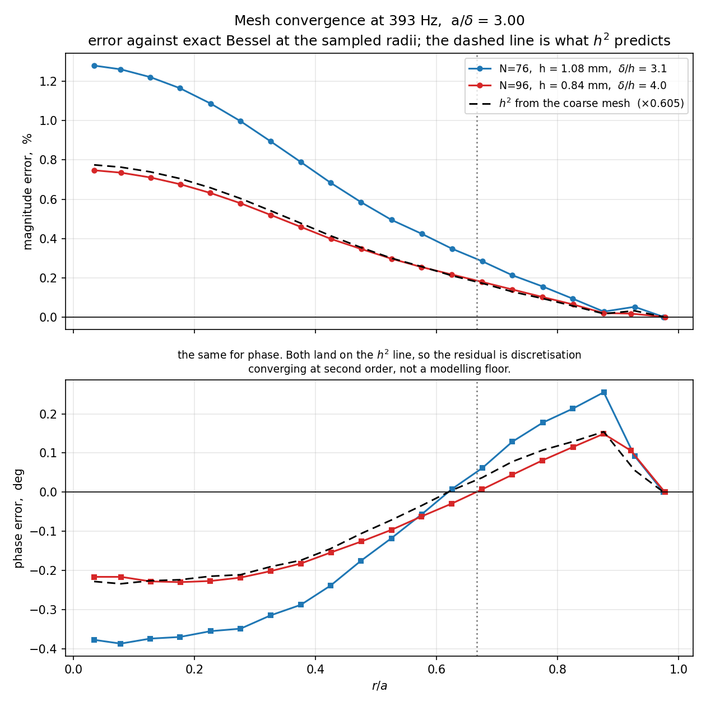

# Skin effect in a copper rod at 393 Hz

Hybrid A-Φ finite-element solver, tree-cotree gauge, validated against the **exact Bessel
solution** for current density — magnitude *and* phase — and against **Kelvin's exact AC
resistance**.

`regression_tests/04_Cylinder_SkinDepth` · `a/δ = 3.000` · 418,318 unknowns · backward error 5.5e-21

> This file keeps relative `fig/` paths, so it renders inside the repository where the figures live
> beside it. `SkinDepthValidation.html` and `.pdf` are self-contained copies with every figure
> inlined — build them with `sh build_doc.sh`.

---

## 0. What this case establishes

`01_OneCylinder` runs the same rod at 50 Hz, where `a/δ = 1.07` and `R_ac/R_dc = 1.027`. The skin
effect is real there but it is only **2.6 %** of the answer — almost all of `R` is just `R_dc`,
which any solver that integrates `σ` correctly will get right. Matching Kelvin to 0.038 % there
validates *the effect itself* to only about 1.4 %.

This case runs the same rod at **393 Hz**, where the skin effect is **77 % of `R`** rather than a
correction to it.

| | 01 @ 50 Hz | 04 @ 393 Hz |
|---|---|---|
| `a/δ` | 1.070 | **3.000** |
| `\|J(0)/J(a)\|` exact | 0.9265 | **0.2522** — 4× surface to axis |
| phase rotation, axis to surface | 27.6° | **148°** — nearly anti-phase |
| `R_ac/R_dc` exact | 1.0267 | **1.7680** |
| the skin effect is | 2.6 % of `R` | **77 % of `R`** |
| measured `R_ac/R_dc` | 1.02633 | **1.77191** |
| error against Kelvin | −0.038 % | **+0.220 %** |
| so the *effect* is validated to | ~1.4 % | **~0.29 %** |

**Why the larger raw error is the stronger result.** 0.038 % looks better than 0.220 % until you
ask what fraction of the answer the skin effect actually is. At `a/δ = 1.07` the quantity under test
is a 2.6 % correction to a number the solver would get right anyway. At `a/δ = 3` it is most of the
answer, and `|J|` falling 4× from surface to axis is something a wrong answer cannot fake.

## 1. The case

| | |
|---|---|
| Conductor | copper, `σ = 5.8e7 S/m`, `a = 10 mm`, `L = 40 mm`, a **76-gon** |
| Domain | 200 mm box of air, `n × A = 0` on the outer boundary |
| Excitation | 1.0 V across the end caps, **393 Hz** |
| Skin depth | `δ = 3.3336 mm`, so `a/δ = 2.9998` |
| Formulation | first-order Whitney edge `A`, second-order P2 nodal `Φ` |
| Mesh | 31,922 nodes, 179,477 tets, 98,204 of them in the wire; Netgen-optimised |
| `A_poly` | 313.8015 mm² (the circle would be 314.1593) |
| `R_dc` | `L/(σ A_poly)` = 2.197743e-06 Ω |
| Measured | `\|I\| = 19977.92 A`, `Z = 3.894203e-06 + 4.990355e-05 j Ω` |

**Why 393 Hz and not more.** At `a/δ = 5` (1092 Hz) the exact `|J(0)/J(a)|` is 0.054, so the core
current is 5 % of the surface value and a relative error there is taken against nearly zero — the
reference stops being well conditioned. It would also need `N = 128` and about 1.7 M unknowns.
`a/δ = 3` is the most demanding point that still has a meaningful exact reference.

## 2. The analytical solution

### 2.1 From Maxwell's equations to Bessel's equation

Inside the conductor displacement current is negligible (`σ >> ωε`), so with the `e^{jωt}`
convention:

```
∇ × H = J = σE          ∇ × E = −jωμH
```

Taking the curl of the first, substituting the second, and using `∇·B = 0` with constant `μ`:

```
∇²J = jωμσ J
```

Define the skin depth `δ = √(2/ωμσ)`. Then `jωμσ = 2j/δ²`, and writing this as a Helmholtz equation
`∇²J + k²J = 0` gives

```
k² = −jωμσ = −2j/δ²   →   k = (1 − j)/δ
```

For a long cylinder the current is axial and depends only on `r`, so the Laplacian reduces to

```
(1/r) d/dr ( r dJ_z/dr ) + k² J_z = 0
```

which is **Bessel's equation of order zero**. Its two solutions are `J₀(kr)` and `Y₀(kr)`; `Y₀`
diverges on the axis, so physics keeps only the first:

```
J_z(r) = J_z(a) · J₀(kr) / J₀(ka)
```

> **A notation collision worth naming.** `J_z` is current density; `J₀` is the Bessel function. They
> are unrelated and both are standard.
>
> **This is not an exponential.** `e^{−(a−r)/δ}` is only the asymptotic form for `a >> δ`. At
> `a/δ = 3` the Bessel solution is what is correct, which is why the measured profile *flattens*
> toward the axis rather than decaying to zero.

### 2.2 Kelvin functions: why the argument is complex

Because `k` is complex, `J₀(kr)` is a Bessel function of complex argument. The **Kelvin functions**
exist precisely to split that into real and imaginary parts:

```
ber(x) + j·bei(x) ≡ J₀( x·e^{3jπ/4} )
```

Since `kr = √2 (r/δ) e^{−jπ/4}` and `J₀` is even, this is exactly `J₀(kr) = ber(u) + j·bei(u)` with

```
u = √2 · r/δ        and at the surface   u = √2 · a/δ = 4.242337
```

That is why `u = √2 a/δ` appears throughout: it is the same Bessel function written in real
arithmetic. The defining series are

```
ber(x) = Σ (−1)^m (x/2)^{4m}   / [(2m)!]²
bei(x) = Σ (−1)^m (x/2)^{4m+2} / [(2m+1)!]²
```

At this case's `u`:

| | value at u = 4.242337 |
|---|---|
| `ber(u)` | −3.365444524 |
| `bei(u)` | +2.095782021 |
| `ber′(u)` | −3.475101853 |
| `bei′(u)` | −1.160258139 |

### 2.3 The AC resistance — Kelvin's formula

Integrate the current density over the cross-section, using `∫₀^a J₀(kr) r dr = (a/k) J₁(ka)`:

```
I = ∫₀^a J_z(r) · 2πr dr = J_z(a) · 2πa · J₁(ka) / (k · J₀(ka))
```

Divide the surface field `E_z(a) = J_z(a)/σ` by that to get the internal impedance per unit length,
and normalise by `R_dc = 1/(σπa²)`:

```
Z_internal / R_dc = (ka/2) · J₀(ka) / J₁(ka)
```

Taking the real part and rewriting in Kelvin functions gives the form used in `expected.txt`:

```
R_ac/R_dc = (u/2) · [ ber(u) bei′(u) − bei(u) ber′(u) ] / [ ber′(u)² + bei′(u)² ]
```

and the companion internal inductance,
`ωL_int/R_dc = (u/2)[ber·ber′ + bei·bei′]/[ber′²+bei′²]`, which evaluates to `1.463933` here.

### 2.4 Verifying the reference itself

Every error quoted below is measured *against* these formulas, so a bug in them would be invisible
and would corrupt every number in the report. Three independent checks:

**Two routes to the same quantity.** The Kelvin form above and `Re[(ka/2) J₀(ka)/J₁(ka)]` are the
same number written differently, computed through entirely separate code — real `ber/bei` series and
derivative series versus complex `J₀` and `J₁` series:

```
(u/2)(ber bei' - bei ber')/(ber'^2 + bei'^2) = 1.768019136
Re[ (ka/2) J0(ka)/J1(ka) ]                   = 1.768019136
difference                                   = 0.0e+00
```

They agree to machine precision at every `a/δ` from 0.1 to 5.

**The Kelvin functions against their defining identity.** The real `ber/bei` series was checked
against `J₀(x e^{3jπ/4})` computed from the complex series — a different code path — and they agree
to machine precision at every `x` tested up to 8, including this case's 4.242.

**Both asymptotic limits.**

| `a/δ` | computed | limit |
|---|---|---|
| 0.10 | 1.00000208 | `1 + (a/δ)⁴/48` = 1.00000208 |
| 0.50 | 1.00130073 | 1.00130208 |
| 10.0 | 5.25930 | `a/(2δ) + 1/4` = 5.25000 |
| 30.0 | 15.25312 | 15.25000 |

That low-frequency limit also explains why cases 02 and 03 see nothing: at `a/δ = 0.16`,
`(a/δ)⁴/48 = 1.4e-05`.

> **A caution the series carries.** The alternating `ber/bei` series suffers catastrophic
> cancellation at large argument — it returns nonsense by `a/δ = 100`. It is exact to machine
> precision across the range used here (`u ≤ 4.25`), but it is not a general-purpose implementation
> and should not be reused blindly at higher frequency.

## 3. The mesh, and how it was sized

### 3.1 The sizing was measured, not assumed

`01_OneCylinder`'s mesh was run at three frequencies first and the error read off against Bessel, to
find what resolution the profile actually needs:

| f | `δ` | `a/δ` | `δ/h` | worst band error | `R` vs Kelvin |
|---|---|---|---|---|---|
| 50 Hz | 9.346 mm | 1.070 | 5.66 | 0.26 % | −0.038 % |
| 175 Hz | 4.996 mm | 2.002 | 3.03 | 2.10 % | −0.050 % |
| 300 Hz | 3.815 mm | 2.621 | 2.31 | 4.73 % | +0.386 % |

So the error is governed by `δ/h`, and `δ/h ≥ 3` is what holds it near 1 %. At 393 Hz,
`δ = 3.334 mm`, so `h` must be about 0.8–1.1 mm.

### 3.2 Where the refinement had to go — the non-obvious part

> **Reading the per-band error gets this backwards.** At 300 Hz the error is 0.1 % in the annulus
> (`r > 0.8a`) and 4.7 % in the core (`r < 0.3a`), which looks like "refine the core". It is not.
>
> `|J|` in the core is **flat** there — 0.3934, 0.3929, 0.3949 across `r/a` 0 to 0.3 — so the core
> is not failing to resolve local variation. It is **inheriting accumulated error** from the region
> where the field actually decays, and `δ/h` was 1.45 to 2.31 across the *whole* conductor. The
> annulus's own relative error only looks small because `|J|` is large there.

At `a/δ = 3` the decay region `r > a − 2δ = 3.33 mm` is **89 % of the cross-section**, so there is
nothing to gain by grading inside the conductor: `lc_core = lc_skin` and the wire is meshed
uniformly.

### 3.3 The facet rule fixes N

The polygon facet is `2a sin(π/N)`, and the design rule is that the volume element size stays
*comparable* to the facet width; a volume size well below the facet produces slivers. At `N = 36`
the facet is 1.743 mm, so `h = 0.833 mm` would be less than half of it. `N = 76` gives **0.827 mm**,
matched to `h`.

This is the same rule that killed an `N = 96` experiment in case 02 from the other direction, where
the facet was 0.098 mm and the volume size 0.25 mm. **The ratio is what matters, in either
direction.**

### 3.4 The unsigned-distance trap

The mesh is graded by a `Distance` field measured from the conductor's lateral surface, mapped
through a `Threshold`. **That distance is unsigned**, so it reads 10 mm on the axis — the same as a
point 10 mm out in the air — and the field coarsens *inward* as well as outward. In
`01_OneCylinder` that left the core at 4.4 mm elements with **no cells at all inside `r < 0.1a`**.

The fix, used here and in case 02, is a second field capping the interior:

```
Field[3] = MathEval;   Field[3].F = Sprintf("%g", lc_core);
Field[4] = Restrict;   Field[4].InField = 3;  VolumesList = {wire_volume};
Field[5] = Min;        Field[5].FieldsList = {2, 4};
```

`Restrict` returns a huge size outside its volume, which is exactly what `Min` wants, so `lc_core`
binds only inside the wire and the air grading is untouched. A third field holds the fine size
through the first half skin depth outward (`DistMin = δ/2` rather than 0) — without that, the fine
size decays immediately and there is a fine *surface* but no resolved *shell*.

## 4. Results

### 4.1 The picture



**`|J|` at mid height.** The current is confined to a surface layer about one skin depth thick; the
core carries almost none of it.



**Longitudinal slice**, the full 40 mm. Two skin layers on the outside, a blue core between them,
and the bands run **straight down the length** — nothing varies along `z`, which is what the
infinite-cylinder assumption behind the analytical solution requires.

Unlike the 50 Hz cases, the auto colour range here is *meaningful*: `|J|` spans nearly 4× across the
section, so the visible structure is physics rather than noise in the fifth digit.

### 4.2 Magnitude and phase against the exact Bessel solution



**38,294 cells, one point each**, against `J₀(kr)/J₀(ka)` evaluated at the radii actually sampled.
Top: magnitude. Middle: phase. Bottom: both errors.

> **There is no radial probe line.** Every point is one tetrahedron plotted at its centroid radius,
> over **all azimuths** and all `z` in `0.3L` to `0.7L`. A line would have allowed a lucky azimuth
> to be chosen and would have sampled about 30 cells instead of 38,294. The vertical spread at fixed
> `r` *is* the azimuthal scatter and element noise, shown rather than averaged away. The values are
> the per-cell `J`, exact per tetrahedron, not the volume-averaged nodal field.

Both curves are normalised by the *same* reference — the mean over cells with `r > 0.95a` — so
amplitude and the drive's own phase cancel and only shape is compared. Amplitude is checked
separately by `R`, which is an integral of the same field.

| `r/a` | cells | \|J\| measured | \|J\| exact | err | phase err |
|---|---|---|---|---|---|
| 0.00–0.10 | 334 | 0.2717 | 0.2683 | +1.27 % | −0.385° |
| 0.10–0.20 | 958 | 0.2724 | 0.2692 | +1.19 % | −0.372° |
| 0.20–0.30 | 1576 | 0.2770 | 0.2741 | +1.04 % | −0.353° |
| 0.30–0.40 | 2248 | 0.2917 | 0.2893 | +0.84 % | −0.302° |
| 0.40–0.50 | 2842 | 0.3236 | 0.3216 | +0.63 % | −0.206° |
| 0.50–0.60 | 3323 | 0.3798 | 0.3781 | +0.46 % | −0.086° |
| 0.60–0.70 | 3900 | 0.4651 | 0.4636 | +0.31 % | +0.036° |
| 0.70–0.80 | 4413 | 0.5841 | 0.5831 | +0.18 % | +0.156° |
| 0.80–0.90 | 5212 | 0.7458 | 0.7454 | +0.05 % | +0.238° |
| 0.90–0.95 | 3455 | 0.8890 | 0.8886 | +0.05 % | +0.092° |
| 0.95–1.00 | 10033 | 1.0000 | 1.0000 | 0.00 % | 0.000° |

**Worst band: 1.27 % in magnitude, 0.385° in phase**, and both are *monotonic* — largest at the
axis, vanishing at the surface. That shape is the signature of an `h`-limited solution rather than a
wrong one: the error is largest exactly where `δ/h` is worst and disappears where the mesh is
finest.

### 4.3 Phase is the tighter test

`J_z` is a phasor and the magnitude comparison tests only half of it. The argument is independent,
and in practice more demanding: an error in the `−jωA` term of `E = −jωA − ∇Φ` shows up in the phase
before it shows up in `|J|`. The exact rotation across the radius:

| `r/a` | 0.0 | 0.2 | 0.4 | 0.6 | 0.8 | 1.0 |
|---|---|---|---|---|---|---|
| `\|J₀(kr)/J₀(ka)\|` | 0.2522 | 0.2543 | 0.2833 | 0.3895 | 0.6119 | 1.0000 |
| phase, deg | −148.09 | −137.81 | −108.92 | −71.42 | −34.91 | 0.00 |

The axis current is **nearly anti-phase** with the surface. Across the whole suite:

| case | `a/δ` | measured lag | exact | error | (magnitude error) |
|---|---|---|---|---|---|
| 02 / 03 | 0.16 | −0.62816° | −0.63860° | **0.010°** | 0.00 % |
| 01 | 1.07 | −27.4249° | −27.5592° | **0.134°** | +0.26 % |
| 01's mesh @ 300 Hz | 2.62 | −112.673° | −111.979° | 0.694° | +4.7 % |
| **04** | **3.00** | **−134.239°** | **−133.847°** | **0.392°** | +1.15 % |

This case reproduces a **134° rotation to 0.39°** — 0.29 % of the rotation, *tighter* than the
1.15 % on the magnitude ratio. Case 02 is the most telling of the others: its magnitude ratio is
0.99997, flat to five digits and nearly insensitive, yet it resolves a 0.64° lag to 0.010°.

> **Two details that had to be right.** The **complex field is averaged and the argument taken
> afterwards**; averaging the arguments is wrong wherever the phase spread inside a band is not
> small, which is exactly the high-frequency case. And everything is referred to the same
> `r > 0.95a` band, so the drive's own phase cancels — `Φ` is gauge dependent, but `J = σE` is not,
> so the result is physical rather than a convention.

### 4.4 AC resistance against Kelvin



**The exact Kelvin curve** with every run in this study placed on it. At `a/δ` = 1.07 the effect is
2.6 % of `R`; at 3.00 it is 77 %.

| | |
|---|---|
| Kelvin exact | **1.768019** |
| measured | **1.771910** |
| error | **+0.220 %** |
| of which the polygon accounts for | +0.028 % — see §7 |
| `L` from `Im(Z)/ω` | 20.2097 nH |
| `ωL/R` | 12.8 — strongly inductive |

## 5. Mesh convergence: N=76 against N=96

`cylinder_skin_n96.geo` is the same case at `N = 96`, `lc = 0.640 mm`, which reaches `δ/h = 4.0` in
the conductor. It is **not** a regression case — 739,304 unknowns and 17.1 GB of factors is too
heavy to run on every change — it exists to establish the convergence *rate*.



**The dashed line is what `h²` predicts** from the coarse mesh. The fine mesh lands on it at every
radius, in magnitude and phase alike.

| | N=76 | N=96 | ratio | implied order |
|---|---|---|---|---|
| `h` in the conductor | 1.08 mm | 0.84 mm | 0.778 | |
| `δ/h` | 3.1 | 4.0 | | |
| worst band `\|J\|` | 1.27 % | **0.74 %** | 0.58 | **2.17** |
| worst band phase | 0.385° | **0.230°** | 0.60 | **2.06** |
| `R` vs Kelvin | +0.220 % | **+0.145 %** | 0.66 | 1.65 |
| `L` | 20.2097 nH | 20.2041 nH | | converged to 0.03 % |
| unknowns | 418,318 | 739,304 | 1.77 | |
| factor nnz | 497.8 M | 1068.6 M | 2.15 | |
| factorization | 25.9 s | 81.8 s | 3.15 | |

> **The rate matters more than either error value.** A single number says "we are 0.74 % off" and
> cannot distinguish discretisation error from a modelling mistake sitting at a floor. Two meshes
> give the rate: `h` falls by 0.778 and the error falls by **0.605 = 0.778²**, at every radius, in
> magnitude and phase alike. So the residual is genuine discretisation converging at **second
> order**, and refinement would keep paying. An error that had stalled between the two meshes would
> have meant the opposite, and would have pointed at the geometry or the formulation rather than at
> `h`.

`R` converges more slowly (order 1.65) because part of its error does not scale with `h` at all: the
polygon floor, which fell 0.028 % to 0.018 % only because `N` changed. Net of it, 0.192 % to
0.127 %.

## 6. Cost

| | |
|---|---|
| nodes / tets | 31,922 / 179,477 (98,204 in the wire) |
| unknowns | **418,318** — `A`: 176,554 free edges, 28,996 gauged, 8,772 Dirichlet |
| factor nnz | 497.8 M, about 8.0 GB |
| mesh | 24 s |
| factorization, MUMPS + threaded MKL | **25.9 s** |
| one frequency end to end | **42 s** |
| backward error | 5.5e-21 |

**This is the first case that cannot practically run on the internal solver**, so its `expected.txt`
names the MUMPS input — the opposite of cases 01–03, which name their plain inputs on purpose so
`check.bat` exercises the default backend.

Measured scaling on this geometry, across case 01's mesh and both meshes here: **fill ~ `n^1.47`**,
factorization time **~ `n^2.39`** on a sequential BLAS. Linking MKL's threaded layer
(`-DMKL_THREADING=intel_thread`) is worth about **10×** on this problem — 266.78 s to 25.94 s —
because nearly all the flops are dense kernels inside the frontal matrices, and a sequential BLAS
runs those on one core. See `docs/MUMPS_SETUP.md`.

## 7. Limitations, and what "exact" does not mean

The analytical solution is exact for an **idealisation**: an infinitely long, perfectly circular
conductor of uniform `σ` and `μ`, quasi-static. The simulation differs from it in three ways, and
the residual error is discretisation *plus* those differences, not discretisation alone.

- **The conductor is a 76-gon, not a circle.** At `a/δ = 3` the current lives in a thin surface
  layer, so what matters is the *perimeter* rather than the area: 62.8140 mm against the circle's
  62.8319 mm, or −0.0285 %, which raises `R_ac` by about **+0.028 %**. **This will not go away with
  a finer mesh** — only with a larger `N`, which also changes `R_dc`. A tolerance tight enough to
  exclude it would be asserting something false.
- **The rod is 4 radii long, not infinite.** Mitigated by sampling only the mid-length band `0.3L`
  to `0.7L`, and the longitudinal slice shows no `z` dependence there.
- **The air box is finite**, with `n × A = 0` at 200 mm, against the analytical solution's unbounded
  exterior.

**`Φ` is gauge dominated here and is deliberately not checked.** At `ωL/R = 12.8` the reactance
dominates, and under the tree-cotree gauge `Φ` differs from the `z/L` gradient by `−jωψ`, which is
the larger term; measured, `Φ/V` deviates from `z/L` by 0.51. That was established by experiment
rather than assumed: running `01_OneCylinder`'s *same mesh* at 1 Hz instead of 50 Hz — identical
elements, only `ω` changed — moves the deviation from 5.4e-01 to 1.9e-03, a factor of 253.
Discretisation cannot do that. `E`, `B`, `H` and `J` are gauge independent and are what this case
validates.

**Memory, not time, is what stops further refinement** on a 32 GB machine. Halving `h` again needs
`N ~ 136` and about 1.8 M unknowns, which extrapolates to roughly 45 GB of factors. Going materially
below 0.5 % needs a different lever — second-order elements for `A`, or an out-of-core solve — not a
smaller `h`.

## 8. What is asserted automatically

`regression_tests/check.bat` runs this case and asserts all five, against the values in
`expected.txt`:

| | |
|---|---|
| `\|V\|` measured vs prescribed | 1.000000 vs 1.0 |
| `R/R_dc` vs Kelvin | 1.77191 vs 1.768019, tol 0.006 |
| `L` | 20.2097 nH, tol 0.05 — pinned to catch change |
| `<J>core/<J>surf` | 0.281160 vs 0.277956, tol 0.005 |
| phase lag, core to surface | −134.239° vs −133.847°, tol 0.8° |

The two `Φ` checks are deliberately *absent*, and `verify.py` prints `SKIPPED` with the reason
rather than passing silently. An omitted key is a claim about the physics, not an exemption.

### Reproducing

```bat
gmsh cylinder_skin.geo -3 -o cylinder_skin.msh
..\run_case.bat cylinder_393hz_mumps.aphi
"C:\Program Files\ParaView 6.1.1\bin\pvbatch.exe" make_plots.py output
sh build_doc.sh

rem the convergence study
gmsh cylinder_skin_n96.geo -3 -o cylinder_skin_n96.msh
..\run_case.bat cylinder_393hz_n96_mumps.aphi
"C:\Program Files\ParaView 6.1.1\bin\pvbatch.exe" make_convergence_plot.py
```

**Run `build_doc.sh` after regenerating figures**, or the HTML and PDF keep showing the previous
run's pictures — they are baked in.
