# A conducting ring driven through an internal cut

Hybrid A-Φ finite-element solver, tree-cotree gauge. The first **multiply connected** case in the
suite: the current circulates with no terminal anywhere on the outer boundary, so the ring can only
be driven by cutting it.

`regression_tests/05_Loop_1A_50Hz` · 1 A internal current source · 50 Hz · 509,598 unknowns ·
backward error 1.0e-22

> This file keeps relative `fig/` paths, so it renders inside the repository where the figures live
> beside it. `LoopValidation.html` and `.pdf` are self-contained copies with every figure inlined —
> build them with `sh build_doc.sh`.

---

## 0. What this case establishes

Cases 01–04 are all a straight rod. A rod is **simply connected** and the tree-cotree gauge has
nothing hard to do on one. A ring is **multiply connected**: the cotree has to span the loop, the
current has to be able to go all the way round, and there is no outer surface to attach an electrode
to. It can only be driven through a **cut**.

> **The check no other case can make.** Inject 1 A across the cut, then measure the current crossing
> a plane where *nothing is prescribed*.

| | measured |
|---|---|
| `\|I\|` through the **cut**, where 1 A is injected | **1.000503 A** |
| `\|I\|` through **θ = π/2**, nothing prescribed | **1.000176 A** |

The current circulates the whole way round. A gauge that wrongly killed the loop would show up there
and in no other case in the suite.

### Everything with a closed form, against it

This geometry is unusually well supplied with exact solutions, and §5 compares against all of them.
The summary:

| quantity | reference | error |
|---|---|---|
| `E` inside the conductor | exact, `I/(σρK)` | **0.016 %** median, 0.035 % at the 90th pct |
| `R` | exact, `2π/(σK)` | **−0.128 %** |
| `B` on the loop axis, at the centre | exact, superposed over the real current | **−0.37 %** |
| `B` in the air, `2a`–`20a` | filament, elliptic integrals | **inside ±0.75 %** |
| `L` | `μ₀R[ln(8R/a) − 2 + ¼]` | **−0.09 %** |

Inside the conductor, where the exact solution is a genuine closed form rather than a thin-wire
idealisation, the solver reproduces it to four significant figures in every one of 23,409 elements.

> **Four of those five used to be 2–25 % out, and it was one cause: the air domain.** It stopped
> 2.3 loop radii from the ring, and `flux_tangential` makes the wall behave like a flux-excluding
> shell. Everything that touches the field *away* from the conductor was wrong, all in the direction
> that picture predicts. The domain is now 90 mm — which costs **fewer** elements, not more, because
> the grading scales with it — and `loop_small.geo` keeps the 30 mm version as the control.
> §5.7 is the argument. §5.6 retracts two earlier tests of mine that said the domain did not
> matter; both were negative results from experiments that moved more than one variable.

## 1. The case

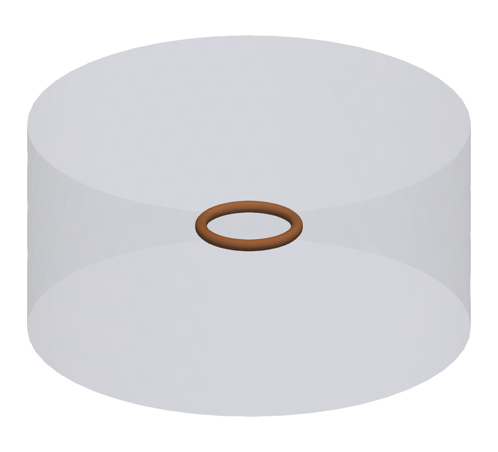

**What was modelled.** The copper ring at mid height inside the air cylinder, drawn transparent.
Loop radius 6.5 mm and tube radius 0.8 mm against a domain **90 mm** in radius and 90 mm tall, so
the ring is a small object in a large box. That is deliberate and it is §5.7's subject: at the
30 mm this case used to ship, the outer boundary was the largest error in it.

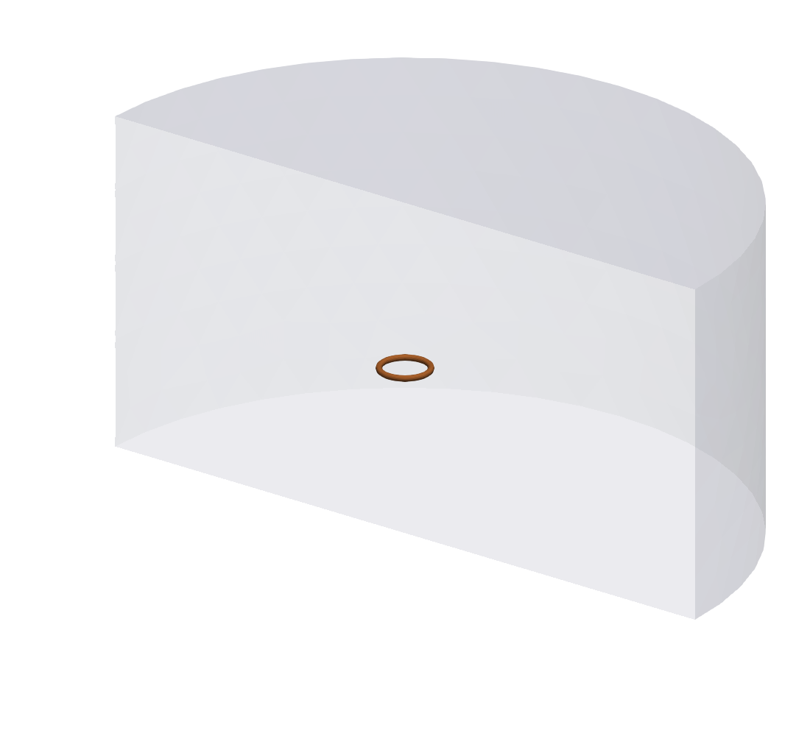

**Cut at `y = 0`**, the plane the port sits on, so the ring is visible rather than seen through the
domain.

| | |
|---|---|
| Conductor | copper, `σ = 5.8e7 S/m`; loop radius `R = 6.5 mm`, tube circumradius `a = 0.8 mm`, a **20-gon** cross-section revolved about `z` |
| Domain | cylinder of air, **90 mm** radius, 90 mm tall, `n × A = 0` on the outer boundary |
| Excitation | **1.0 A through the cut** at `θ = 0`, 50 Hz |
| Skin depth | `δ = 9.346 mm`, so `a/δ = 0.086` — no skin effect |
| Mesh | 38,248 nodes, 237,031 elements, Netgen-optimised |
| Measured | `Z = 3.542415e-04 + 6.215758e-06 j Ω` |

### 1.1 Where the dimensions came from

Not from a document. Two **published** closed forms, solved together against a reference impedance
measured for this geometry:

```
R_dc = 2 pi R / (sigma A)
L    = mu0 R [ ln(8R/a) - 2 + 1/4 ]      round wire, uniform current
```

`R = 6.5 mm` with `a = 0.8 mm` reproduces the reference `R` to 1.3 % and `L` to 0.27 %, and agrees
independently with dimensions measured off the reference model's own scale bar — centreline diameter
1.23 cm, tube 1.4–2.0 mm.

> **The reference was run at 100 Hz, not 50.** That was stated nowhere and falls out of the same two
> equations. `Im(Z)/ω` is 19.75 nH at 100 Hz and 39.50 nH at 50 Hz, and *no* geometry consistent
> with the reported `R` can give 39.50 nH. It does not matter for what this case checks: `a/δ` is
> 0.086 at 50 Hz and 0.121 at 100 Hz, so there is no skin effect either way and `R` and `L` are
> frequency independent between them.

## 2. The potential

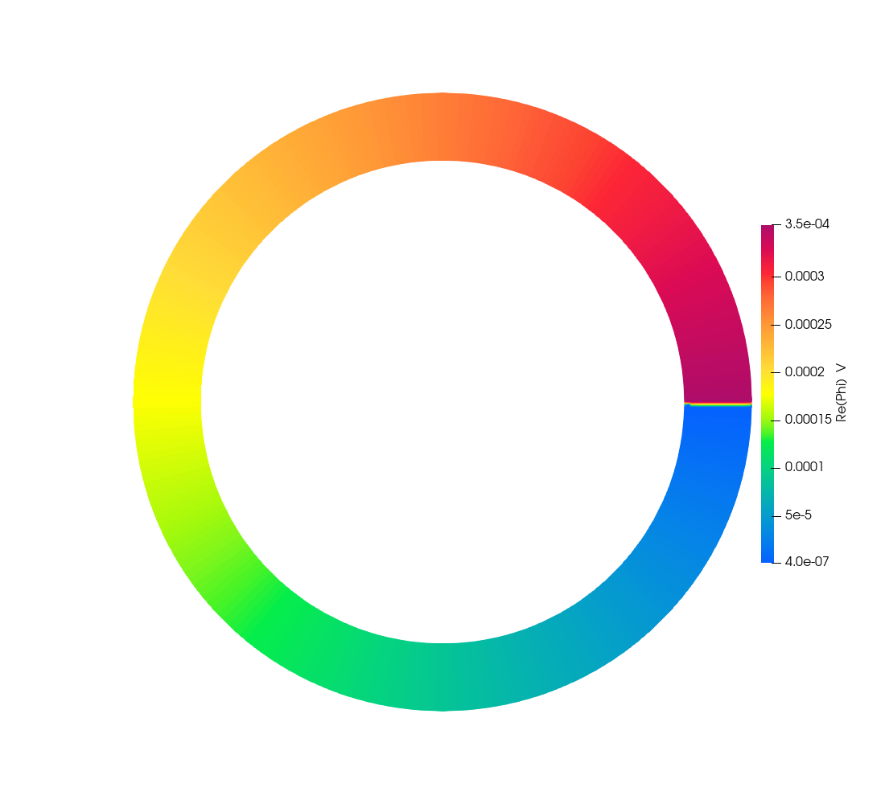

**Re(Φ) over the whole ring**, seen from `+z`. It ramps smoothly all the way round and **falls off a
cliff at the cut**, at 3 o'clock.

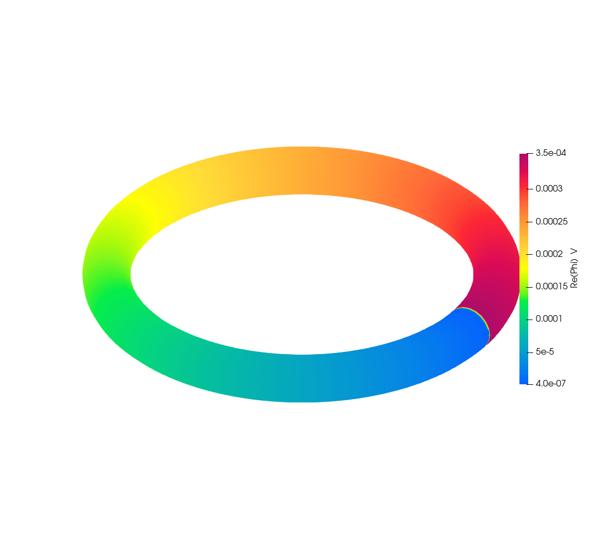

**The same, obliquely**, so the tube reads as a tube. Flat-shaded: 3D lighting darkens one side by
more than Φ changes across a colour band.

This is the picture of what an internal cut actually does, and nothing in cases 01–04 looks like it.
One side of the cut is the port's 0 V reference; the other floats to whatever the solve returns.
**That jump is the terminal voltage** — 3.542415e-04 V here, for 1 A, which is the impedance.

Φ is single-valued on each side: 193 nodes sit exactly on the cut plane and every one reads the same
value, so the jump is a genuine discontinuity across a zero-thickness interface, not a gradient
through a thin region.

## 3. The current

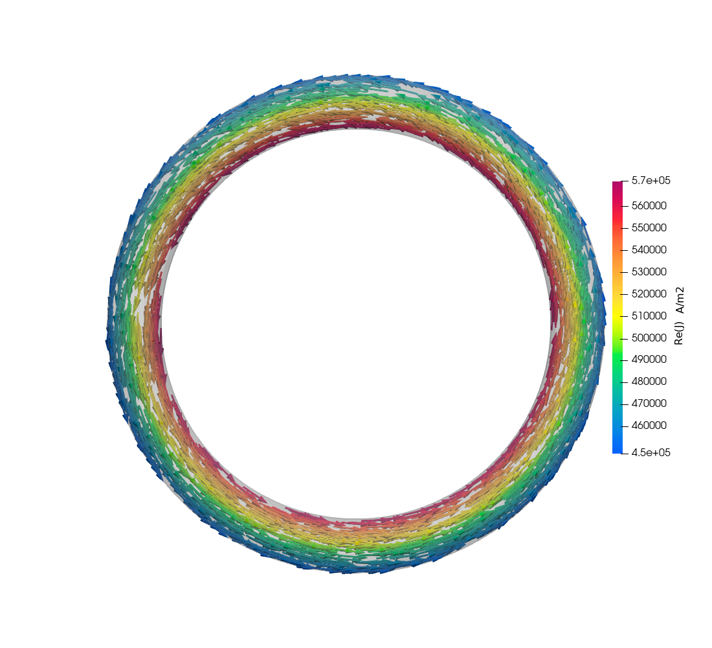

**J = σE** on the ring, every 11th cell, coloured by magnitude. The arrows close the loop.

> **Look at the colour, not just the arrows.** `|J|` is highest on the **inner** radius — 5.8e5
> against 4.4e5 A/m², a ratio of **1.32**. That is not noise: current flowing azimuthally takes a
> shorter path on the inside, so it crowds there. `(R+a)/(R−a) = 1.28`, and the measured 1.32 is
> that effect.
>
> It is also why the exact `R` below is **not** `2πR/(σA)`.

## 4. The fields

### 4.1 B in the xy plane

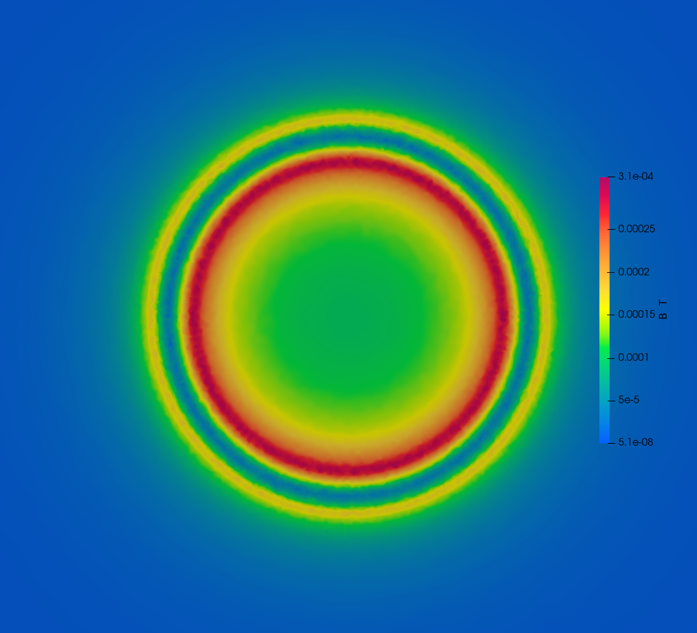

**|B| through the tube centreline**, zoomed. Red at the **inner** tube surface, a minimum at the tube
axis, yellow at the outer surface.

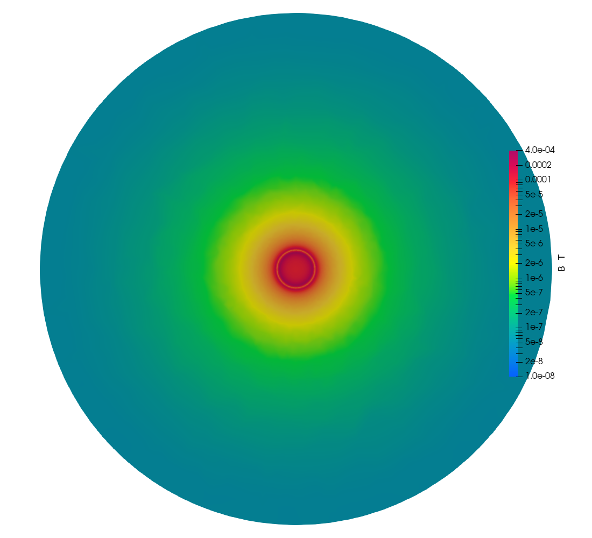

**The whole 90 mm domain**, log scale and pinned, so the decay to the wall is visible. The field
is flat and dark well before the wall is reached, which is the point of §5.7: the boundary is far
enough out to stop interfering.

Three things in the zoomed view are worth naming, because each is a check. `|B|` has a **minimum at
the tube axis** — the wire's own field vanishes there. It **peaks at the tube surface**, where
Ampère gives `μ₀I/(2πa) = 2.5e-4 T`. And the inner surface is **hotter than the outer**, because the
rest of the loop's field adds on the inside and subtracts on the outside.

### 4.2 The port plane

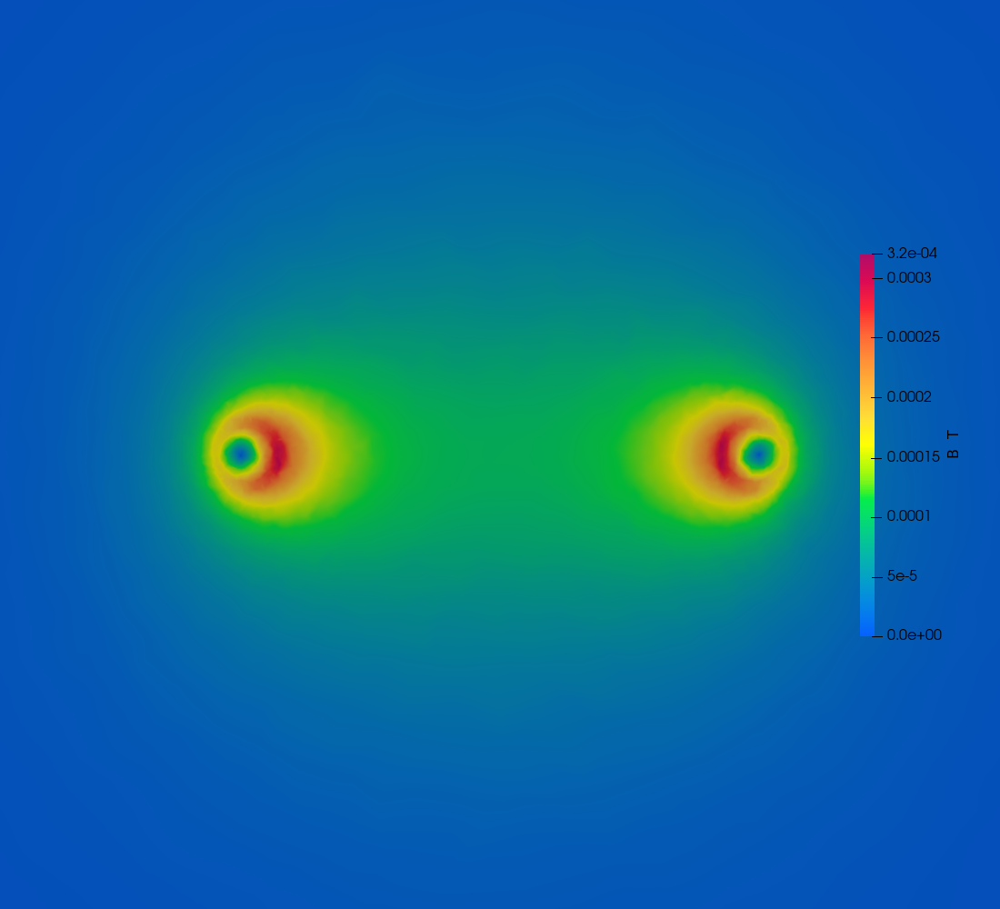

**|B| on the `y = 0` plane**, which cuts the tube twice — at the port (`θ = 0`, right) and at
`θ = π` (left). Range pinned: see the note in §4.3.

Each conductor carries its own circulating field with a minimum on its axis, and the loop's hole
between them is brighter than the outside — the two contributions add in there and oppose outside.
This is the plane the cut is made on.

### 4.3 E in the xy plane, and a warning about colour ranges

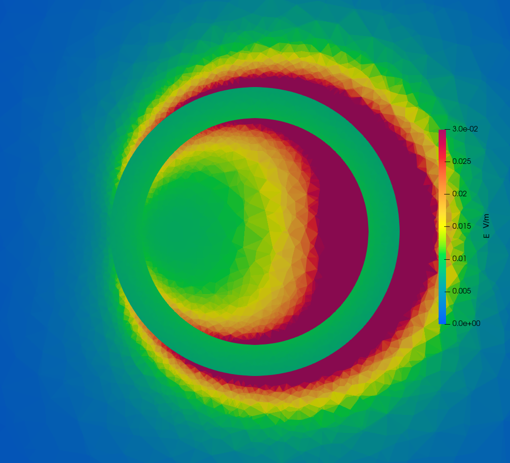

**|E|, zoomed**, range pinned to 3.0e-02. The conductor is the uniform green annulus; the air around
it is *higher*.

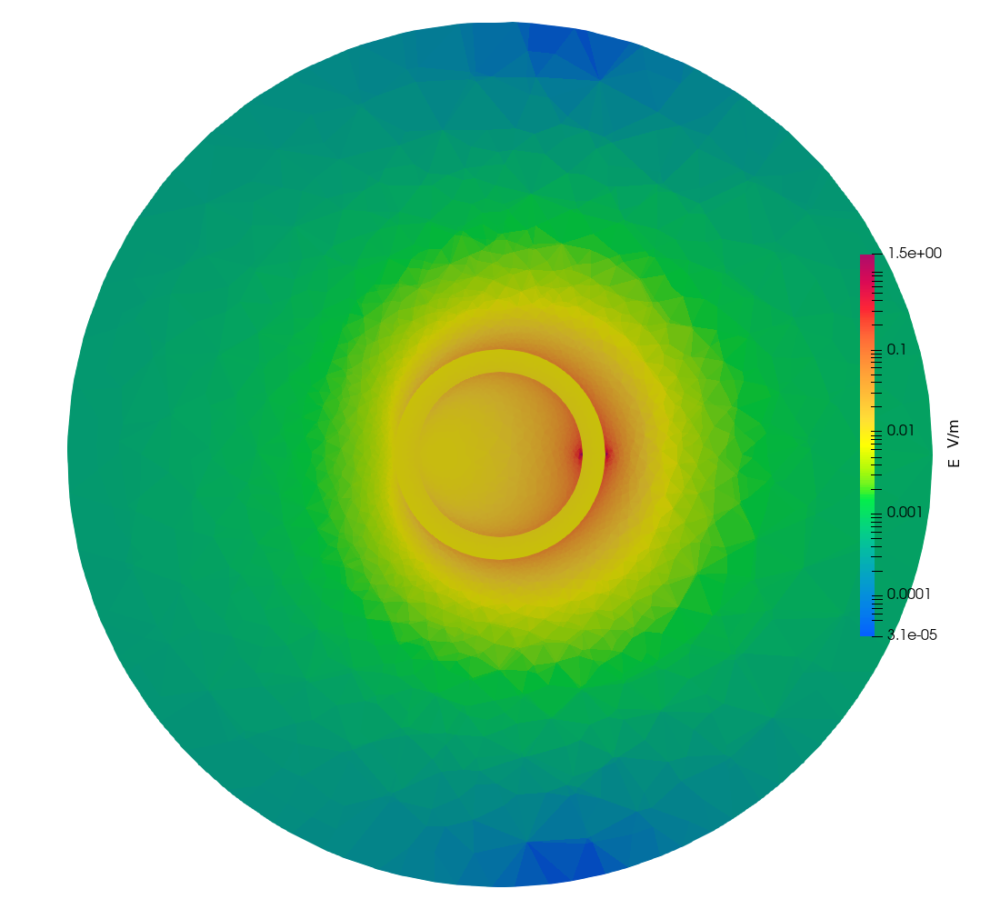

**The whole domain**, log scale.

> **Two earlier claims in this section were wrong and are withdrawn.** The first was a table of
> "median `|E|` inside the conductor / in the air / at the cut" taken as **volume medians over whole
> regions**. Averaging `|E|` over a region that is not homogeneous does not measure anything: in
> case 02 the same statistic is dominated by the rod's *end caps*, where `|E|` reaches 197.8 V/m
> against 25 V/m in the body, and here it mixes the port's neighbourhood with the far side of the
> ring. The second was the claim that the air's field exceeds the conductor's "in every other
> case", supported by a cross-suite table built from those same volume medians. **Both are replaced
> below by measurements made on a stated plane, in a stated shell, on a stated side.**

Measured on the `y = 0` plane — the plane these figures actually cut — split by side:

| shell around the tube | port side, `x > 0` | joint side, `x < 0` |
|---|---|---|
| inside the conductor | 0.00867 V/m | 0.00864 V/m |
| air, `1.0–1.5a` | **0.18829** | 0.00860 |
| air, `1.5–2.5a` | 0.08383 | 0.00685 |
| air, `2.5–5a` | 0.03321 | 0.00511 |

**Inside the conductor the two sides agree to 0.3 %**, as they must: the same current flows through
both. Immediately outside, they differ by **22×**. That difference is the port, and nothing else.

**On the joint side the air just outside the tube is indistinguishable from the conductor's own
field** — 0.00860 against 0.00864, half a per cent apart — and it then decays outward. So there is
no general rule that "the air's `E` is larger". There is a boundary condition at the wall, which
§5.8 shows this mesh can only just resolve, and a decay away from it.

For comparison, case 02's rod measured the same way, on the mid-height plane its own figure cuts:

| | median `\|E\|` |
|---|---|
| inside the conductor | 24.935 V/m |
| air, `1.0–2.5a` | 24.600 |
| air, `2.5–5a` | 14.927 |
| air, `5–10a` | 9.257 |
| maximum anywhere on that plane | 25.307 |

On the plane the figure shows, case 02's air is **not** higher than its conductor — 24.6 against
24.9. The 55.7 V/m that the withdrawn table attributed to "air within 2.5a" was the volume median,
set by the end caps the figure does not show.

> **Why the conductor reads blue here.** It is the colour range, not the physics. These figures keep
> the air in frame and must span the cut spike at 1.95 V/m, so the conductor — more than two orders
> of magnitude below it — lands at the bottom of the scale. A figure thresholded to the conductor
> alone and auto-ranged would show the same field spanning the whole colour map. Same data,
> different window.
>
> **The air's field is electrostatic**, not `−jωA` — that term is only 2.6e-04 V/m here. The loop
> carries 0.354 mV from one side of the cut to the other and that voltage appears across the
> surrounding air, strongest near the cut where the gradient is.
>
> **The 1.95 V/m at the cut is a mesh artefact, not a field.** It equals the potential jump divided
> by the local element size to within 6 %, and the 30 mm mesh reads 1.72 V/m for the same ratio. It
> diverges under refinement. §5.8 does the arithmetic.
>
> **Every range in these figures is pinned, and on the 90 mm domain it has to be.** An auto range is
> set by the single faintest cell in the frame, which sits in a far corner and moves whenever the
> domain or the grading changes — so the shipped figure and the control's could not honestly be laid
> beside each other. Pinning also keeps the cut spike from taking the whole colour map, which is how
> these figures first came out.

### 4.4 E on the plane normal to the torus, through the port

"Normal to the torus" at `θ = 0` means the plane whose normal is the centreline tangent there, which
is `+y` — so it is the `y = 0` plane, and **that is the cut plane itself**. It slices the tube twice:
at the port on the `+x` side, and at `θ = π` on the `-x` side.

> **How to read these.** You are looking along `-y` at a *vertical* plane containing the `x` and
> `z` axes. **`+x` is to the right.** The plane crosses the tube twice — at `x = +6.5 mm`, which is
> the **port**, and at `x = -6.5 mm`, which is **just a joint** where the two half-rings meet with no
> potential difference across them. Only one of those two is a source, which is why only one is
> bright.

| crossing | conductor `\|E\|` | air right around it |
|---|---|---|
| `x > 0`, θ = 0 — **the port** | 0.008669 V/m | median **0.1362**, max **1.9506 V/m** |
| `x < 0`, θ = π — a plain joint | 0.008641 V/m | median 0.0081, max 0.0109 V/m |

Inside the two conductors `|E|` is the **same** — 0.008669 against 0.008641 V/m, both `J/σ`, because
the same current flows through both. Outside them it differs by **17×**. That difference *is* the
port.

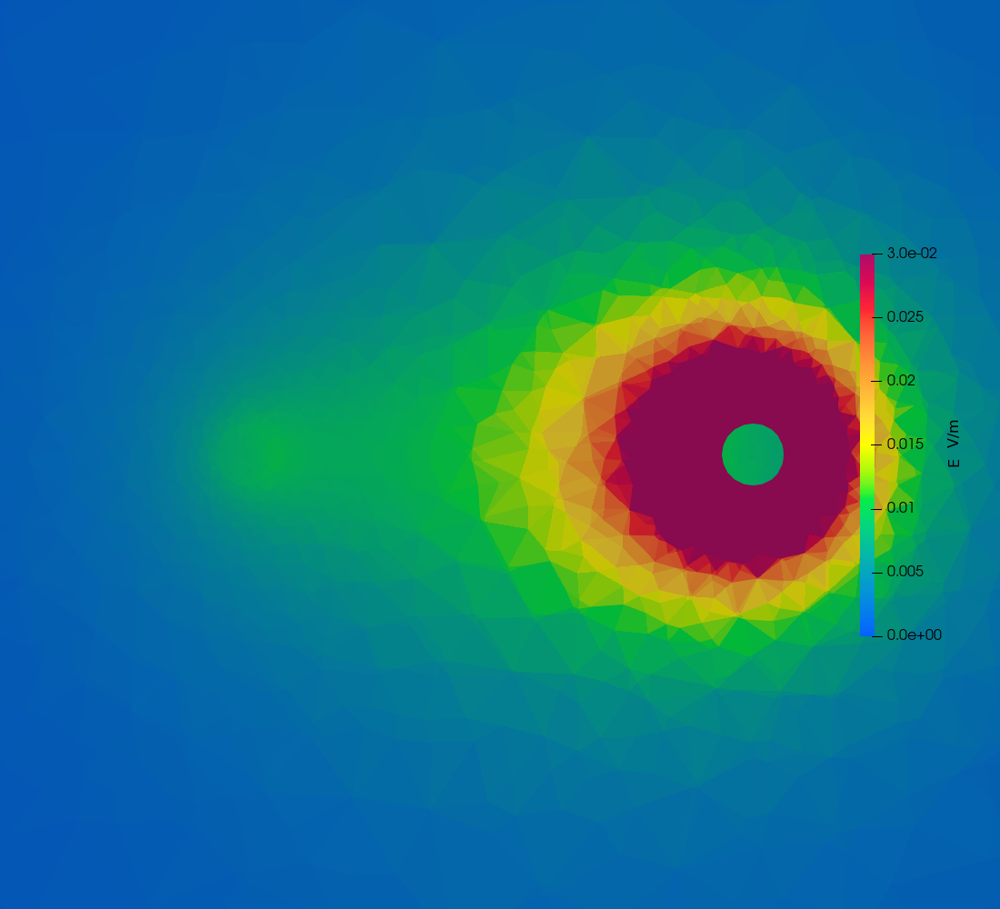

**|E| on the `y = 0` plane**, zoomed to the ring. The port is the bright crossing on the right; the
faint patch on the left is the joint at `θ = π`.

#### The same cut over the whole domain

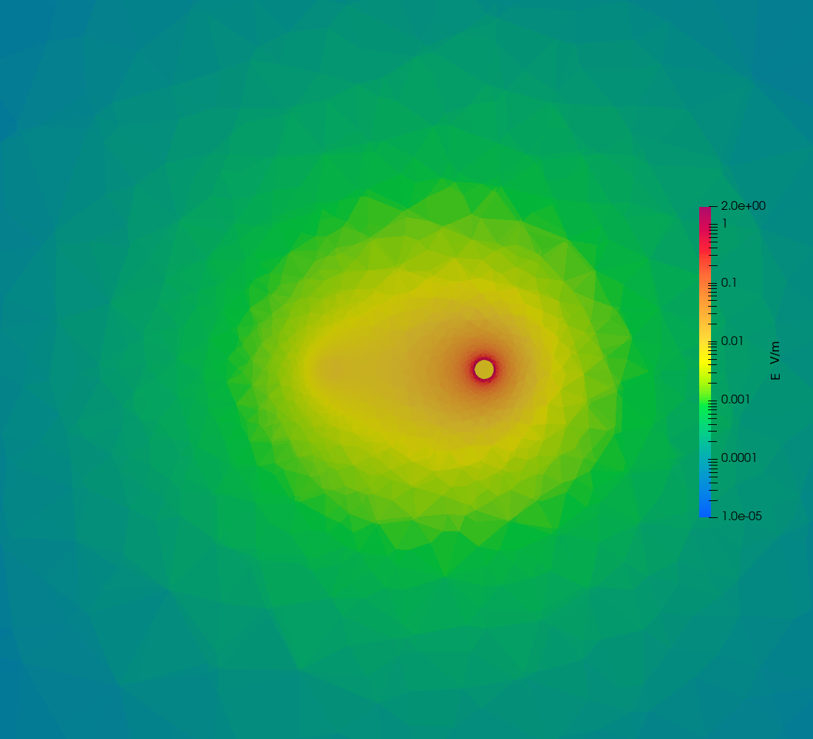

**|E| on the `y = 0` cut, framed at 30 mm.** Log scale over five decades: 1.95 V/m at the cut face
down to 1.8e-05 at the 90 mm wall. The cut itself is 180 × 90 mm now, and framing a square render on
all of it shrinks the ring to a dot — so this view keeps the 30 mm window where the structure is,
and the square `xy` views above are the ones framed on the whole domain.

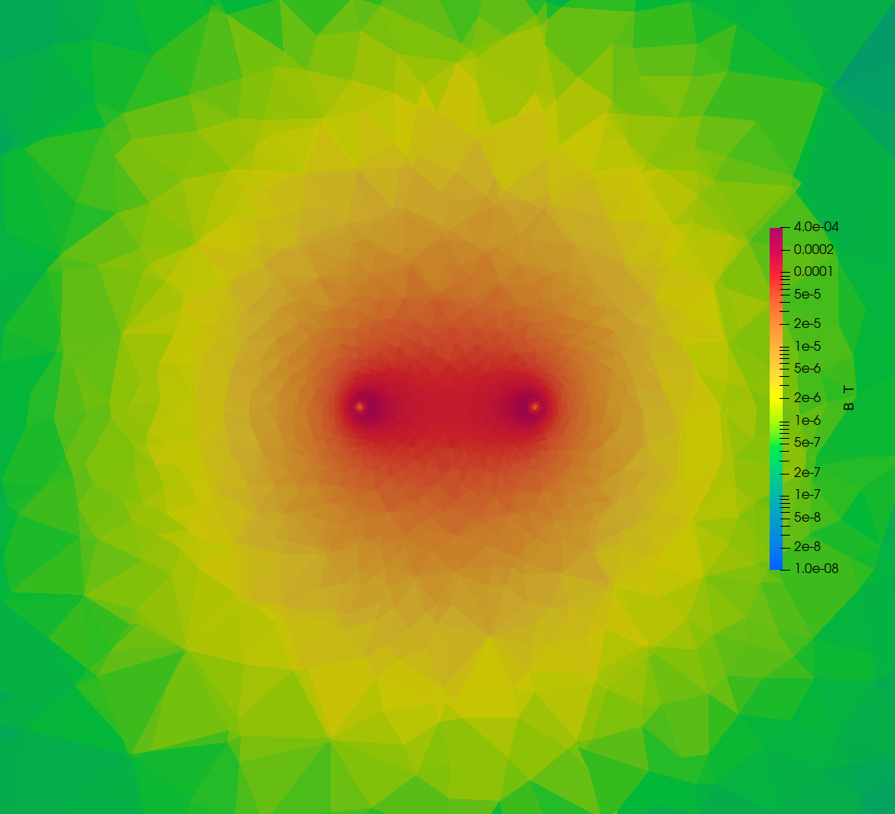

**|B| on the same cut**, for comparison. It is **continuous** across the port and shows both
crossings equally — the asymmetry above is an `E` effect only.

The `B` figure is the control. A magnetic field does not care that Φ jumps, so both tube crossings
look alike there, and the two pictures side by side separate what the port does to `E` from what the
geometry does to everything.

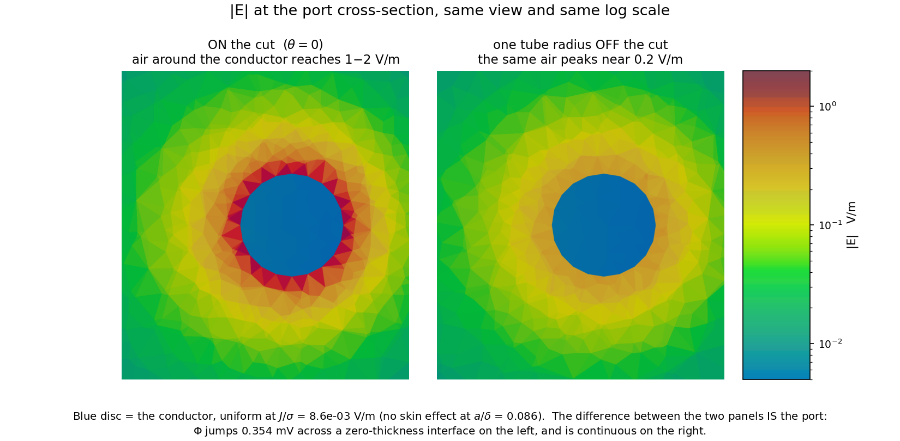

**The measurement is the difference between these two.** Same view, same tube, same log scale — the
left panel lies *on* the cut, the right one tube radius off it. The red ring on the left is the
port.

Each panel alone is an unremarkable blob, which is why they are drawn in one frame rather than
merely adjacent: the eye has to compare them, and a shared colour bar is the only way that
comparison means anything. The blue disc is the conductor, uniform at `J/σ` because `a/δ = 0.086`
leaves no skin effect to resolve. `make_port_pair.py` composes it, sampling ParaView's own colour
ramp out of the render rather than guessing a matplotlib equivalent.

> **This slice lies exactly on a discontinuity, which is the point.** Φ jumps across the cut, so
> `E = −jωA − ∇Φ` does too: the whole 0.354 mV appears across a zero-thickness interface, and the
> adjacent air sees an enormous gradient. `B` is continuous there and does not care, which is why
> §4.2's plot of the same plane needs none of this care.

| air shell hugging the tube, `+x` side | median `\|E\|` |
|---|---|
| at the cut, `\|y\| < 0.3a` | **0.4041 V/m** |
| one tube radius off, `0.7a < \|y\| < 1.3a` | 0.1706 V/m |
| two to three radii round | 0.0994 V/m |
| inside the conductor | 0.008619 V/m (`J/σ`) |
| global maximum, at the cut face | **1.9506 V/m** — 226× the conductor |

The field falls by 2.4× within one tube radius of the cut and by 4.1× by two or three. Both zooms
are **log scaled**: the view spans more than two decades, from the conductor's 8.6e-03 to 1.95 V/m,
and a linear range that resolves the conductor saturates every air cell around it into one flat
colour. The 226× is a property of the mesh, not of the ring — §5.8.

### 4.5 Nodal or per-tet, and why `E` is drawn per-tet

Every field here can be coloured from either of two arrays, and the choice is
visible. **Nodal** (point) data is Gouraud-shaded: the colour ramps across each
triangle between its vertex values, so the picture is smooth. **Per-tet** (cell)
data is one flat fill per element, so every tetrahedron reads as a facet.

Smooth is better everywhere except at a material interface — and there it is
actively wrong.

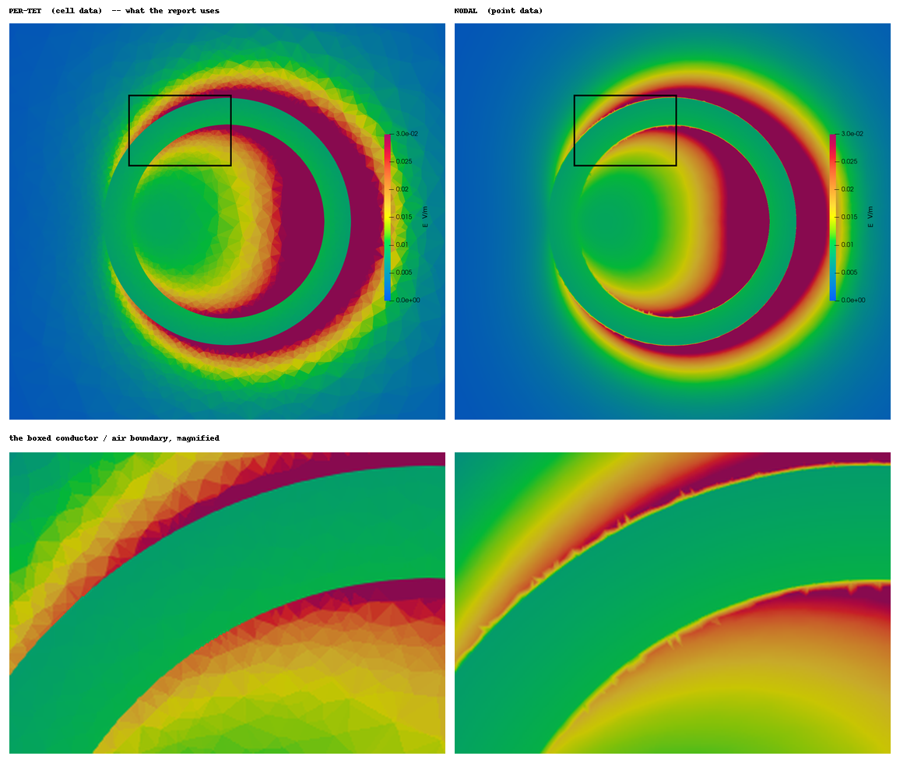

**Same slice, same pinned range, same colour map. The only difference is which
array the colour came from.** Top row, the whole frame; bottom row, the boxed
part of the conductor's inner wall at 3×.

**What nodal averaging does.** A nodal value is the volume-weighted average of
the tetrahedra touching that node. For a node sitting *on* the conductor
surface, those tets are on both sides of it: some hold the conductor's
`8.7e-03 V/m`, some the air's `4.2e-02`. The average is a blend of two numbers
that are different **because the field genuinely jumps there** — `E_t` is
continuous across the interface but `E_n` steps by the surface charge, so there
is no single value at the wall to average towards.

**Why it comes out ragged rather than merely blurred.** Which tets happen to
touch a given surface node varies around the ring, so the blend varies node to
node. The result is the saw-tooth fringe in the bottom-right panel — the shape
of the mesh, drawn as if it were the field. The per-tet panel beside it has the
clean discontinuity the physics actually has, because every tetrahedron lies
wholly in one material and nothing is averaged across anything.

**The solver already knows which nodes these are.** It writes a
`material_interface` flag, and **14,736 nodes — 5.0 % of the mesh — carry it**.
That is exactly the set that produces the fringe.

| band, distance from the tube axis | nodal `\|E\|` | per-tet `\|E\|` | nodal vs exact |
|---|---|---|---|
| 0.80–0.90a, inside | 8.503694e-03 | 8.521196e-03 | −2.1 % |
| 0.90–0.97a, inside | 8.893547e-03 | 8.459322e-03 | **+2.4 %** |
| 1.03–1.10a, outside | 4.251213e-02 | 4.109542e-02 | — |
| 1.10–1.30a, outside | 3.776337e-02 | 3.786500e-02 | — |

against the exact interior value `I/(σρK) = 8.684847e-03 V/m` at `ρ = R`. So the
cost is a couple of per cent in the band next to the wall — not a disaster, and
not the reason for the choice. **The reason is that a ragged fringe at the
conductor surface is a picture of the mesh, in a report whose §5.8 is about what
happens at exactly that surface.**

**So: `E` is drawn per-tet, `B` is drawn nodal.** `B` has no interface to fall
over — `mu_r = 1` in both the ring and the air, so every tet contributes to every
node and nothing is averaged across a jump. Its only cost is a far-field bias
from the mesh grading, −7.5 % at the wall against −2.2 % per cell
(`FIELD_POSTPROCESSING.md`), which matters for numbers and not for a picture.

**None of this touches a validated number.** Every figure in this report is
illustration; every quantity in §5 is computed from the per-cell arrays by
`analytic_comparison.py`, which averages nothing anywhere.

## 5. Comparison with the analytical solutions

Every number in this section comes from `analytic_comparison.py`, which prints the whole set in one
run and derives each closed form in its docstring. Nothing here is hand-copied from a previous run.

```bash
"C:\Program Files\ParaView 6.1.1\bin\pvbatch.exe" analytic_comparison.py output
"C:\Program Files\ParaView 6.1.1\bin\pvbatch.exe" analytic_comparison.py output_small
```

**What has a closed form here, and what does not.** This matters more than it sounds, because the
two places the fields look most dramatic — the cut, and the conductor's own surface — are the two
places with the least to compare against.

| quantity | closed form | status |
|---|---|---|
| `E` inside the conductor | `E(ρ) = I/(σρK)` | **exact** |
| `R` | `2π/(σK)` | **exact** |
| `B` on the loop axis | superposition over the real current | **exact** |
| `B` anywhere in the air | filament, complete elliptic integrals | approximate, `O((a/R)²) ≈ 1.5 %` |
| `L` | `μ₀R[ln(8R/a) − 2 + ¼]` | approximate, thin-wire |
| `E` in the air | — | **none**; only a bound at the wall, and §5.8 shows it is barely testable |
| `E` at the cut | diverges | **none exists**; see §5.8 |

`K = ∫dA/ρ` is the one quantity every exact form is built on. It is taken off the mesh as
`(1/2π) ∫dV/ρ²`, which assumes nothing whatever about the cross-section's shape — not that it is a
circle, not that it is a 20-gon. For this mesh **`K = 3.054193e-04 m`**.

### 5.1 The interior solution, derived

Current flows azimuthally, so try `Φ = Vθ/2π` and check it:

- **It conserves charge.** `θ` is harmonic — `∇²θ = 0` in cylindrical coordinates — so `∇²Φ = 0`
  and `∇·J = −σ∇²Φ = 0`.
- **No current leaks through the wall.** `∇Φ = (V/2π)(1/ρ) φ̂` is purely azimuthal, and the tube
  wall is a surface of revolution whose normal lies in the `ρ`–`z` plane. So `∂Φ/∂n = 0` on it
  identically.

Both conditions hold exactly, for any cross-section shape, so this **is** the solution — not an
approximation to it. Therefore

```
E(ρ) = V/(2πρ)           J(ρ) = σV/(2πρ)
```

**`E` is not uniform across the section; it goes as `1/ρ`.** Every filament at cylindrical radius
`ρ` closes a path of length `2πρ`, and all filaments share the same terminal voltage `V`, so the
field along each is `V` divided by its own path length. The inner filaments have a shorter path, so
they carry more current: the current *crowds toward the inner radius*. Across this tube the ratio is
exactly

```
E(R−a)/E(R+a) = (R+a)/(R−a) = 7.3/5.7 = 1.2807
```

Integrating `J` over the section gives `I = σVK/2π`, hence `V = 2πI/(σK)` and the two forms used
below:

```
E(ρ) = I/(σρK)                R = V/I = 2π/(σK)
```

This holds while there is no skin effect to redistribute the current. Here `a/δ = 0.086`, so there
is none — case 04 is the case where that assumption is deliberately broken.

### 5.2 `E` inside the conductor — exactly where it was compared

**The comparison is made cell by cell, in the conductor only.** Specifically: every tetrahedron with
`body_tag = 1`, taking its complex `E_cell_real`/`E_cell_imag` at the tet centroid, forming
`|E| = √(Re² + Im²)`, and dividing by `I/(σρK)` evaluated at that same centroid's cylindrical radius
`ρ`. The cells are then binned by `ρ` and the median and 90th percentile of the relative error are
reported per band. **No comparison is made in the air** — there is no closed form there (§5.8).

The reason for splitting by azimuth as well as radius is that the discretisation has to carry a
*discontinuity* in `Φ` at the cut, and the question is whether the solution is worse there.

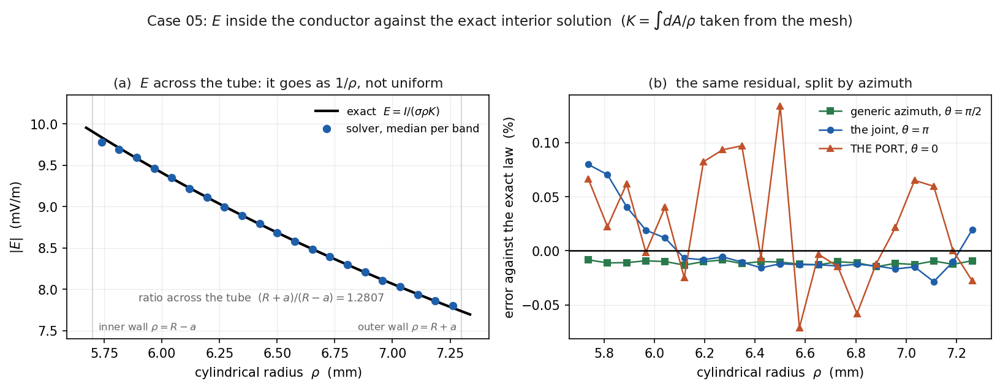

**Panel (a)** is the `1/ρ` law with the solver's per-band medians on top of it. **Panel (b)** is the
same data as a residual, split three ways: at the port, at the joint diametrically opposite it, and
at a generic azimuth that is neither.

| region | `ρ` band | cells | median error | 90th pct `\|error\|` |
|---|---|---|---|---|
| **whole conductor** | 0.88–0.94R | 4500 | −0.013 % | 0.035 % |
| | 0.94–1.00R | 6016 | −0.015 % | 0.030 % |
| | 1.00–1.06R | 6268 | −0.016 % | 0.027 % |
| | 1.06–1.12R | 6625 | −0.016 % | 0.029 % |
| **at the port, θ = 0** | 0.88–0.94R | 188 | +0.033 % | 0.801 % |
| | 0.94–1.00R | 187 | +0.062 % | 0.392 % |
| | 1.00–1.06R | 187 | +0.027 % | 0.965 % |
| | 1.06–1.12R | 165 | +0.013 % | **2.404 %** |
| at the joint, θ = π | 0.88–0.94R | 182 | +0.025 % | 0.153 % |
| | 0.94–1.00R | 182 | −0.010 % | 0.020 % |
| | 1.00–1.06R | 178 | −0.013 % | 0.021 % |
| | 1.06–1.12R | 183 | −0.015 % | 0.053 % |
| generic azimuth, θ = π/2 | 0.88–0.94R | 343 | −0.010 % | 0.021 % |
| | 0.94–1.00R | 460 | −0.011 % | 0.021 % |
| | 1.00–1.06R | 469 | −0.012 % | 0.020 % |
| | 1.06–1.12R | 503 | −0.011 % | 0.022 % |

**Over the whole conductor the field is within 0.016 % of the exact law**, and the 90th percentile
is 0.035 % — that is the solver reproducing a closed form to four significant figures, everywhere,
in all 23,409 conductor elements. The four bands partition the conductor exactly; nothing is left
out of them.

**The port costs about a factor of a hundred, and only in the spread.** Its *medians* are still at
the 0.01–0.06 % level, so there is no bias; what grows is the scatter, from a 90th percentile of
0.02 % at a generic azimuth to 2.40 % next to the cut. Narrowing to the cells that actually touch
the cut face:

| cells touching the cut face (`\|y\| < 0.12 mm`, `x > 0`) | |
|---|---|
| count | 353 |
| median error | **+0.058 %** |
| worst single cell | **−3.378 %** |

That is the honest cost of representing a discontinuity with a finite element: one layer of cells
gets it wrong by a few per cent, the median is unbiased, and one element further in it is gone. The
joint at `θ = π` — geometrically identical, two half-rings meeting, but with no potential difference
across it — sits at 0.02 %, which confirms the error belongs to the *cut*, not to the mesh seam.

### 5.3 `R` — 0.13 %

| | |
|---|---|
| measured | 3.542415e-04 Ω |
| exact for **this** shape, `2π/(σK)` | 3.546953e-04 Ω |
| **error** | **−0.128 %** |

**The exact value is not `2πR/(σA)`.** That formula assumes every filament has the same path length,
and §5.1 shows they do not. Using it gives 3.560434e-04 Ω, **+0.380 %** — three times the solver's
own error, and in the opposite direction. The naive form is wrong because it ignores the `1/ρ`
crowding.

The 2.5 % gap to the reference tool decomposes exactly: **+1.61 %** because our cross-section is a
20-gon with 1.64 % less area than a circle, and 0.91 % between the reference and the exact
round-torus value.

### 5.4 `B` on the loop axis — exact, no filament approximation

On the axis there is a closed form that uses the **real** current distribution, not a thin-wire
idealisation. A circular filament of radius `ρ` carrying `I_f` produces, on its own axis at axial
distance `d`,

```
B = μ₀ I_f ρ² / (2 (ρ² + d²)^{3/2})
```

Superposing the tube's filaments, each carrying `J(ρ) dA = I dA/(ρK)`, and writing `dA = dV/2πρ`:

```
B_z(z₀) = (μ₀I / 4πK) ∫ dV / (ρ² + (z₀−z)²)^{3/2}
```

The integral runs over the conductor cells of the mesh, so this reference knows the actual
cross-section and the actual `1/ρ` current profile. It is exact.

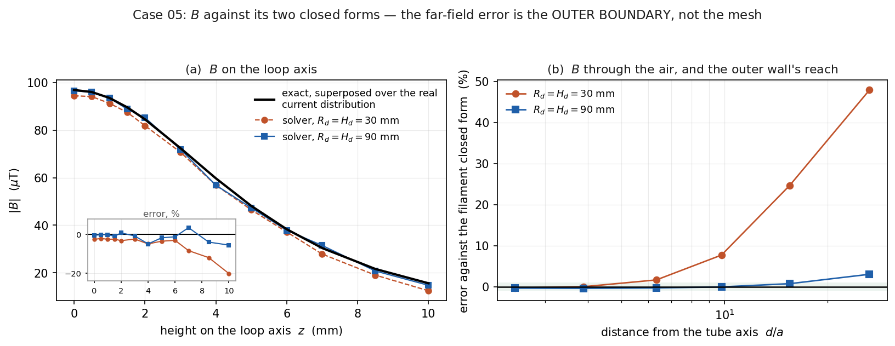

| `z₀` (mm) | measured (T) | exact (T) | error | error, 30 mm control | filament `μ₀IR²/2(R²+z²)^{3/2}` |
|---|---|---|---|---|---|
| 0.0 | 9.648862e-05 | 9.684792e-05 | **−0.371 %** | −2.512 % | 9.666439e-05 |
| 1.0 | 9.347581e-05 | 9.349618e-05 | −0.022 % | −2.426 % | 9.333132e-05 |
| 2.0 | 8.522485e-05 | 8.451782e-05 | +0.837 % | −3.155 % | 8.439933e-05 |
| 3.0 | 7.191648e-05 | 7.241929e-05 | −0.694 % | −2.329 % | 7.235454e-05 |
| 5.0 | 4.732007e-05 | 4.812508e-05 | −1.673 % | −3.434 % | 4.813579e-05 |
| 7.0 | 3.150876e-05 | 3.041954e-05 | +3.581 % | −8.317 % | 3.045491e-05 |
| 10.0 | 1.476315e-05 | 1.561401e-05 | −5.449 % | **−20.191 %** | 1.564690e-05 |

Two things to read off this. First, the shipped column **scatters either side of zero** while the
30 mm control is **one-signed and grows monotonically** — that is the difference between
discretisation noise and a systematic boundary error, and it is the heart of §5.7. Second, the last
column shows the **filament idealisation is worth 0.19 %** at the centre (9.666439e-05 against the
exact 9.684792e-05): at `a/R = 0.123` the tube's thickness barely matters, which is what licenses
§5.5.

### 5.5 `B` through the air — the filament's elliptic-integral form

Away from the wire the ring can be treated as a filament of radius `R`, and then `B` is known in
closed form **everywhere**, not just on the axis, through the complete elliptic integrals `K(m)` and
`E(m)`:

```
Q = (R+ρ)² + z²        m = 4Rρ/Q        D = (R−ρ)² + z²

B_z   = (μ₀I/2π) Q^{−1/2} [  K(m) + E(m)(R²−ρ²−z²)/D ]
B_ρ   = (μ₀I/2π)(z/ρ) Q^{−1/2} [ −K(m) + E(m)(R²+ρ²+z²)/D ]
```

`K` and `E` are evaluated by the arithmetic–geometric mean, which reaches machine precision in about
five iterations. **The script checks this against itself before using it**: as `ρ → 0` the pair must
collapse to the on-axis formula `μ₀IR²/2(R²+z²)^{3/2}`, and it does, to `1.8e-14` relative.

Unlike §5.1–5.4 this form is an **approximation**. It ignores the tube's thickness, so it errs
`O((a/R)²) ≈ 1.5 %`, and it *diverges* at the ring. It is therefore used only outside `2a` from the
tube axis — and §5.4 measured how good it is there: 0.19 %.

The comparison is again cell by cell: every air cell (`body_tag = 2`) outside `2a`, binned by
distance `d` from the tube axis.

| `d/a` | cells | median `\|B\|` (T) | filament (T) | median error | 30 mm control | median `h/d` |
|---|---|---|---|---|---|---|
| 2–3 | 48237 | 8.940967e-05 | 8.990699e-05 | **−0.36 %** | −0.31 % | 0.21 |
| 3–5 | 33704 | 4.936850e-05 | 4.960650e-05 | **−0.40 %** | −0.01 % | 0.22 |
| 5–8 | 16614 | 2.121133e-05 | 2.127459e-05 | **−0.31 %** | +1.64 % | 0.23 |
| 8–12 | 8774 | 8.940558e-06 | 8.931514e-06 | **−0.06 %** | +7.70 % | 0.23 |
| 12–20 | 7567 | 3.547741e-06 | 3.540672e-06 | **+0.73 %** | +24.69 % | 0.24 |
| 20–35 | 6194 | 1.029378e-06 | 1.018296e-06 | +3.02 % | +47.92 % | 0.24 |

**From `2a` out to `20a` the solver tracks the closed form inside ±0.75 %**, across four decades of
field magnitude — 8.9e-05 down to 3.5e-06 T. The +3.02 % in the last band is the 90 mm wall, three
times further out than the control's, doing exactly what the control's did at 20–35a.

The `h/d` column is in the table to rule out element size as the cause: it is flat at ≈0.21–0.24
across every band, so resolution relative to the distance being resolved is constant while the
control's error grows by a factor of 150. That is not discretisation.

### 5.6 `L` — the closed form, and two retractions

For a thin circular loop in free space,

```
L = μ₀R [ ln(8R/a) − 2 + ¼ ]
```

The bracket is the external inductance from the loop's own flux (`ln(8R/a) − 2`) plus the internal
term `¼` for uniform current inside the wire. With `R = 6.5 mm` and `a = 0.8 mm`, `ln(8R/a) = ln 65`
and `L = 19.803 nH`. Using the *equal-area* radius of the 20-gon instead, `a_eq = 0.79343 mm`, gives
19.870 nH — so the choice of which radius to call `a` is itself worth 0.34 %, and no comparison here
is meaningful below that.

| | L | vs closed form (`a` = circumradius) |
|---|---|---|
| **measured, shipped (90 mm)** | **19.785 nH** | **−0.09 %** |
| measured, 30 mm control | 19.377 nH | −2.15 % |
| reference tool | 19.748 nH | −0.27 % |
| closed form, free space | 19.803 nH | — |

> **Two statements previously made here were wrong, and both are retracted.**
>
> The first: *"refining the tube moved L the wrong way, so resolution is not the cause."* That test
> refined `lc_ring` globally while half the ring was still being meshed coarse by the `+π`/`−π`
> sweep bug of §6.2, so it was measuring the bug.
>
> The second: *"the domain is ruled out — doubling it to 60 mm moved L by +0.2 %."* That mesh still
> carried the same sweep bug, **and** it coarsened the far field so much that elements near the loop
> grew from 4 mm to 8.8 mm. Two variables, neither controlled.
>
> Both are negative results produced by a test that moved more than one thing at a time, and both
> pointed away from the actual cause for months. That is the lesson worth keeping from this case,
> rather than anything about loops.

> **Extracting `L` here is ill-conditioned.** `ωL/R = 0.017`: the reactance is 1.7 % of the
> resistance, so `Im(Z)` is a small difference between large numbers. Dividing by the *measured*
> current instead of the imposed 1 A lets that current's own 0.02 % imaginary part into the answer
> and moves `L` by 1.3 % — fifty times its own size. `verify_loop.py` divides by the imposed current.

### 5.7 Why the domain is 90 mm

`[boundary] outer = flux_tangential` sets `n·B = 0` on the domain wall. That confines the return
flux inside the domain and behaves like a **flux-excluding shell** — equivalently, an image loop
carrying opposing current. Three consequences follow from that one picture, and all three are
observed, with the signs it predicts:

- flux is pushed **out** of the middle of the ring → `B` on the axis reads **low**;
- less flux links the loop → `L` reads **low**;
- the excluded flux has to go somewhere, and it crowds **along** the wall → `B` out near the wall
  reads **high**.

`loop_small.geo` is the 30 mm domain this case used to ship, kept as the control that demonstrates
it. The grading is scaled with the domain so that element size **on the loop axis matches to within
10 %** out to `z = 10 mm`: the only thing that differs between the two meshes is where the wall is.

| observable | 30 mm control | **90 mm, shipped** |
|---|---|---|
| `B` on the axis, at the loop centre | −2.51 % | **−0.37 %** |
| `L` | −2.15 % | **−0.09 %** |
| `B` in the air, `d` = 8–12a | +7.70 % | **−0.06 %** |
| `B` in the air, `d` = 12–20a | +24.69 % | **+0.73 %** |
| `B` in the air, `d` = 20–35a | +47.92 % | +3.02 % ← *the new wall* |

At `R_d = 30 mm` the wall is 2.3 loop radii out, which is simply too close. Panel (b) of §5.4's
figure is the whole argument in one frame.

**And the larger domain is cheaper.** `Threshold` grades linearly in distance, so raising `lc_far`
and `d_far` with the domain reproduces the old grading wherever the fields actually are, while
putting far fewer elements in the empty mid-field:

| | 90 mm, shipped | 30 mm control |
|---|---|---|
| tets | **217,719** | 223,879 |
| unknowns | **509,598** | 524,050 |
| MUMPS fill-in | **674.1 M** | 724.0 M |

27× the volume for 3 % fewer elements and 7 % less fill.

**Wall-clock is a wash and should not be quoted either way.** Back to back on an idle machine,
43.5 s against 43.8 s. An earlier measurement here said 103 s against 130 s; that pair was taken
with gmsh and ParaView running alongside, and the 1.3× it appeared to show was machine load, not
the mesh. The three counts above are properties of the mesh. The seconds are a property of whatever
else was running.

### 5.8 Where there is no closed form

Two places in this problem have no analytic value to compare against, and both are places the
pictures in §4 draw the eye to. One of them also turned out to be barely measurable, which is a
correction to an earlier version of this section.

#### At the tube wall there is a bound, and this mesh can only just see it

`E_tangential` is continuous across any interface and `E_normal` jumps by the surface charge, so
`|E|` just outside a current-carrying conductor is **≥** `|E|` just inside — always, pointwise.

> **An earlier version of this report tested that with a shell statistic and declared it confirmed.
> The statistic does not test the bound.** It compared the median over `0.95a–0.99a` inside against
> the median over `1.01a–1.05a` outside — different points, from samples of a few dozen cells. On
> the 30 mm mesh it reads **1.086**; on the shipped 90 mm mesh, same physics, it reads **0.984**.
> A statistic that changes sides when the far-field boundary moves was never measuring a local
> boundary condition.

The air's own field is not even monotonic across those shells, which is why a thin band is a bad
sample:

| shell outside the wall, θ = π ± 14° | cells | median `\|E\|` |
|---|---|---|
| 1.01–1.05a | 99 | 8.338984e-03 |
| 1.05–1.10a | 497 | **9.325833e-03** |
| 1.10–1.20a | 620 | 8.865476e-03 |
| 1.20–1.40a | 806 | 8.377270e-03 |

The bound is pointwise, so it has to be tested pairwise. Taking each near-wall conductor cell and
its *nearest* air cell:

| paired across the wall, θ = π ± 14° | |
|---|---|
| pairs | 577 |
| median centre separation | 0.153a |
| `\|E_air\|/\|E_cond\|`, median | **1.026** |
| 10th / 90th percentile | 0.971 / 1.166 |
| fraction ≥ 1 | **67 %** |

**That is as much as this discretisation can say, and the report should not claim more.** `E` is
piecewise constant per tet; the element size at the wall is 0.343a; the paired centres straddle the
interface at about ±0.08a; and the air's field varies by ~10 % over that distance — comparable to
the jump being looked for. The median is above 1 and two thirds of pairs are, which is consistent
with the bound and too coarse to be a proof of it. Individual pairs below 1 are that averaging, not
a violation.

Note also that "the field is highest inside the conductor" is **not** a law. The opposite is, and
even that is only a bound: its *value* would require solving the exterior problem, which is what the
FEM is for and which there is nothing to check against.

#### At the cut the analytic answer is that `E` diverges

A finite voltage across a zero-thickness interface is a singularity: there is no finite number
there, and what the solver returns is set by the local element size.

| | shipped (90 mm) | 30 mm control |
|---|---|---|
| peak `\|E\|` in air | 1.9506 V/m | 1.7218 V/m |
| local element size `h` | 0.1928 mm | 0.2001 mm |
| `V/h` | 1.8397 V/m | 1.7724 V/m |
| **ratio peak / (V/h)** | **1.06** | **0.97** |

**Two different meshes, two different peak values, the same ratio to `V/h`.** The spike *is* the
potential jump spread over one element. It scales as `1/h` and never converges, so quoting
"1.72 V/m, 200× the conductor" as a result — as an earlier version of this report did — is
meaningless without naming the mesh. Refine the cut region and the number goes up.

## 6. The mesh, and two bugs found building it

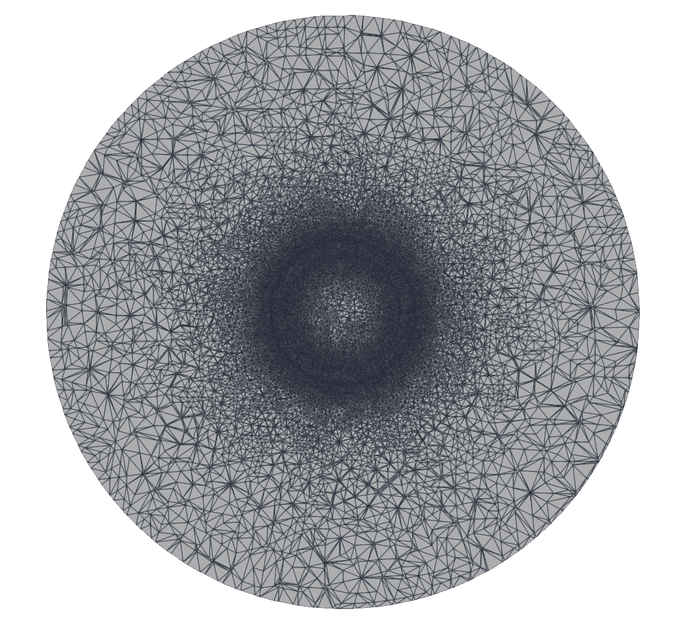

**Whole domain**, graded from 0.25 mm at the ring to 4 mm at the wall.

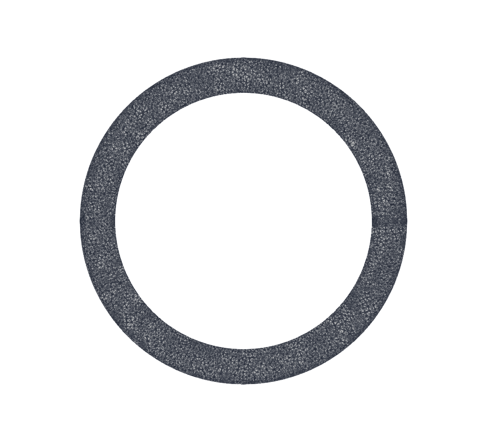

**The ring**, about 5 elements across the 1.6 mm tube.

### 6.1 An OCC Torus will not mesh with a cut in it

The obvious construction — an `OpenCASCADE Torus`, cut, fragmented against the air — fails with
*"Invalid boundary mesh (overlapping facets)"*: a curved torus face overlapping itself. That was
tried **eight ways**: partial tori welded with `Coherence`, cuts by oversized discs, by exact-size
discs, by thin boxes, cuts moved off the parametric seam, the seam rotated away from the cuts, the
air fragmented before and after the cut. Every one failed identically.

**Revolving a polygon has none of that trouble**, and it is what this project does for every other
conductor anyway, because planar lateral faces make `∂Φ/∂n = 0` hold exactly.

Note also that a ring needs **two** cuts. Cut in one place it is still one connected volume, because
the current can go round the other way.

### 6.2 One +π sweep and one −π sweep is wrong in a way that is easy to miss

The ring was first revolved as one `+Pi` extrude and one `-Pi` extrude. It meshes, it passes every
check, and **both halves come out with the right volume** — 40.386 against 40.307 mm³, equal to
0.2 %. But:

| | tets | mean h | volume |
|---|---|---|---|
| `+Pi` half | 11,621 | 0.302 mm | 40.386 mm³ |
| `-Pi` half | **4,557** | 0.373 mm | 40.307 mm³ |

**Half the conductor was quietly meshed two and a half times coarser.** It showed up as a ragged
lower half in the field plots, and was measured before it was believed. Chaining two *positive*
sweeps — the second starting from the first's end face — gives a count ratio of 0.988.

> **And it moved the physics.** On the 30 mm domain of the day, `L` went 19.038 → 19.377 nH, closing 1.87 of the 4.02 points of the
> gap to theory. It also **retracts** an earlier conclusion recorded in this case: that refining the
> tube moved `L` the wrong way, so resolution was not the cause. That test refined `lc_ring`
> globally while half the ring stayed coarse, so it was measuring the wrong thing. Resolution *is*
> part of it.

## 7.1 The cut's local field is tree-dependent — the assertions are not

Everything this case asserts is an **integral**, and that turns out to be the
only reason it passes.

Running `07_GaugeInvariance`'s permutation harness on this case — the same
problem solved on three different spanning trees, which changes nothing physical
— gives:

| | base → permA | base → permB |
|---|---|---|
| `L`, asserted 19.7854 ± 0.05 nH | **+0.0035 nH** | +0.0009 nH |
| `\|V\|` | ~3e‑6 relative | ~3e‑6 relative |
| **`J` within 2 mm of the cut** | **8.3 %** | — |
| **`B` within 2 mm of the cut** | **7.4 %** | — |

and the change dies away from the cut: `J` moves 8.3 % inside 2 mm,
**2.3e‑4** at 2–5 mm and **7.2e‑6** at 5–10 mm.

**It is not numerical noise.** All three solves are exact (backward errors
9.1e‑23, 9.0e‑23, 9.2e‑23); `ΔE = ΔJ/σ` to a ratio of 1.0000, so the `E` and `J`
figures are one physical change reported against different global maxima; and it
decays smoothly over some 11,000 nodes rather than sitting on the 205 cut nodes,
so it is not an artifact of which side of the cut the output happens to print.

**So this case is correct and its tolerances are honest.** `L` moves by 0.018 %
of itself, which is 7 % of a tolerance it was never close to failing.

**What is not safe is the local field at the feed.** The current distribution
within a couple of millimetres of the cut depends on which spanning tree the
gauge happened to pick. Nothing in `expected.txt` could catch that, because every
assertion here is an integral and integrals average the discrepancy away.

> **Read the right thing off this case.** `R`, `L`, `Z`, the current through a
> plane, and the fields away from the cut are all sound. **`J` and `B` within a
> few millimetres of the cut are not** — treat them as indicative, not
> quantitative, until the gauge is replaced.

This is the measurement that sets the bar for that replacement: a new gauge has
to make the local field near an interior port tree-independent, not merely keep
`L` inside tolerance. See `docs/GAUGE_CHOICE.md` §1.3, where it is recorded
alongside the literature and the practitioner experience it refines.

## 8. What is asserted automatically

`check.bat` runs this case through `verify_loop.py`, not `../verify.py`: the rod verifier finds the
drive by differencing Φ between two end caps, and a ring has none. A case-local `verify_*.py` wins
where one exists.

| | |
|---|---|
| `\|I\|` through the cut | 1.000503 vs 1.0, tol 1e-3 |
| `\|I\|` at θ = π/2 | 1.000176 vs 1.0, tol 1e-3 |
| `R` vs exact for this shape | 0.99872 vs 1.0, tol 2e-3 |
| `L` | **19.7854 nH**, tol 0.05 — now **0.09 % from the closed form**, so for the first time this
line is a validation and not only a regression guard; §5.6 |

### Reproducing

```bat
gmsh loop.geo -3 -o loop.msh
..\run_case.bat loop_50hz.aphi
"C:\Program Files\ParaView 6.1.1\bin\pvbatch.exe" make_plots.py output
"C:\Program Files\ParaView 6.1.1\bin\pvbatch.exe" make_port_pair.py
"C:\Program Files\ParaView 6.1.1\bin\pvbatch.exe" verify_loop.py
"C:\Program Files\ParaView 6.1.1\bin\pvbatch.exe" analytic_comparison.py output
"C:\Program Files\ParaView 6.1.1\bin\pvbatch.exe" make_analytic_plots.py
sh build_doc.sh
```

And the 30 mm control, which §5.7 rests on. `make_analytic_plots.py` has to be re-run after it for
the second curve in `fig/analytic_B.png` to appear:

```bat
gmsh loop_small.geo -3 -o loop_small.msh
..\run_case.bat loop_50hz_small.aphi
"C:\Program Files\ParaView 6.1.1\bin\pvbatch.exe" analytic_comparison.py output_small
"C:\Program Files\ParaView 6.1.1\bin\pvbatch.exe" make_analytic_plots.py
```

`loop_small.geo` is the 30 mm domain this case shipped until the boundary turned out to be the
largest error in it. It is kept because §5.7's comparison is the evidence for the 90 mm, and a
control nobody can rerun is not evidence. **Run `build_doc.sh` after regenerating figures**, or the
HTML and PDF keep showing the previous run's pictures — they are baked in.
