# Two wires in quadrature

Hybrid A‑Φ finite-element solver. Two parallel copper wires driven with equal
currents **a quarter cycle apart** — the only case in the suite whose field is
**elliptically polarized**, and the one that demonstrates the `[postprocess]`
options.

`regression_tests/06_TwoWires_Quadrature` · 1 A per wire at 0° and 90° · 2.5 kHz ·
192,368 tets · 448,438 unknowns · backward error 5.3e‑22 · 19.8 s

---

## 0. What this case establishes

Three things, in order of how much work they do.

**It demonstrates every `[postprocess]` option.** Sixteen requests covering all
three geometries, every display, `phase_deg`, `colormap` and `data`. That is the
reason the case exists, and §4 is the tour.

**It is the only case in the suite with an elliptically polarized field.** A
single conductor has `B` purely azimuthal, so the polarization ellipse collapses
to a line and `axial_ratio`, `peak` against `complex_magnitude`, and `phase` all
go trivial — case 05's median axial ratio is `9e-06`. Two sources 90° apart make
`B` genuinely rotate, and the two-wire superposition says exactly where. §6.

**It is the first case to exercise a port `phase_deg` at all.** Everything else
in the suite uses `0` or omits the key, so nothing would have caught it quietly
doing nothing. Measured: **90.014°** between the wires.

> **It also found a renderer bug on its first run**, which is what a case with a
> known analytic answer is for. `axial_ratio` read `2.7e-05` where theory says
> exactly 1.0 — `tools/postprocess.py` was dividing `|P×Q|` by `a` once, which
> gives the semi-minor axis `b` rather than the ratio `b/a`. The wrong quantity
> is in the field's own units and looks entirely plausible on a colour bar; only
> a case with an exact expected value separates the two.

---

## 1. The geometry

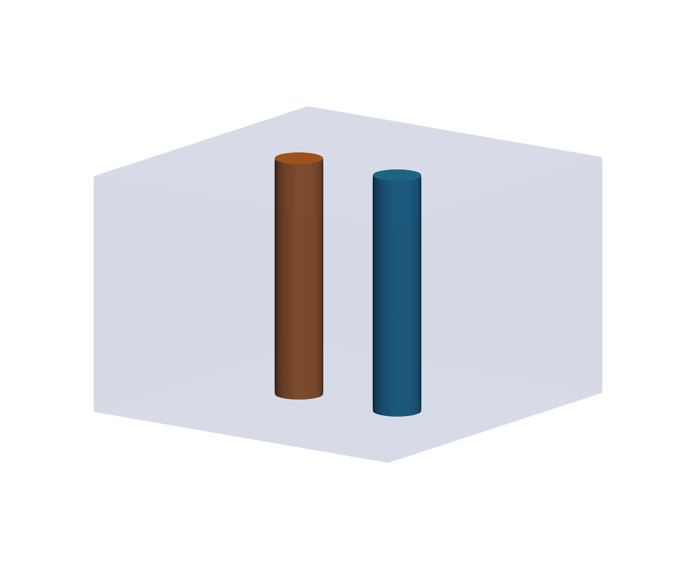

**Two copper wires in a box of air.** `a = 2 mm`, centres `d = 10 mm` apart,
`20 mm` long, in a `30 × 30 × 20 mm` box. The wires run the full height of the
box, so their end faces lie *in* the box's end faces — which is what lets each
wire be driven by a boundary port rather than needing an internal cut (case 05's
problem).

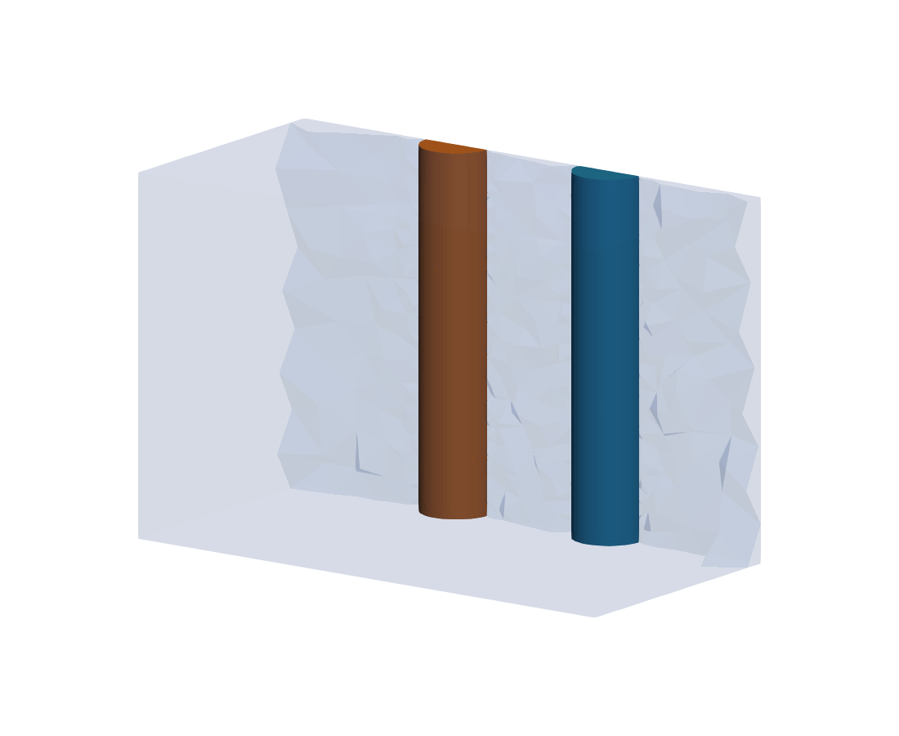

**Cut at `y = 0`**, the plane through both axes, so the wires are seen directly
rather than through 14 mm of air.

| | |
|---|---|
| Wire radius `a` | 2 mm |
| Separation `d` | 10 mm, so `d/a = 5` |
| Length `Lz` | 20 mm, `Lz/a = 10` |
| Domain | 30 × 30 × 20 mm of air, `n × A = 0` on the outer boundary |
| Conductor | copper, `σ = 5.8e7` S/m |
| Air | `σ = 0` |
| Frequency | 2500 Hz |
| Skin depth `δ` | 1.3217 mm, so **`a/δ = 1.511`** |

**Why 2.5 kHz.** Low enough that the case solves in twenty seconds, high enough
that `a/δ > 1` and the current visibly crowds toward the surface. It also puts a
53° phase gradient *inside* each conductor, which is what gives
`display = phase` something to show in §4.3 instead of a flat fill.

**Three bodies, not two.** `wire1`, `wire2` and `air` carry `body_tag` 1, 2 and 3.
Worth stating because every earlier case has exactly two bodies and the air is
always tag 2 — scripts that hard-code that assumption read a wire here and
produce a plausible, wrong answer. `tools/skin_profile.py` finds the conductors
by `sigma > 0` instead of by tag for this reason.

---

## 2. The mesh, and which one

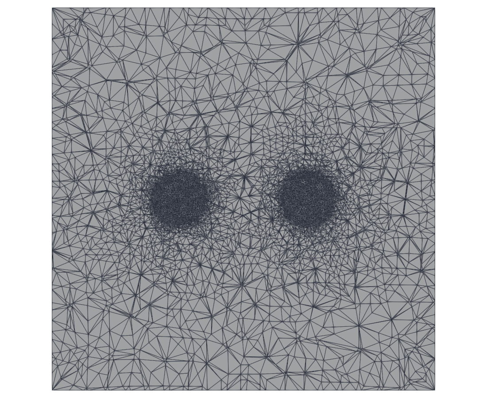

**The `xy` cut at mid-height.** Fine inside the conductors, coarsening outward
through the air to `lc_far = 3 mm` at the walls.

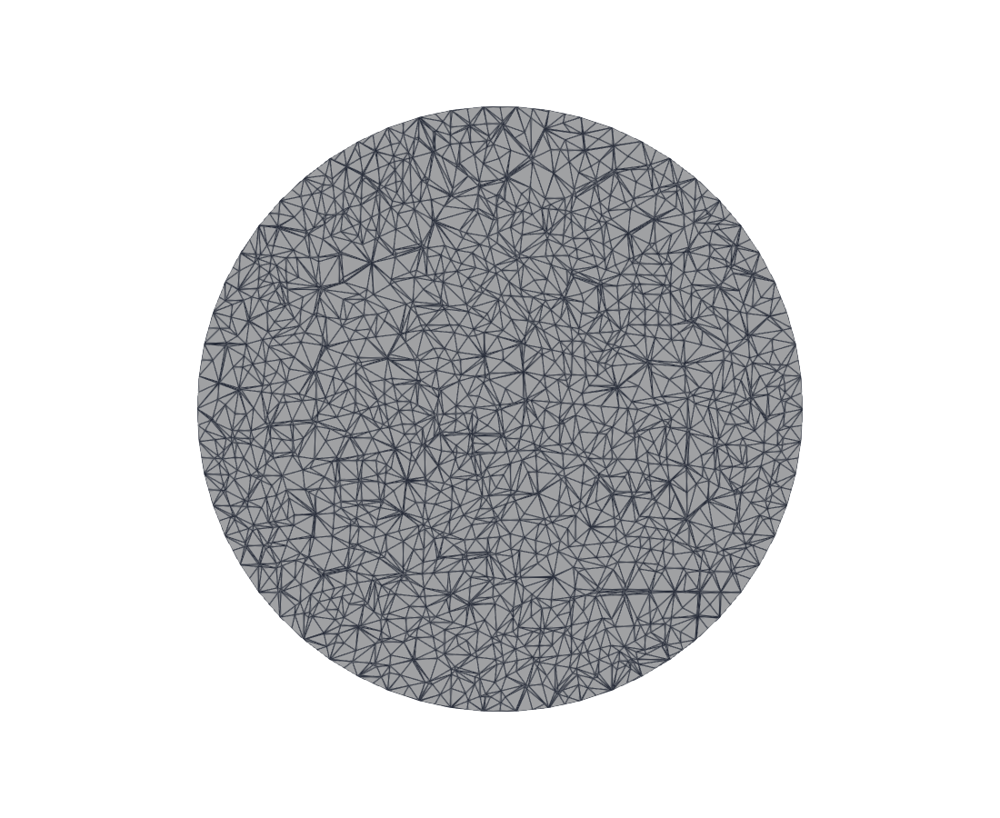

**Wire 1 alone**, at the same `z`. Median element **0.317 mm** against
`δ = 1.3217 mm` — about **4.2 elements per skin depth**.

> The size *field* asks for 0.25 mm and the median comes out 0.317 mm. These are
> not the same number and the report quotes the measured one. gmsh treats
> `lc_wire` as a target that its own quality constraints relax, so a resolution
> claimed from the `.geo` is optimistic by about 25 % here.

### 2.1 The refinement has to go *inside* the conductor

The skin depth is a length scale in the metal, so that is where the elements must
be small. A distance-to-the-surface field cannot express that: distance is
positive on **both** sides of a surface, so asking for 0.25 mm at the wire
boundary also refines a 2 mm shell of **air** around each wire. That produced
**about 660,000 elements, more than half of them air** — air in which nothing
varies on a skin-depth scale at all.

Two gmsh `Cylinder` fields instead, which size the interior of a cylinder and
leave everything outside it alone, with the air graded on its own terms:

```
Field[3] = Cylinder;
Field[3].Radius  = 1.02 * a;
Field[3].VIn     = lc_wire;      // 0.25 mm
Field[3].VOut    = lc_far;
```

**192,368 tets instead of 660,000, for the same resolution where it matters.**

### 2.2 Which mesh — measured, not asserted

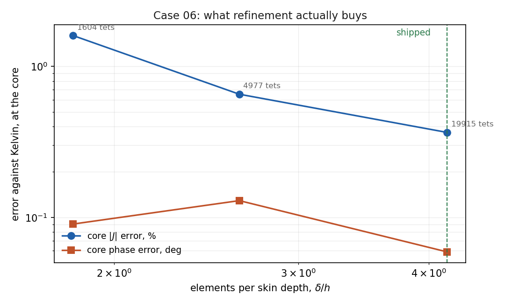

Three refinements, each meshed, solved and compared against Kelvin at the core by
`make_convergence_data.py`:

| `lc_wire` | median `h` | per `δ` | wire tets | core `\|J\|` err | core lag err | solve |
|---|---|---|---|---|---|---|
| 0.60 mm | 0.724 mm | 1.8 | 1,604 | +1.600 % | +0.090° | ~8 s |
| 0.40 mm | 0.502 mm | 2.6 | 4,977 | +0.654 % | +0.129° | ~12 s |
| **0.25 mm** | **0.317 mm** | **4.2** | **19,915** | **+0.365 %** | **−0.059°** | **~20 s** |

**The shipped mesh is the finest**, and the magnitude column is what justifies
it: 1.60 % → 0.65 % → 0.37 %, for 8 s → 20 s. The coarsest is already fine for a
demonstration you edit and re-run; the finest is what makes the skin-effect
comparison in §5 worth quoting at all.

> **The phase column is not converging, and that is honest rather than
> worrying.** It wanders +0.090° → +0.129° → −0.059°. A tenth of a degree is this
> comparison's own noise floor — the radial binning, the azimuthal spread within
> each bin and the finite cell sample each contribute more than the
> discretisation does. A clean monotone trend at that magnitude would be more
> suspicious than this wandering is.
>
> **Three points do not establish a convergence order, and this report does not
> claim one.** An earlier version of this case claimed first-order convergence in
> `h` from *two* meshes. Two points fit any power law you care to assume — they
> cannot test one. The third point showed the apparent order collapsing to 0.37,
> which turned out not to be a property of the solver at all but a constant
> offset in the measurement: §5.3.

---

## 3. The drive

Each wire is driven independently, and each therefore needs its own potential
reference: a current source on the bottom face, a 0 V terminal on the top.

```ini
[port P1]                          [port P3]
type        = boundary_current     type        = boundary_current
surface     = wire1_bottom         surface     = wire2_bottom
current     = 1.0                  current     = 1.0
phase_deg   = 0                    phase_deg   = 90      # <-- the whole point

[port P2]                          [port P4]
type        = boundary_voltage     type        = boundary_voltage
surface     = wire1_top            surface     = wire2_top
voltage     = 0.0                  voltage     = 0.0
```

Under the solver's `e^{+jωt}` convention a port phase `φ` means the terminal
current is `I cos(ωt + φ)`, so wire 2's current leads wire 1's by a quarter
cycle.

| | measured | target |
|---|---|---|
| `\|I\|` in wire 1 | 1.000405 A | 1 A |
| `\|I\|` in wire 2 | 0.998795 A | 1 A |
| phase difference | **90.014°** | 90° |

The current is recovered by integrating `J_z` over a **slab** at mid-length and
dividing by the slab's thickness — `Σ J_z ΔV / Δz` — rather than over a single
plane of faces. Many layers of tets then contribute and no one plane's mesh can
set the answer. Neither wire's port is on the plane being measured, so this is a
check and not a restatement of the input.

---

## 4. The post-processing tour

Sixteen requests. Every picture in this section comes from the manifest the
solver itself writes (`output/postprocess.json`) rendered by
`tools/postprocess.py`. Nothing here is hand-plotted — that is the claim the case
is making, so `collect_postprocess_figs.py` copies those exact files into `fig/`
rather than redrawing them.

```bash
..\run_case.bat two_wires.aphi
"C:\Program Files\ParaView 6.1.1\bin\pvbatch.exe" ..\..\tools\postprocess.py output
```

### 4.1 The current, as arrows

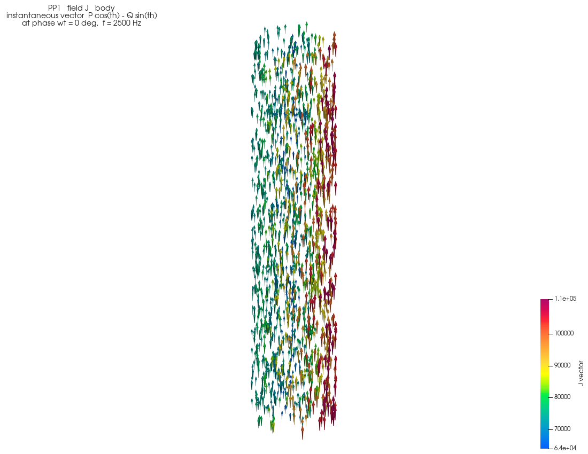

**PP1 — `geometry = body`, `field = J`, `display = vector`, `phase_deg = 0`.**
A side view of the whole conductor; every arrow points along `+z` and is coloured
by `|J|`, from `6.4e4` to `1.09e5 A/m²`. At this instant wire 1 is at its peak:
every cell is positive and the net is **+0.9995 A**.

Read **across** the silhouette, which is a projection through the wire: the left
edge is the face turned away from wire 2 and the right edge is the face turned
toward it. The gradient between them is the **proximity effect**, quantified in
§5.2. The skin effect is in this picture too but is harder to read here, because
a projection superimposes the near and far surfaces on the middle of the
silhouette — §5.1 is where it is measured properly.

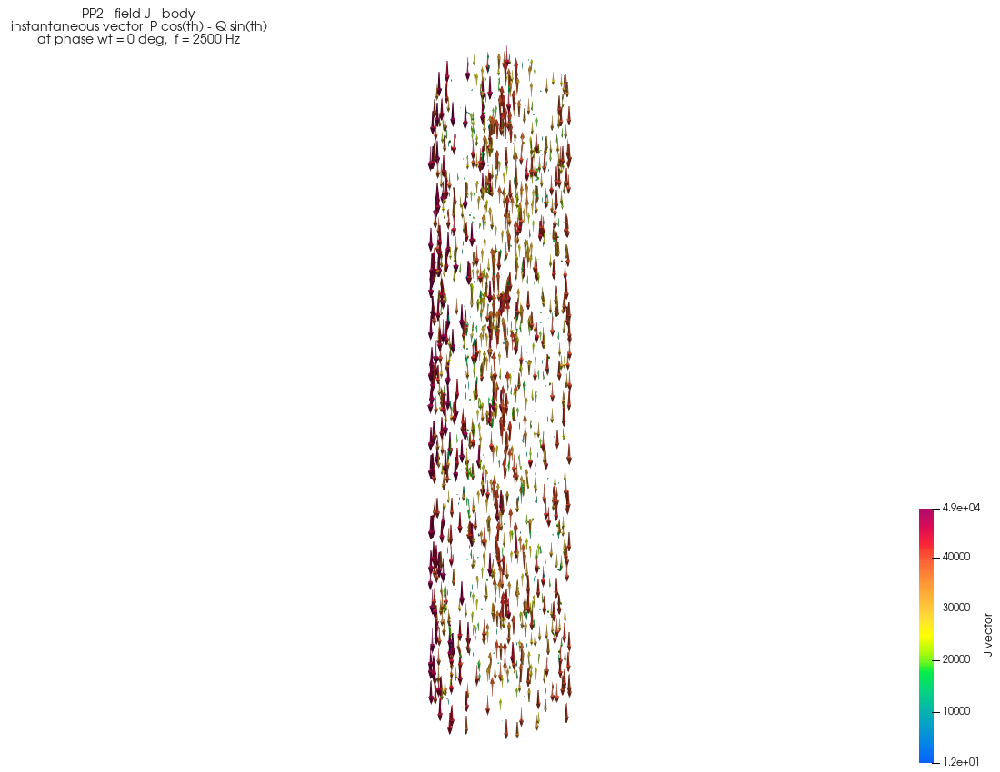

**PP2 — the same instant, wire 2**, whose terminal current is at its zero
crossing. The net instantaneous current really is zero: **−0.0003 A**.

**But `J` is not zero anywhere**, and that is the interesting part. It reaches
`±4.6e4 A/m²` — 40 % of wire 2's own phasor peak of `1.15e5` — and **the outer
shell and the core flow in opposite directions**: measured here, cells with
`J_z < 0` occupy `r/a = 0.64 … 0.98` and cells with `J_z > 0` occupy
`r/a = 0.01 … 0.76`. The two cancel in the integral and not pointwise.

That is the skin effect stated in the time domain. `J` lags by 53° more at the
core than at the surface (§5.1), so the radii cannot all cross zero together; at
the instant the *terminal* current vanishes, what is left inside is a purely
**circulating** eddy current. The arrows read as downward in the picture because
the outer shell dominates a projection — it is both the larger magnitude and the
longer path through the silhouette.

### 4.2 The three magnitudes, one field

The heart of the tour: three pictures of the same `B` on the same plane, none of
them wrong, each answering a different question.


**PP3 — `display = complex_magnitude`** (the default).
`N = √(|P|² + |Q|²) = √2 × RMS`, independent of phase. **Left–right symmetric
about the perpendicular bisector**, because both wires carry the same amplitude
and `N` does not care that they are 90° apart. `|B|` peaks in the red ring at
each conductor's *surface* and falls toward its axis, as it must. This is the one
that never blinks, which is why it is the default.

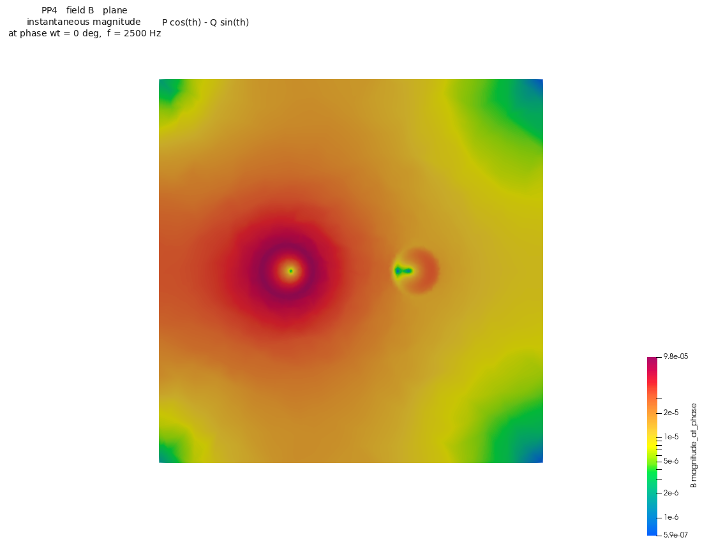

**PP4 — `display = magnitude_at_phase`, `phase_deg = 0`.** A single instant,
`|P cos θ − Q sin θ|` at `θ = 0`. Wire 1 is at its peak and wire 2 near zero, so
the symmetry of PP3 is gone.

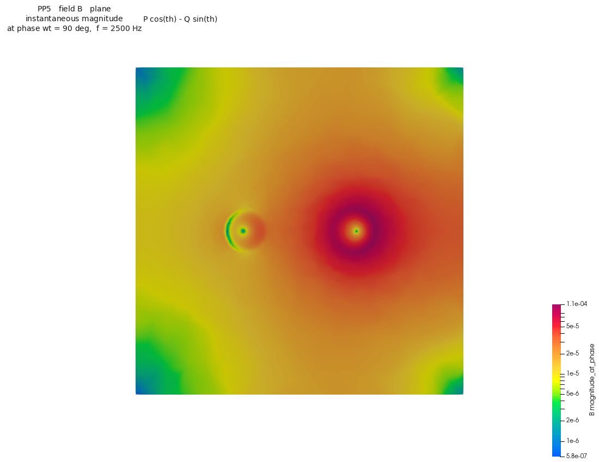

**PP5 — the same, `phase_deg = 90`.** A quarter cycle later the bright region has
moved to the other wire. PP4 and PP5 are what `phase_deg` *is*.

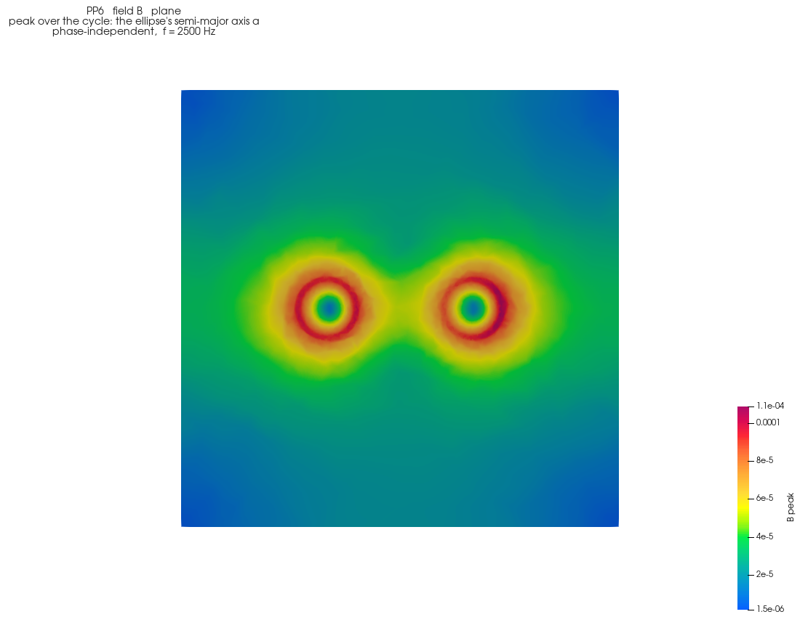

**PP6 — `display = peak`**, the largest `|B|` ever reaches over the cycle: the
semi-major axis `a` of the polarization ellipse. Compare it with PP3 — where the
field is circularly polarized the two differ by `√2`, and §6 measures exactly
that.

> **The three panels are not on a common colour scale, and the colour bars say
> so.** `complex_magnitude` never reaches zero, so its dynamic range stays narrow
> and the renderer keeps the scale linear. `magnitude_at_phase` passes *through*
> zero wherever the instantaneous field nulls, so its range blows up and the
> renderer switches to logarithmic. The *structure* across the three is real; the
> relative brightness between them is not comparable. A pinned `range` key would
> fix this and the input format does not have one yet.

### 4.3 Phase

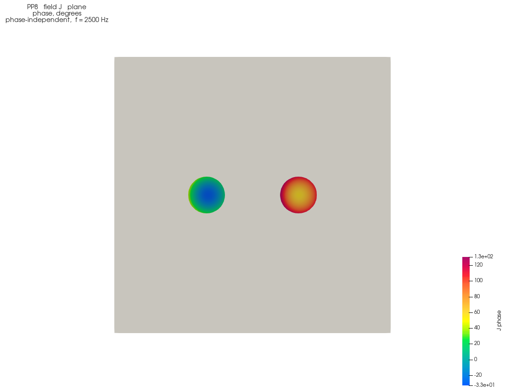

**PP8 — `display = phase`, `component = z`.** A vector field needs a component
before a phase means anything, and the parser rejects `display = phase` on a
vector without one. The two wires sit about 90° apart, and *within* each the
phase varies with radius — the skin effect again, this time in the argument
rather than the magnitude.

> **The air is blank on purpose.** In an insulator `J` is identically zero, and a
> zero vector **has no phase** — it points nowhere. `atan2` returns an angle
> regardless, and *which* angle depends on the sign bit of the zero:
> `atan2(+0.0, −0.0) = π`, and 21,727 of this mesh's 37,706 air nodes hold
> *negative* zero. The first version of this figure painted half the frame a
> confident, uniform **+180°**.
>
> The renderer now writes NaN wherever the magnitude is negligible relative to
> the field's own scale, and sets the NaN colour to **white** — deliberately a
> colour the rainbow scale cannot produce, so a reader cannot mistake it for a
> reading. It arrives on the page as the flat neutral **grey** you see, RGB
> `(200, 197, 189)` against the figure's white margin, because ParaView shades
> the slice like any other lit surface. Either way it is outside the scale.
>
> **The solver's output contains no NaN or Inf anywhere** — that was checked
> directly. This is the renderer declining to invent a phase for a quantity that
> does not have one.

### 4.4 A line plot, and the other geometries

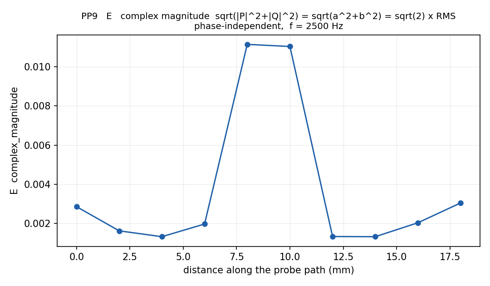

**PP9 — `geometry = points`.** Ten coordinates along `x` at mid-length, from
`x = −9 mm` to `+9 mm`. This geometry produces a **graph**, not a render, with
the horizontal axis the arc length along the path.

Inside each conductor `E ≈ 1.3e‒3 V/m`, which is just `J/σ`: 1 A spread over
`πa² = 12.6 mm²` is `7.96e4 A/m²`, and `7.96e4 / 5.8e7 = 1.37e‒3`. The
**peak is in the air gap between the wires**, about `1.1e‒2 V/m` — eight times
the value inside the metal. That is the induced part, `E = −jωA − ∇Φ`: in the
gap both wires' vector potentials contribute, and `A` falls away toward the box
walls where `n × A = 0` pins it, which is why the two end points are lower again.

> **Four of these ten points sit exactly on a conductor surface** — `x = ±3` and
> `±7 mm` are the wire boundaries. The probe interpolates **nodal** data, and the
> solver's own output header flags those nodes `iface = 1` and says E is
> **meaningless** there, because its normal component genuinely jumps across a
> material interface. The figure is the renderer faithfully reporting what it was
> asked for; the four interface values should not be read as field values. Move
> the probe points off the surfaces, or read only the six clear of them.

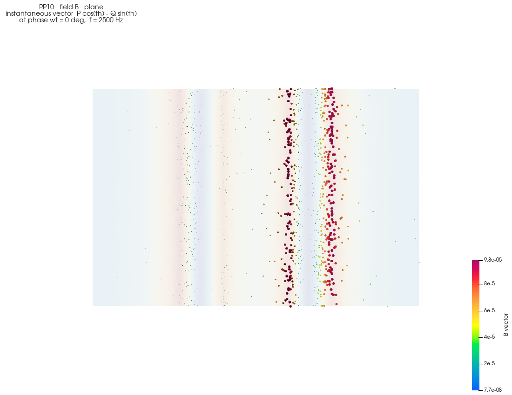

**PP10 — `plane = zx`**, with no `offset`, so the cut is `y = 0`, the plane
through both wire axes. **The glyphs render as dots, and that is correct.** This
figure needs decoding, so here is everything in the frame.

**Three things are drawn, and only one of them is the data.** The pale rectangle
is the slice itself, shown as a surface at **12 % opacity** purely as a backdrop
— the washed-out vertical stripes are `|B|` on the cut, bleached nearly white.
The dots are **arrow glyphs**: `Glyph(GlyphType = "Arrow")` on every ~25th mesh
point (`Stride = n // 1500`, so about 1,500 of the 38,579 points on this slice),
each oriented along `B` and scaled *and* coloured by `|B|`. The colour bar is the
third thing, and it reads correctly.

**They look like dots because they point at you.** On `y = 0`, `B` is almost
perfectly normal to the plane:

| | mean `\|·\|` over the plane |
|---|---|
| `\|Bx\|` | 4.15e‒7 T |
| **`\|By\|`** | **3.57e‒5 T** |
| `\|Bz\|` | 1.27e‒7 T |

Median `\|By\|/\|B\| = 0.9999`, and **94.3 % of the points have
`\|By\|/\|B\| > 0.99`**. `B` around a z-directed current is azimuthal, and the
plane through both axes is exactly the surface on which azimuthal means *straight
out of the page*. Every arrow is therefore seen end-on — you are looking down the
barrel at the cone head — and a bigger, redder dot simply means a larger `|B|`,
because the Arrow glyph scales uniformly in all three dimensions.

**It is not a short-arrow artifact**, which was checked separately: the median
`|B|` on the plane is 26 % of the maximum and the 75th percentile is 57 %, so a
typical arrow has real length. The degeneracy is in orientation, not scale.

**What the dots say once decoded.** The camera sits at `+y` looking along `−y`
with `+z` up, so screen-right is `f × u = (0,−1,0) × (0,0,1) = (−1,0,0)`:
**`+x` runs leftward**, putting wire 1 (`x = −5 mm`) on the *right* of the image
and wire 2 (`x = +5`) on the left. Measured across the cut:

| x band (mm) | mean `\|B\|`/max | |
|---|---|---|
| −9 … −7 | **0.841** | wire 1's outer surface |
| −7 … −5 | 0.584 | inside wire 1 |
| −5 … −3 | 0.401 | inside wire 1 |
| −3 … −1 | **0.827** | wire 1's inner surface |
| +3 … +5 | 0.066 | inside wire 2 |
| +5 … +7 | 0.254 | inside wire 2 |

The **two dense dark-red columns are wire 1's two surfaces cut edge-on** — the
same `|B|` peak that appears as a red ring in PP3, sliced through rather than
viewed down the axis — and `|B|` sags between them because it falls toward the
wire's own axis. The dim left half is **wire 2 at its zero crossing**: mean
`|B|`/max is 0.166 there against 0.552 on wire 1's half, the same quadrature
asymmetry as PP4.

**The useful negative result of the tour**, then: `display = vector` is readable
only when the plane is chosen to *contain* the field. The data here is right and
only the glyph direction is degenerate. For this geometry the `xy` plane of
PP3–PP6 is the one that shows `B`; `zx` is where `J` would be worth drawing
instead.

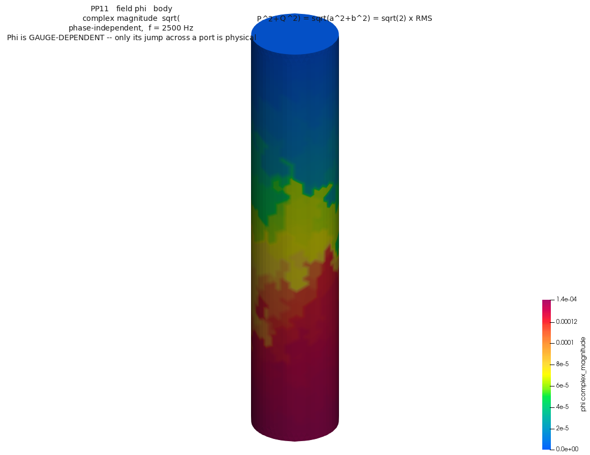

**PP11 — `field = phi`**, a scalar, so no `component` is needed. Note the caption
the renderer stamps on it: **Φ is gauge-dependent**. Its value depends on which
spanning tree the tree-cotree gauge happened to pick, not only on the problem — a
different tree shifts Φ by `−jωψ`. `E`, `B`, `H` and `J` are the quantities that
may be quoted; Φ and `A` are bookkeeping.

### 4.5 The presentation options

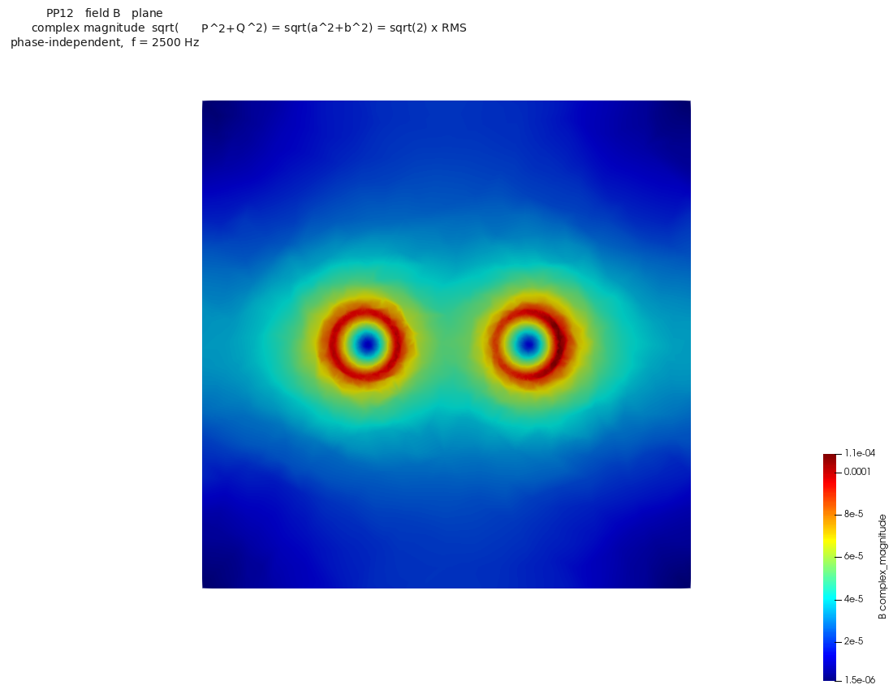

**PP12 — PP3 again with `colormap = jet`.** Nine maps are available; `rainbow`
(Rainbow Uniform) is the default, chosen because it reads as a *scale* at a glance
without either end disappearing into the background.

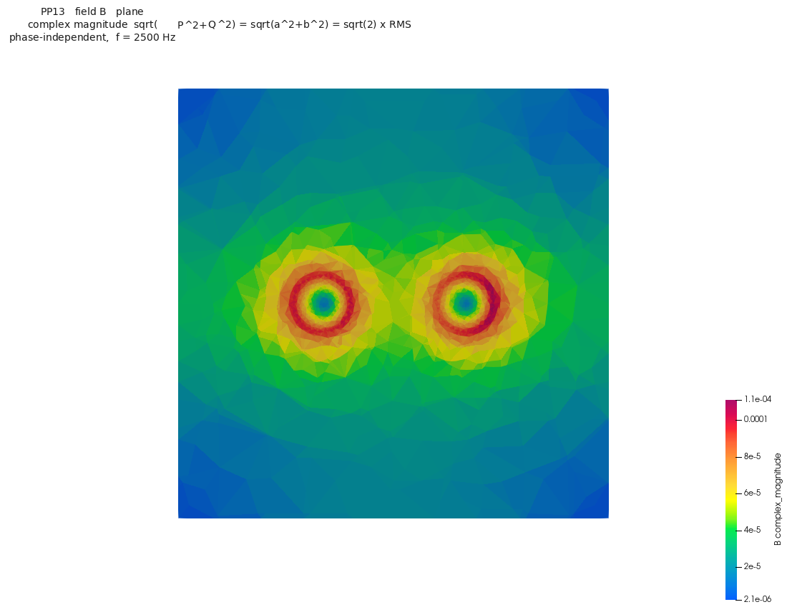

**PP13 — PP3 again with `data = per_tet`.** One flat fill per element against
PP3's smooth interpolation. Per-tet is not simply the uglier option: with
first-order Whitney edge elements **`B` is exactly constant per tetrahedron**, so
the cell array *is* the computed answer and the nodal one is an average of it.
Nodal is the default because it reads better; per-tet is the honest one near a
material interface, where the nodal average blends two values the field genuinely
jumps between.

### 4.6 The same comparison, for the current

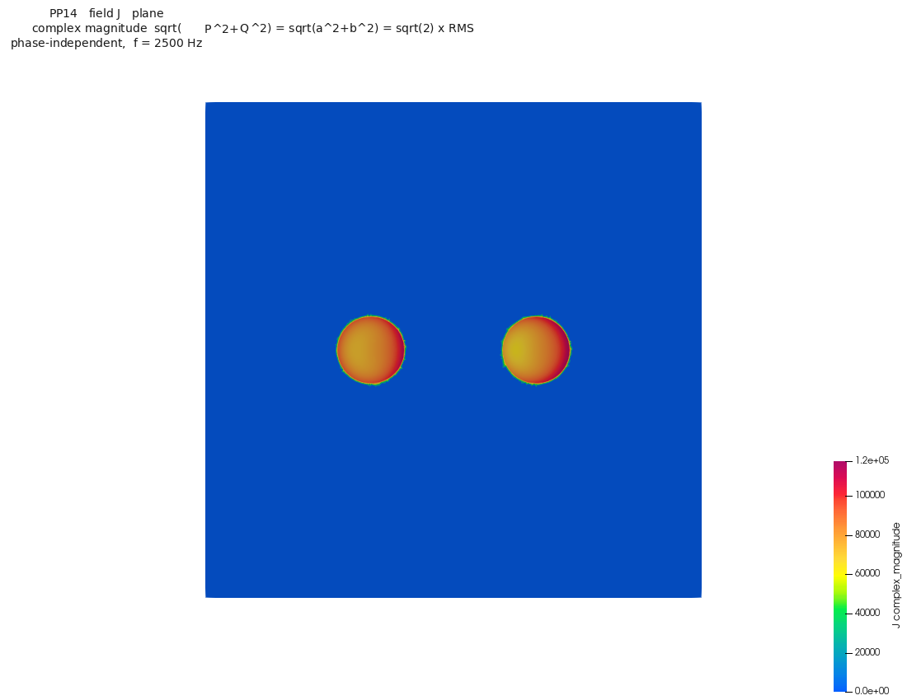

**PP14 — `J`, phase-independent.** Symmetric, both wires equally bright.

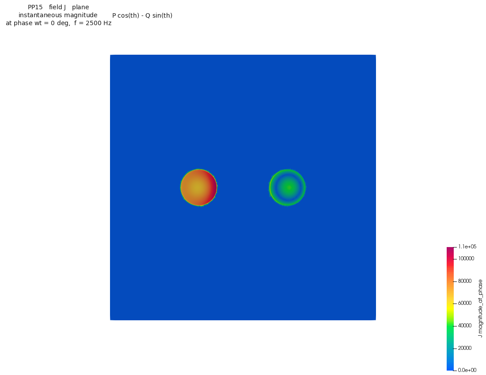

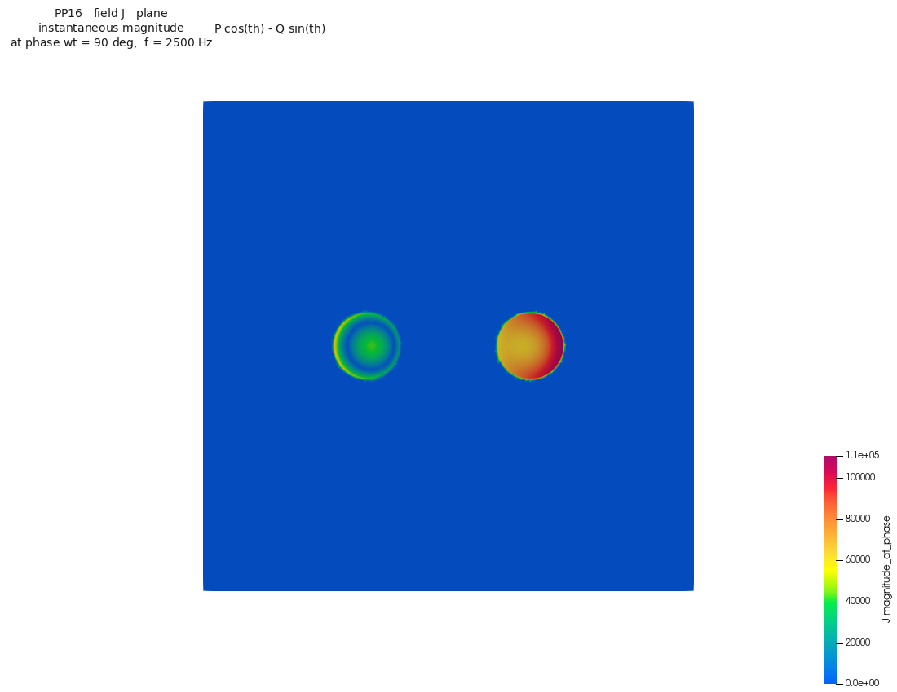

**PP15 and PP16 — `phase_deg = 0` and `90`.** The current is the quantity being
*driven*, so this is the most direct view of what a port `phase_deg` does: at
`ωt = 0` wire 1 carries its full current while wire 2 sits at its zero crossing,
and a quarter cycle later they swap. PP4/PP5 show the same thing one step removed,
in the field the currents produce.

---

## 5. Skin-depth validation

### 5.1 The radial profile against Kelvin

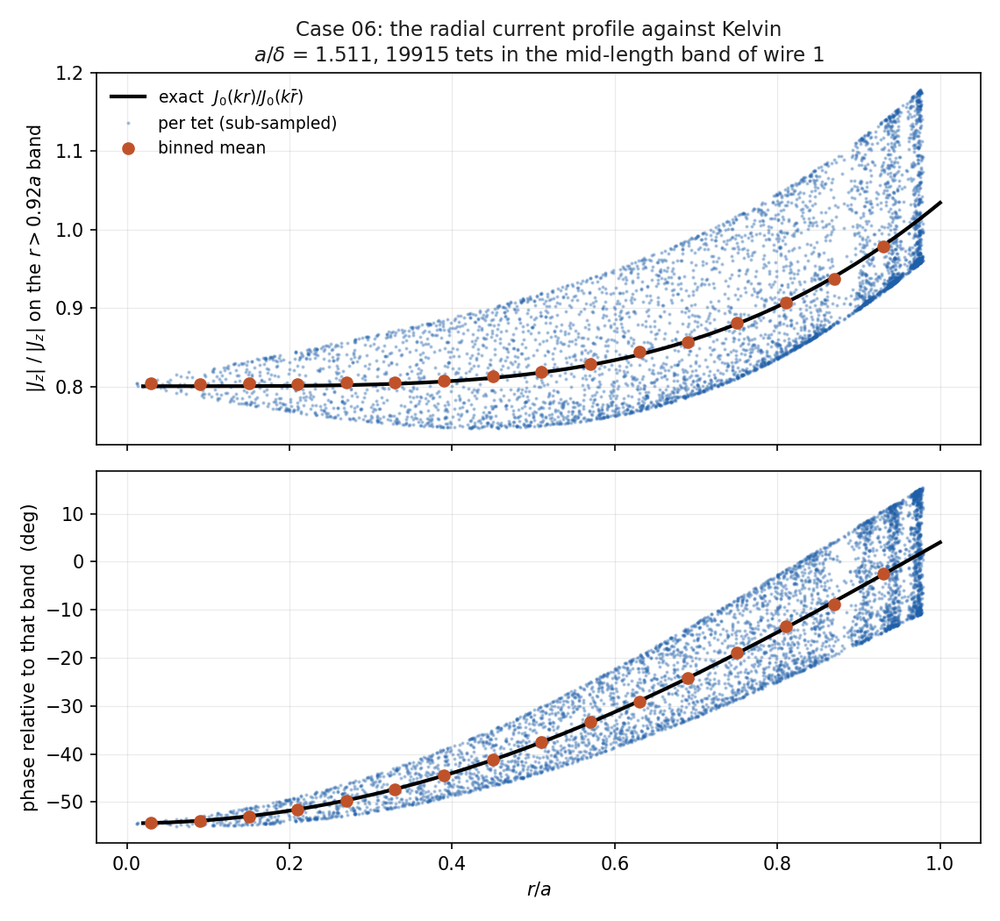

Inside a straight round conductor the diffusion equation `∇²J_z = jωμσ J_z`
reduces to Bessel's equation, whose bounded solution is

```
J_z(r)        J₀(k r)              1 − j                    2
──────   =   ─────────  ,   k =  ───────  ,   δ  =  ────────────────
J_z(a)        J₀(k a)               δ                  √(ω μ σ)
```

At 2.5 kHz in copper `δ = 1.3217 mm` and `a/δ = 1.511`. Measured against that, per
`tools/skin_profile.py`:

| `r/a` | measured | Kelvin | err | lag | Kelvin | err |
|---|---|---|---|---|---|---|
| 0.00–0.20 | 0.8034 | 0.8006 | **+0.35 %** | −53.09° | −53.05° | **−0.04°** |
| 0.20–0.40 | 0.8048 | 0.8028 | +0.24 % | −47.86° | −47.86° | +0.00° |
| 0.40–0.60 | 0.8182 | 0.8171 | +0.14 % | −37.54° | −37.56° | +0.03° |
| 0.60–0.80 | 0.8624 | 0.8621 | +0.04 % | −22.64° | −22.71° | +0.07° |
| 0.80–0.92 | 0.9343 | 0.9349 | −0.06 % | −8.78° | −8.91° | +0.13° |

**A 53° lag from surface to core, reproduced to 0.04°**, and the magnitude profile
to better than 0.35 % everywhere. Both sides are anchored on the same
`r > 0.92a` band, whose mean radius is `0.9575a` — §5.3 is about why that
sentence matters more than it looks.

`tools/skin_profile.py` reduces any case's output the same way, which makes the
comparison portable:

| | `a/δ` | elements per `δ` | core `\|J\|` err | worst lag err |
|---|---|---|---|---|
| **04**, single cylinder | 2.998 | 3.2 | +1.20 % | 0.39° |
| **06**, this case | 1.511 | 4.2 | +0.35 % | 0.13° |

Case 06 is the **better-resolved** of the two per skin depth; case 04 is the
**harder problem** — 138° of rotation from surface to core against 53°, and `|J|`
down to 27 % of its surface value against 80 %.

### 5.2 Proximity effect, which Kelvin does not contain

| | `\|J\|` facing the neighbour / away from it |
|---|---|
| wire 1 | **1.137** |
| wire 2 | **0.766** |

The neighbour's field redistributes current around the circumference by +14 % and
−23 %. It is what makes PP1's arrows asymmetric. The two wires are pushed
**opposite** ways precisely because they are 90° apart: at any instant one is
near its peak while the other is at its zero crossing, so what each sees from the
other is not the same thing.

Kelvin's solution is axisymmetric and contains none of this, so the comparison in
§5.1 uses the **azimuthal mean** at each radius, which removes it to first order.
The proximity effect is real physics the case captures and the analytic reference
does not describe — it is not an error, and it is not something the §5.1 table is
testing.

### 5.3 Both sides must be reduced identically

> This is the most useful thing the case taught, and it cost two wrong results.
>
> Kelvin's profile is normalised **at `r = a`**. A measurement cannot be: a cell
> band "at the surface" is `r > 0.92a`, whose **mean radius is 0.9575a**, because
> cell centres never reach the boundary. Dividing the measurement by `J(0.9575a)`
> while dividing the theory by `J(a)` compares two profiles pinned at different
> places, and inflates every measured ratio by about **+3.5 %**.
>
> **That offset contains no `h`**, so no amount of refinement can remove it — and
> it told a thoroughly convincing story: core errors of 7.2 % that "improved" to
> 3.9 % under refinement and then stalled, an apparent convergence order
> collapsing to 0.37, and a tidy physical explanation for the floor (a modelling
> error from the proximity effect, or from the finite length). All of it was one
> constant offset sitting on a real error ten times smaller. The retracted 7 %
> figure was quoted in `two_wires.geo`'s own header until this report was written.
>
> Two controls placed it. A **single isolated wire** — same radius, length, box
> and element size, no neighbour — showed the *identical* error, so not the
> proximity effect. Narrowing the axial sample band from 0.30–0.70 `Lz` to
> 0.45–0.55 `Lz` changed the fourth decimal, so not the ends. **An error that
> survives removing the neighbour, ignores axial position, and ignores element
> size is in the instrument, not the solve.**
>
> A second, subtler version of the same mistake followed. The measured reference
> is a *mean over cells*, so the Bessel reference must be the **mean of `J₀` over
> those same radii** — not `J₀` evaluated at their mean radius. `J₀` is not
> linear, so the two differ by its curvature across the band. Case 04's own
> `make_plots.py` had always done this correctly; the shared tool had not.
>
> A third, found while writing §7: the radius itself. Inferring `a` from a
> percentile of cell-centre radii under-reads it by about 2 %, because the
> outermost centre sits half an element inside the surface — and under-reading `a`
> inflates the reported `a/δ`. The cross-section **area** is unbiased:
> `a = √(area/π)`, which is what both scripts now use, and
> `tools/skin_profile.py` prints the ratio of the two as a roundness check.

---

## 6. The polarization ellipse

The payoff, and the reason for the geometry.

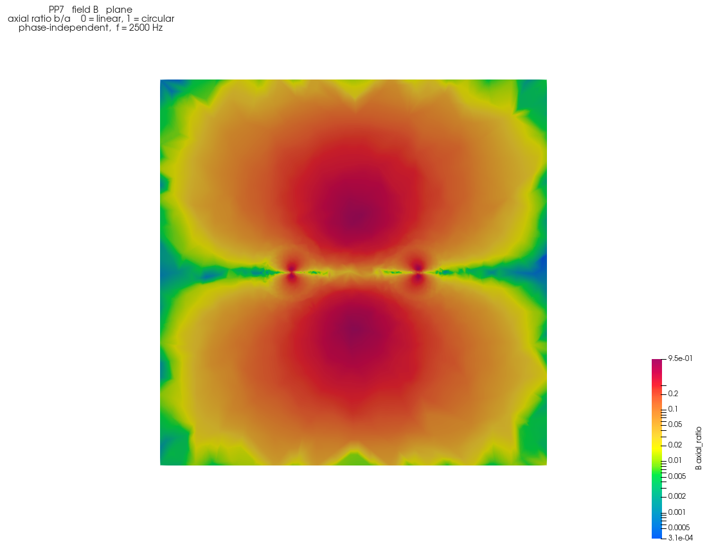

**PP7 — `display = axial_ratio`**: the *shape* of the polarization ellipse,
`b/a`, which is 0 for a linearly polarized field and 1 for a circular one. Two
lobes above and below the line of centres, and a null along it.

Both features are what the two-wire superposition predicts. A phasor vector traces
`B(u) = P cos u − Q sin u`; with `I₁ = I` and `I₂ = jI` the real part `P` is the
field of wire 1 alone and the imaginary part `Q` is the field of wire 2 alone. So:

```
b/a = 0   on the line of centres — the two wires' fields are PARALLEL there,
          and a sum of two parallel vectors out of phase is still linear
b/a = 1   at (0, ±d/2) — the two contributions are perpendicular and equal,
          which is a circle
```

| | measured | exact |
|---|---|---|
| max `b/a` near `(0, ±d/2)` | **0.9647** | 1 |
| `N/a` at the most circular cell | **1.3895** | `√2 = 1.41421` |
| median `b/a` − analytic, per cell, near the axis | **−0.0098** | 0 |

**`N/a = √2` is the equality case** of the chain
`b ≤ |B(θ)| ≤ a ≤ N ≤ √2 a`, derived in
`docs/ComplexVectorPhasorConcept.md`. Where the field is circularly polarized,
`complex_magnitude` exceeds the true peak by **41 %** — so PP3 and PP6 differ by
that much at those two points and not at all on the line of centres. That is the
whole of the phasor document in two pictures.

> **Read `axial_ratio` next to a magnitude plot, never alone.** Here the
> ellipticity sits where the field is strong: the median `b/a` is 0.140 among
> cells carrying at least 30 % of peak `|B|`. In case 05 it was the opposite — the
> most circular cell there carried `8.1e-04` of the peak, three decades down and
> physically invisible. A nearly circular but negligible field is indistinguishable
> from a nearly circular dominant one on this plot, because the plot shows only
> shape.

---

## 7. What is asserted automatically

`..\check.bat 06_TwoWires_Quadrature` runs `verify_two_wires.py`. Eight checks,
all passing:

| | measured | target |
|---|---|---|
| `\|I\|` in wire 1 | 1.000405 | 1 A ± 2 % |
| `\|I\|` in wire 2 | 0.998795 | 1 A ± 2 % |
| phase difference | 90.014° | 90° ± 1° |
| max `b/a` near `(0, ±d/2)` | 0.9647 | ≥ 0.90 |
| `N/a` at the most circular cell | 1.3895 | √2 ± 0.05 |
| median `b/a` − analytic, per cell | −0.0098 | 0 ± 0.03 |
| core `\|J\|` vs Kelvin | 0.80301 | 0.80028 ± 1 % |
| core phase lag vs Kelvin | −53.126° | −53.230° ± 0.5° |

The `b/a` residual is compared **cell by cell**, with the analytic value
evaluated at each cell's own centroid. An earlier version compared the cells'
*median* against the analytic's *area* average over the same region: that
assertion moved from 0.0658 to 0.0509 when the mesh was refined while no physics
changed at all. **A test that moves with the mesh and not with the field is
measuring the mesh.**

### Run summary

| | |
|---|---|
| Tets | 192,368 |
| Unknowns | 448,438 — A: 190,175 free edges, 31,733 gauged to zero, 6,582 Dirichlet; Φ: the rest |
| Stored nonzeros | 9,659,864 |
| `nnz(L)` after AMD | 384,933,274 |
| Backward error | 5.33e‑22 |
| Timing | assemble 0.75 s, analyze 5.0 s, factorize 10.8 s, solve 0.23 s |

---

## Reproducing

```bat
gmsh two_wires.geo -3 -o two_wires.msh
..\run_case.bat two_wires.aphi
"C:\Program Files\ParaView 6.1.1\bin\pvbatch.exe" ..\..\tools\postprocess.py output
"C:\Program Files\ParaView 6.1.1\bin\pvbatch.exe" make_report_figs.py output
"C:\Program Files\ParaView 6.1.1\bin\pvpython.exe" collect_postprocess_figs.py
sh build_doc.sh
```

`make_convergence_data.py` rebuilds §2.2's three meshes and `convergence.json`;
it takes a few minutes and is only needed when the mesh changes.
`tools/skin_profile.py <output-dir>` prints §5.1 for this or any other case.

**Run `build_doc.sh` after regenerating figures**, or `TwoWiresValidation.html`
and `.pdf` keep showing the previous run's pictures — they are inlined, not
referenced.
